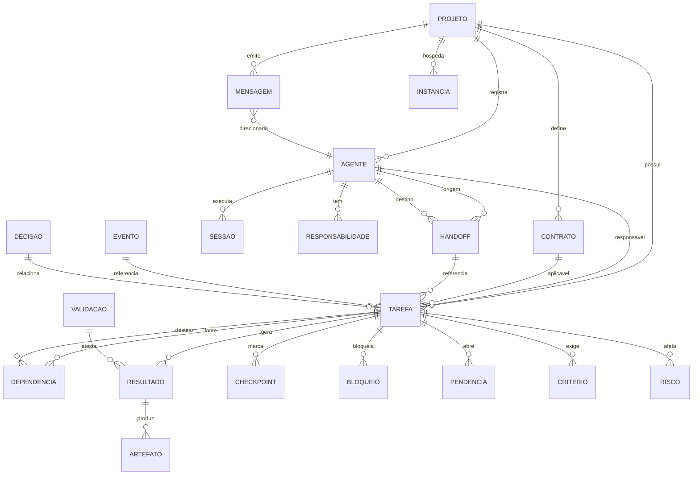

# Proposta do Analista de Sistemas — AgentMap

> **Papel:** Analista de Sistemas (`analista-sistemas`)
> **Versão:** 1.0.0
> **Data:** 2026-08-27
> **Base analisada:** branch `v0044` (conforme `.ia/qualidade/mapeamento-completo-agentmap.md`)
> **Escopo:** Diagnóstico de sistemas, especificação de APIs, modelagem de dados, integrações, arquitetura de comunicação, especificações técnicas (BRD/FRD/NFR), viabilidade e recomendação de ferramentas.
>
> **Nota de escopo (regra do papel):** Este documento **especifica e propõe**, não implementa. Requisitos aqui derivados de evidência de código/arquitetura ou de documentação do projeto (`mapeamento-completo-agentmap.md`, `AGENTS.md`). Requisitos de produto novos devem ser validados pelo Product Owner; mudanças arquiteturais, pelo Arquiteto.

---

## Índice

1. [Diagnóstico de Sistemas Atuais](#1-diagnóstico-de-sistemas-atuais)
2. [Especificação de APIs](#2-especificação-de-apis)
3. [Modelagem de Dados](#3-modelagem-de-dados)
4. [Integrações Externas](#4-integrações-externas)
5. [Arquitetura de Comunicação](#5-arquitetura-de-comunicação)
6. [Especificações Técnicas](#6-especificações-técnicas)
7. [Análise de Viabilidade](#7-análise-de-viabilidade)
8. [Recomendações de Ferramentas](#8-recomendações-de-ferramentas)
9. [Apêndice — Checklist de Critérios de Aceitação](#9-apêndice--checklist-de-critérios-de-aceitação)

---

## 1. Diagnóstico de Sistemas Atuais

### 1.1 Pontos fortes da integração atual

| # | Ponto forte | Evidência no código |
|---|------------|---------------------|
| PS-1 | **Camada de serviço bem definida e consistente** | `backend/src/servicios/*` — um `*Service` por domínio (Tarefa, Agente, Handoff, Monitoramento, etc.), com `ResultadoOperacao<T>` como envelope uniforme. |
| PS-2 | **State machines centralizadas e tipadas** | `backend/src/tipos/index.ts` exporta `TRANSICOES_ESTADO_TAREFA`, `TRANSICOES_ESTADO_SOLICITACAO`, `TRANSICOES_ESTADO_HANDOFF`, etc., com `validarTransicao()`. |
| PS-3 | **Fonte canônica versionável** | Filesystem + JSON em `.ia/`. O arquivo é a informação primária; alinhado ao princípio "o arquivo é a informação principal". Git legível. |
| PS-4 | **Proteção de segurança básica presente** | Path-traversal validado, esquemas Zod (`SchemaValidator`), CORS configurável (`CorsService`). |
| PS-5 | **Event-driven parcial já existente** | `MonitoramentoService extends EventEmitter` e `globalEventBus` (`backend/src/mcp-server/events/event-bus`). |
| PS-6 | **Cobertura MCP ampla** | ~172 tools MCP registradas cobrindo quase todos os domínios; transporte STDIO local; tracing OpenTelemetry via `registerTracedTool`. |
| PS-7 | **Health/Readiness desacoplados de projeto aberto** | Corrigido em v0044 — `GET /api/health` e `/api/readiness` não exigem projeto aberto (viável para CI/CD). |
| PS-8 | **Reconciliação Kilo recente** | `KiloReconciliationService` + `KiloDiscoveryService` comparam sessões AgentMap × Kilo. |

### 1.2 Gaps de comunicação entre sistemas

| # | Gap | Severidade | Descrição técnica |
|---|-----|-----------|-------------------|
| GC-1 | **Instanciação de serviços por requisição** | 🔴 Crítica | `projectMiddleware` (`backend/src/api/middleware.ts:86-172`) **recria todas as ~30 classes de serviço a cada requisição HTTP**. Serviços stateful (ex.: `MonitoramentoService`, que carrega mensagens/config/sequence do disco e estende `EventEmitter`) perdem estado em memória entre chamadas e pagam I/O de disco em todo request. |
| GC-2 | **Duas instâncias de `MonitoramentoService`** | 🔴 Crítica | O router `/api/monitoramento` é montado **antes** do `projectMiddleware` e usa a instância global `getMonitoramentoAtual` (`setupRotas`). Já o `projectMiddleware` cria **outra** instância em `req.servicos.monitoramento`. Por isso `monitoramento.ts:5-7` faz fallback `(req as any).monitoramentoProjeto \|\| req.servicos?.monitoramento`. Consequência: escrita via uma instância e leitura via outra → **divergência de cache de mensagens** entre canais. |
| GC-3 | **Sem push real (WebSocket/SSE)** | 🟠 Alta | Wake-up do Kilo é **polling** (`GET /api/monitoramento/mensagens?after=`). Frontend também sem canal de push. Latência de entrega e carga desnecessária sob ociosência. |
| GC-4 | **dois transportes para a mesma semântica** | 🟠 Alta | Filho→AgentMap escreve via **HTTP** (`POST /api/monitoramento/mensagens`); Pai→Filho lê via **MCP** (`agentmap_monitoramento_verificar_pendentes`). Mesma mensageria, duas implementações e dois contratos. |
| GC-5 | **REST e MCP duplicam lógica** | 🟠 Alta | Cada domínio tem `api/X.ts` **e** `mcp-server/tools/X.ts`. Mudança de regra de negócio exige tocar em 2 lugares → divergência silenciosa (ex.: `POST /tarefas/:id/estado` vs `agentmap_tarefas_alterar_estado`). |
| GC-6 | **Frontend acoplado ao backend** | 🟡 Média | Frontend servido pelo backend (porta 3150). Não pode ser implantado/escalado separadamente (item 10 do mapeamento). |
| GC-7 | **Sem contrato OpenAPI navegável** | 🟡 Média | Existem JSON Schemas (`esquemas/*.json`), mas **não há spec OpenAPI/Swagger** gerada. Documentação de API é manual (o próprio `mapeamento-completo-agentmap.md`). |

### 1.3 Inconsistências de API

| # | Inconsistência | Evidência |
|---|---------------|-----------|
| IA-1 | **Verbos mistos (RPC-over-HTTP vs REST)** | Ações como sub-recurso variam sem padrão: `POST /tarefas/:id/estado`, `PUT /bloqueios/:id/resolver`, `PUT /reservas/:id/liberar`, `PUT /validacoes/:id/aprovar`. Sem regra única (POST de sub-recurso vs PUT de ação). |
| IA-2 | **Rota duplicada `/api/estado`** | `api/index.ts:82` define inline `GET /api/estado` e `:88` monta `criarEstadoRouter()` em `/api/estado` — sobreposição. |
| IA-3 | **Shadowing de routers em `/api/contratos`** | `api/index.ts:121-122` monta `contratos-validacao` e depois `contrato` no mesmo path; ordem define comportamento implícito. |
| IA-4 | **Mapeamento de status HTTP frágil** | `responder(res, result, status=200)` (`middleware.ts:191`) ignora o `codigoErro`. Ex.: `alerta` PUT retorna `200 : 404` (`monitoramento.ts:289-295`) — 404 usado para "falha genérica", confundindo NOT_FOUND com erro de validação. Não há mapa `codigoErro → HTTP status` (404/409/422). |
| IA-5 | **Ordem do `projectMiddleware`** | `api/index.ts:76` aplica `projectMiddleware` **após** monitoramento/projetos/observabilidade/health/readiness/temp/gerenciador-agentes/estado. Essas rotas não passam pelo middleware; o projeto-aberto é checado *ad hoc* dentro de cada handler (`if (!monitoramento) ... NO_PROJECT_OPEN`). Inconsistente e fácil de regredir. |
| IA-6 | **`GET /api/auditoria` vs `/api/auditoria/listar`** | Alguns domínios expõem listagem em `GET /` e outros exigem sub-rota; padrão de coleção não uniforme. |

### 1.4 Problemas de modelagem de dados

| # | Problema | Descrição |
|---|----------|-----------|
| MD-1 | **Registries como array plano (sem índice)** | Toda entidade vive em `*.json` como `{ entidades: [...] }` (ex.: `TarefasRegistry`, `AgentesRegistry`). Leitura por id é O(n) e exige parse do arquivo inteiro. Degrada com volume. |
| MD-2 | **IDs não-UUID e colisão** | Mensagens usam `id: MSG-${Date.now()}` (`monitoramento.ts:56`) — colisão sob concorrência. `eventSequence` é contador em arquivo protegido por `Promise` lock **em memória** (`MonitoramentoService`) → **não sobrevive a múltiplos processos** (quebra multi-instância). |
| MD-3 | **Modelos duplicados** | `AgentePerfil` ≈ `ModeloAgente` (quase idênticos); `EstadoAtual` vs `EstadoProjeto` (dois modelos de "estado atual"); `resultado` embutido em `Tarefa` **e** `ResultadoEntity` separado — normalização ausente. |
| MD-4 | **Sem integridade referencial** | `Dependencia`, `Handoff`, `Responsabilidade` referenciam IDs por string. Nada garante existência do alvo (FK implícita inexistente). |
| MD-5 | **Nomenclatura dupla de datas** | Campos `criacao`/`criadoEm`, `ultimaAtualizacao`/`atualizadaEm` para o mesmo conceito (`tipos/index.ts`). |
| MD-6 | **Explosão de estados** | `EstadoTarefa` tem **19 valores**; mistura de estados por domínio (`ATIVO`/`RESOLVIDO` vs `CONCLUIDA`/`CANCELADA`). Sem vocabulário controlado único. |
| MD-7 | **Sem versionamento de schema dos próprios arquivos `.ia/`** | Migrações manuais; ausência de estratégia de evolução de schema dos registries. |

### 1.5 Falhas de integração

| # | Falha | Impacto |
|---|-------|---------|
| FI-1 | **PostgreSQL não implementado** | Pasta `banco/` existe mas índice/consulta recai sobre JSON — não escala (relacionado a MD-1). |
| FI-2 | **Race condition na reconciliação Kilo** | `KiloReconciliationService` lê `sessoes.json` (registry) e compara com descoberta de filesystem. Se AgentMap base e Kilo rodam em processos distintos, janela de inconsistência. |
| FI-3 | **Dispatcher executa comandos (spawn)** | `POST /api/monitoramento/dispatcher/executar` → `executarPendenteDispatcher`. Superfície de ataque; sem sandbox documentado claro (relaciona-se à segurança). |
| FI-4 | **Mensageria sem DLQ/retry/TTL** | Eventos têm estado binário `PENDENTE`/`CONSUMIDO`; sem dead-letter, sem retry, sem expiração. Mensagens órfãs acumulam. |
| FI-5 | **Sem webhook real** | Plugins fazem polling; não há entrega push orientada a evento para sistemas externos. |

---

## 2. Especificação de APIs

### 2.1 API REST atual vs proposta

**Atual:** Express monolítico, rotas por domínio sob `/api/*`, envelope `{ sucesso, dados, erro, codigoErro }`, sem versionamento de URL, sem OpenAPI.

**Proposta (princípios):**
1. **Versionamento por URL:** prefixar `/api/v1/...`. Breaking changes → `/api/v2`.
2. **Envelope único padronizado** (manter `ResultadoOperacao`, mas mapear `codigoErro → HTTP status`).
3. **Ações como sub-recurso REST consistente:** usar `POST /{recurso}/{id}/acoes/{acao}` ( Uniform Resource Action) ou, preferivelmente, estado como recurso (`PUT /{recurso}/{id}` com `estado` no body validado pela state machine). Eliminar `PUT /:id/resolver` etc.
4. **Coleções uniformes:** `GET /api/v1/{recurso}` (listar, paginação `?page&limit`), `GET /{id}`, `POST /`, `PUT /{id}`, `DELETE /{id}`.
5. **Mapeamento de erro:** `NOT_FOUND→404`, `VALIDATION→422`, `CONFLICT→409`, `NO_PROJECT_OPEN→409`, `BUSINESS_RULE→400`, `INTERNAL→500`.

### 2.2 Novos endpoints necessários

| Grupo | Endpoint | Método | Justificativa (gap) |
|-------|----------|--------|---------------------|
| Mensageria | `/api/v1/monitoramento/stream` | `GET` (SSE) | GC-3: push real para frontend/plugin |
| Mensageria | `/api/v1/eventos/subscriptions` | `POST` | GC-7 / FI-5: webhooks outbound |
| Mensageria | `/api/v1/mensagens/:id/ack` | `POST` | FI-4: acknowledge com DLQ |
| Projeto | `/api/v1/projetos/init` (scaffold) | `POST` | Mapeamento item 8: falta scaffold/init |
| Schemas | `/api/v1/openapi.json` | `GET` | GC-7: spec navegável |
| Índice | `/api/v1/search?q=` | `GET` | MD-1: busca centralizada (hoje só MCP `buscarSimbolo`/`buscarConhecimento`) |
| Saúde | `/api/v1/metrics` (Prometheus) | `GET` | PS-7: exposição de métricas padronizadas |
| Reconciliação | `/api/v1/kilo/reconciliar` | `POST` | FI-2: trigger explícito + resultado estruturado |

### 2.3 Versionamento de API

- **Estratégia:** URL versioning (`/api/v1`). Header `Accept: application/vnd.agentmap.v1+json` opcional para content negotiation.
- **Deprecation:** resposta inclui header `Deprecation: true` e `Sunset: <data>`; documentado em changelog.
- **Compatibilidade:** adição de campos não-quebrante permitida em v1; remoção/renome → v2.

### 2.4 Padrões de projeto de API

| Padrão | Quando usar | No AgentMap |
|--------|------------|-------------|
| REST | CRUD de domínios (tarefas, agentes, contratos) | **Mantém**, reformatado (seção 2.1) |
| GraphQL | Leituras relacionais complexas (mapa de projeto, contexto de tarefa) | **Opcional** — reduz overfetching do frontend; fase futura |
| gRPC | Comunicação inter-serviço de baixa latência (dispatcher↔Kilo) | **Avaliar** para canal interno; hoje HTTP/MCP |
| MCP | Ferramentas para LLM/Agente (já adotado) | **Mantém** como contrato primário de agente |

> **Recomendação:** Manter REST (humano/UI) + MCP (agente). GraphQL só se o frontend precisar de muitos joins. gRPC só se o dispatcher virar serviço separado.

### 2.5 Contratos de API (OpenAPI/Swagger)

Gerar `openapi.json` a partir dos JSON Schemas existentes (`esquemas/*.json`) + rotas. Exemplo de trecho proposto (contrato de mensagem — fecha GC-2/GC-4):

```yaml
openapi: 3.1.0
info: { title: AgentMap API, version: v1 }
paths:
  /api/v1/monitoramento/mensagens:
    post:
      operationId: postMensagem
      requestBody:
        required: true
        content:
          application/json:
            schema:
              $ref: '#/components/schemas/MensagemEntrada'
      responses:
        '201': { description: Criada, content: { application/json: { schema: { $ref: '#/components/schemas/Mensagem' } } } }
        '422': { $ref: '#/components/responses/ValidationError' }
    get:
      parameters:
        - { name: after, in: query, schema: { type: integer } }
        - { name: agenteId, in: query, schema: { type: string } }
      responses:
        '200': { description: OK, content: { application/json: { schema: { type: array, items: { $ref: '#/components/schemas/Mensagem' } } } } }
components:
  schemas:
    Mensagem:
      type: object
      required: [id, tipo, emissor, conteudo, timestamp, eventSequence]
      properties:
        id: { type: string, format: uuid }
        tipo: { type: string, enum: [KILO_CHAT, KILO_REPLY, KILO_RESULT, KILO_CHAT_REPLY, WAKEUP_PARENT, HANDOFF_CRIADO] }
        emissor: { type: string }
        agenteId: { type: string }
        tarefaId: { type: string }
        conteudo: { type: string }
        timestamp: { type: string, format: date-time }
        eventSequence: { type: integer, description: Monótono, persistido, multi-processo seguro }
        dados: { type: object, additionalProperties: true }
```

> **Critério de aceitação (CA):** toda rota REST deve ter entrada/saída coberta por JSON Schema versionado e refletida em `/api/v1/openapi.json`, validada em CI.

---

## 3. Modelagem de Dados

### 3.1 Modelo conceitual atual

Entidades centrais (observadas em `tipos/index.ts`): **Projeto**, **Agente**, **Tarefa**, **Contrato**, **Dependencia**, **Handoff**, **Evento**, **Sessao**, **Checkpoint**, **Risco**, **Bloqueio**, **Pendencia**, **Reserva**, **Decisao**, **Validacao**, **Conflito**, **Artefato**, **Resultado**, **Criterio**, **Aprendizado**, **Responsabilidade**, **Instancia**, **Mensagem**.

### 3.2 Modelo lógico proposto (normalização)

Princípios:
- **1NF:** cada entidade em seu próprio arquivo `entidade/<id>.json` (ou tabela, se PostgreSQL) — elimina array-planos (MD-1).
- **2NF/3NF:** `Resultado` vira entidade própria ligada a `Tarefa (1:N)`; `AgentePerfil` e `ModeloAgente` unificados em `Agente` (MD-3).
- **FK explícita:** `Dependencia.fonteId → Tarefa.id`, `Handoff.origem → Agente.id`, validada por `IntegridadeService` (MD-4).
- **Datas únicas:** padronizar `criadoEm`/`atualizadoEm`/`concluidoEm` (MD-5).
- **Estados controlados:** vocabulário único `ESTADO_{ENTIDADE}` reutilizado; `EstadoTarefa` revisado para conjunto mínimo necessário (MD-6).

### 3.3 Diagrama ER (Mermaid)



### 3.4 Normalização — mapeamento de melhoria

| Tabela proposta | Origem (atual) | Mudança |
|-----------------|----------------|---------|
| `agente` | `AgentePerfil` + `ModeloAgente` | Fusão; PK `id` (uuid) |
| `tarefa` | `Tarefa` | PK `id`; `resultado` movido para `resultado` |
| `resultado` | `ResultadoEntity` + `Tarefa.resultado` | Entidade única; FK `tarefaId` |
| `mensagem` | `MonitoramentoService` (array) | PK `id` (uuid); `eventSequence` BIGINT monotônico persistente |
| `evento` | `Evento` | PK `id`; estado `PENDENTE`/`CONSUMIDO`/`DLQ` |
| `dependencia` | `Dependencia` | FK validadas |

### 3.5 Estratégia de migração

1. **Fase A — Compatibilidade:** manter leitura dos registries legados; gravador dual-write (registry + entidade nova) com feature flag.
2. **Fase B — Índice:** introduzir índice em memória (ou PostgreSQL) construído a partir das entidades; `GET /:id` passa a usar índice.
3. **Fase C — Cutover:** descontinuar registries planos; migração one-off de arquivos `.ia/*/registry.json` → `entidade/<id>.json`.
4. **Versionamento de schema:** cada arquivo `.ia/` carrega `schemaVersion`; `SchemaValidator` aplica migração para a versão atual (MD-7).
5. **PostgreSQL (opcional):** ativar apenas como **leitura/índice** (consistente com filosofia); escrita continua em filesystem (source of truth).

---

## 4. Integrações Externas

### 4.1 Integrações necessárias

| Sistema | Direção | Contrato hoje | Proposta |
|---------|---------|--------------|----------|
| **Kilo Code (VS Code)** | Bidirecional | Plugin wake-up (polling) + MCP STDIO | MCP mantém; acordar por **SSE/WebSocket** + MCP `subscribe` |
| **Agent Manager (VS Code)** | Filho→Pai | HTTP `POST /monitoramento/mensagens` | Unificar com canal MCP (GC-4) |
| **Git** | Leitura | `EstadoGit` (consulta) | Manter read-only; adicionar webhook de `post-commit` para invalidar cache de índice |
| **PostgreSQL** | Leitura/índice | Não implementado | Migração opcional (seção 3.5) |
| **OpenTelemetry collector** | Saída | `ConsoleSpanExporter` em dev | OTLP em produção (`OTEL_EXPORTER_OTLP_TRACES_ENDPOINT`) |

### 4.2 Padrões de integração

- **Adapter per external system:** isolar Kilo/Git/Postgres atrás de portas (interfaces) para testabilidade.
- **Idempotência:** `KiloIdempotencyService` já existe — estender para todas as escritas de mensagem (evita duplicação em retry).
- **Contrato estável:** MCP como contrato primário de agente; REST para UI; ambos gerados do mesmo `openapi.json` + schema de tools.

### 4.3 Webhooks

- **Outbound:** `POST /api/v1/eventos/subscriptions` registra URL externa; em `EVENTO_CRIADO`, AgentMap faz `POST` à URL com payload assinado (HMAC). Fecha FI-5/GC-7.
- **Inbound:** endpoint `POST /api/v1/webhooks/git` para `post-commit` (invalidação de índice de `EstadoGit`).

### 4.4 Mensageria

- **Canal interno:** `globalEventBus` (EventEmitter em processo) para handlers locais; **SSE** (`/api/v1/monitoramento/stream`) para clientes externos (frontend/plugin).
- **Persistência de mensagem:** mover de array em memória para entidade persistida (seção 3.4) com `eventSequence` monotônico e **ack/DLQ** (FI-4).
- **Garantias:** ao menos uma entrega; consumidor confirma via `/mensagens/:id/ack`; não-confirmadas após TTL vão para DLQ.

### 4.5 Sincronização

- **AgentMap ↔ Kilo:** `KiloReconciliationService` vira **periódico + orientado a evento** (trigger em `INSTANCE_CONNECTED`/`DISCONNECTED`). Resolver race (FI-2) com **lease/heartbeat** por instância (`Instancia.ultimaAtividade`).
- **Multi-instância:** sequência e locks devem ser **persistidos** (arquivo com `fsync` ou PostgreSQL), não em memória (GC-2/MD-2).

---

## 5. Arquitetura de Comunicação

### 5.1 Síncrona vs assíncrona

| Interação | Padrão | Justificativa |
|-----------|--------|---------------|
| UI ↔ AgentMap (leitura/CRUD) | Síncrona (REST) | Baixa latência, simples |
| Agente ↔ AgentMap (contexto) | Síncrona (MCP tools) | Requisição-resposta sob controle do LLM |
| AgentMap → Agente (wake-up) | **Assíncrona (push)** | Elimina polling (GC-3) |
| Eventos de domínio (handoff, bloqueio) | **Assíncrona (event bus)** | Desacopla serviços |

### 5.2 Event-driven architecture

- Promover `globalEventBus` a **barramento de domínio** com tipos tipados (`TipoHistoricoCoordenacao` já existe em `tipos/index.ts:751-838`).
- Handlers: `HandoffManager`, `EventoService`, reconciliação Kilo — reagem a eventos em vez de polling.
- Eventos viram **source of truth de auditoria** (`EventoAuditoria`).

### 5.3 CQRS

- **Command side:** escritas (REST `POST/PUT/DELETE`, MCP write tools) → validam state machine + regras de contrato → emitem evento.
- **Query side:** leituras (REST `GET`, MCP read tools, `/api/monitor`) → consomem **índice/materialized view** (PostgreSQL ou cache em memória reconstruído). Desacopla leitura pesada (mapa de projeto) da escrita canônica em filesystem.

### 5.4 Saga pattern

- **Orquestração de fases** (`ProjectOrchestrator`, `PhaseStateMachine`) já existe — modelar como **orchestration-based saga**: cada fase = passo; checkpoint humano = pausa da saga; falha → compensação (rollback de estado de fase).
- Útil para *handoff multi-agente* (origem conclui → destino aceita → conclui): saga com estados `PENDENTE→ACEITO→CONCLUIDO` (já em `TRANSICOES_ESTADO_HANDOFF`).

### 5.5 Circuit breaker

- Aplicar ao **dispatcher** (`/dispatcher/executar`, FI-3) e a chamadas externas (Kilo, webhooks outbound):
  - Estados `CLOSED → OPEN` (após N falhas/timeout), `HALF_OPEN` (sonda), `CLOSED`.
  - Evita cascata quando Kilo/processo filho cai; combina com **retry com backoff exponencial** + **idempotência**.

---

## 6. Especificações Técnicas

### 6.1 BRD (Business Requirements Document)

> **Objetivo:** Garantir que o AgentMap entregue contexto correto e registre o que acontece entre agentes de IA, com integração confiável, observável e escalável, sem executar agentes.

**Requisitos de negócio (derivados do `mapeamento-completo-agentmap.md` e `AGENTS.md`):**
- BR-1: O sistema deve permitir comunicação bidirecional AgentMap↔Kilo sem polling manual.
- BR-2: O sistema deve manter fonte canônica em filesystem (`.ia/`) versionável por Git.
- BR-3: O sistema deve escalar para projetos com centenas de tarefas/agentes sem degradação de leitura.
- BR-4: O sistema deve expor contratos de API estáveis e documentados (OpenAPI + MCP).
- BR-5: O sistema deve operar como instância única ou multi-tenant sem mudança de arquitetura.

### 6.2 FRD (Functional Requirements Document)

| ID | Requisito | Gap atendido |
|----|-----------|--------------|
| FR-1 | API REST versionada (`/api/v1`) com envelope e mapa de erros | IA-1..4 |
| FR-2 | Canal de push (SSE) para mensagens/eventos | GC-3 |
| FR-3 | Singleton de serviços (não por requisição) + instância única de `MonitoramentoService` | GC-1, GC-2 |
| FR-4 | OpenAPI gerado e servido em `/api/v1/openapi.json` | GC-7 |
| FR-5 | Webhooks outbound com assinatura HMAC | FI-5 |
| FR-6 | Índice de leitura (CQRS query side) | MD-1 |
| FR-7 | Mensagens com UUID + `eventSequence` persistente multi-processo | MD-2 |
| FR-8 | Circuit breaker no dispatcher e chamadas externas | FI-3 |
| FR-9 | Scaffold `POST /api/v1/projetos/init` | item 8 mapeamento |
| FR-10 | Reconciliação Kilo periódica + por evento com lease | FI-2 |

### 6.3 NFRs (Non-Functional Requirements — FURPS+)

| Categoria | NFR |
|-----------|-----|
| **Funcional** | Cobertura de contrato: 100% das rotas com JSON Schema; OpenAPI em CI. |
| **Usabilidade** | Documentação de API navegável (Swagger UI) em `/docs`. |
| **Confiabilidade** | Mensagens: entrega ≥ 1, ack/DLQ; dispatcher com circuit breaker (fail-open seguro). |
| **Performance** | Leitura por id < 50ms mesmo com 1000 entidades (índice); polling eliminado. |
| **Suportabilidade** | Typecheck/lint limpos; testes de contrato em CI. |
| **Segurança** | HMAC em webhooks; path-traversal mantido; CORS por ambiente; dispatcher sandboxed. |

### 6.4 User Stories

- **US-1 (Engenheiro de Software):** Como dev, quero `GET /api/v1/openapi.json` para gerar client SDK e testar contratos, para não quebrar integrações.
- **US-2 (Plugin Kilo):** Como plugin wake-up, quero receber push via SSE quando houver mensagem para meu agente, para acordar sem polling.
- **US-3 (Gerente de Projeto):** Como GP, quero abrir o mapa de projeto instantaneamente mesmo com 500 tarefas, para monitorar sem lentidão.
- **US-4 (Segurança):** Como agente de segurança, quero que o dispatcher tenha circuit breaker e sandbox, para conter falhas em cascata.
- **US-5 (Analista de Sistemas):** Como AS, quero uma instância única de `MonitoramentoService`, para não ver mensagens perdidas entre canais.

### 6.5 Critérios de aceitação (exemplos testáveis)

- **CA-FR-3:** `projectMiddleware` instancia serviços **uma vez por projeto aberto** (singleton); `/api/monitoramento/*` e demais rotas usam a **mesma** instância de `MonitoramentoService` (teste: injetar mock, contar construções = 1).
- **CA-FR-2:** cliente SSE conectado recebe evento `< 1s` após `POST /mensagens` (teste de integração).
- **CA-FR-7:** 2 processos AgentMap concorrentes não geram `eventSequence` duplicado (teste multi-processo).
- **CA-FR-1:** `POST /api/v1/tarefas` com body inválido retorna **422** + `codigoErro=VALIDATION`.
- **CA-FR-4:** `GET /api/v1/openapi.json` retorna 200 e é válido contra `swagger-parser` em CI.

---

## 7. Análise de Viabilidade

### 7.1 Viabilidade técnica — **Alta**

- Base sólida: camada de serviço, state machines, JSON Schemas, MCP. Mudanças são **evolutivas**, não reescrita.
- Riscos técnicos concentram-se em GC-1/GC-2 (singleton de serviços) e MD-2 (sequência multi-processo) — ambos localizados e testáveis.
- OpenAPI pode ser gerado dos schemas existentes (baixo esforço).

### 7.2 Viabilidade operacional — **Média-Alta**

- Mantém filosofia filesystem+Git (sem dependência de banco para produzir valor).
- PostgreSQL opcional reduz atrito operacional; se adotado, apenas como índice de leitura.
- Eliminar polling e processo-por-requisição reduz CPU/memória em uso real.

### 7.3 Viabilidade econômica — **Alta**

- Esforço concentrado em refatoração de middleware + camada de mensageria; reaproveita ~90% do código.
- Ganho: menos bugs de integração (GC-2), melhor DX (OpenAPI), escalabilidade (CQRS).

### 7.4 Riscos técnicos

| Risco | Prob. | Impacto | Mitigação |
|-------|-------|---------|-----------|
| Regressão ao tornar serviços singleton (estado compartilhado) | Média | Alto | Testes de contrato + feature flag; instância por projeto, não global |
| Perda de mensagens na migração de array→entidade | Baixa | Alto | Dual-write + DLQ durante migração |
| Divergência REST×MCP durante refactor | Média | Médio | Gerar ambos de fonte única (openapi + schema de tools) |
| Multi-instância expõe race em sequência | Baixa | Alto | `eventSequence` persistente com `fsync`/lease |
| Sobrecarga de SSE em muitos agentes | Baixa | Médio | Backpressure + filtro por `agenteId` |

---

## 8. Recomendações de Ferramentas

| Finalidade | Ferramenta recomendada | Motivo |
|------------|------------------------|-------|
| **Modelagem de dados / ER** | [dbdiagram.io](https://dbdiagram.io) ou **Mermaid** (já em uso) + PlantUML | Diagramas versionáveis em repo; Mermaid já adotado |
| **Documentação de API** | **Swagger UI** + `openapi.json` gerado; `redoc` para docs estáticas | Navegável, validável em CI |
| **Geração de contrato** | `openapi-typescript` (tipos TS) + `zod-to-openapi` (schemas→OpenAPI) | Reusa `esquemas/*.json` existentes; fecha GC-7 |
| **Teste de API / contrato** | **Postman** (manual) + **Schemathesis** (property-based) + `swagger-parser` em CI | Valida contratos; detecta breaking changes |
| **Mock de API** | **Prism** (Stoplight) ou **MSW** | Testes de frontend sem backend |
| **Mensageria local** | Manter `EventEmitter`/`globalEventBus`; para SSE usar `express-sse` ou nativo `res.write` | Leve, sem dependência externa |
| **Circuit breaker** | **oversm`/`cockatiel` ou `opossum`** | Padrão para dispatcher/chamadas externas |
| **Observabilidade** | OTEL já presente; adicionar **Prometheus** scrape em `/api/v1/metrics` | Fechamento do ciclo de métricas |
| **Migração de schema** | Script próprio versionado (`schemaVersion` por arquivo) ou **Umzug** (se PostgreSQL) | MD-7 |
| **Teste de carga/leitura** | **k6** ou **Artillery** | Validar CA de performance (FR NFR) |

---

## 9. Apêndice — Checklist de Critérios de Aceitação

- [ ] `projectMiddleware` cria serviços **uma vez por projeto** (singleton); instância única de `MonitoramentoService` (CA-FR-3).
- [ ] `/api/monitoramento/*` e handlers via `projectMiddleware` usam a **mesma** instância (GC-2).
- [ ] `GET /api/v1/openapi.json` válido e servido; CI valida com `swagger-parser` (CA-FR-4).
- [ ] SSE entrega mensagem `< 1s` após POST (CA-FR-2).
- [ ] `eventSequence` monotônico e multi-processo seguro (CA-FR-7).
- [ ] Webhooks outbound com HMAC; DLQ para mensagens não-ack (FI-4/FI-5).
- [ ] Circuit breaker no dispatcher e chamadas externas (FI-3).
- [ ] Índice de leitura reduz `GET /:id` para < 50ms com 1000 entidades (MD-1).
- [ ] Scaffold `POST /api/v1/projetos/init` cria estrutura mínima (item 8 mapeamento).
- [ ] Reconciliação Kilo periódica + por evento com lease (FI-2).
- [ ] typecheck/lint limpos; testes de contrato verdes em CI.

---

*Documento elaborado pelo Analista de Sistemas para o plano final do projeto AgentMap (branch v0044). Recomenda-se revisão do Arquiteto para itens de arquitetura (CQRS, Saga, circuit breaker) e validação do Product Owner para requisitos de negócio novos (BR-1..BR-5).*
