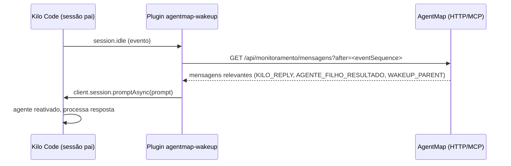

# AgentMap — Gerenciador Local de Agentes de IA

## O que é

Gerenciador local para Windows, Linux e macOS que organiza projetos, agentes, contratos, tarefas,
contexto, conhecimento e governança através de arquivos reais no sistema de arquivos.

O arquivo é a informação principal. PostgreSQL é opcional (não implementado no momento; apenas pasta para futura expansão).

## Princípios

- O gerenciador **não executa agentes**, não escolhe modelos, não distribui tarefas.
- Ele entrega contexto correto e registra o que acontece.
- Git é somente leitura (consulta).
- Proteção contra path traversal, validação de JSON, backups automáticos.

## Arquitetura

```
backend/    → Node.js + TypeScript + Express
frontend/   → HTML5 + CSS3 + JavaScript (vanilla ES modules)
banco/      → PostgreSQL opcional (não implementado)
esquemas/   → JSON Schemas de validação
temp/       → Arquivos temporários do projeto (limpeza automática/manual)
```

**Armazenamento operacional:** predominantemente **filesystem + JSON**. Os dados reais do projeto vivem em arquivos dentro de `.ia/`. PostgreSQL, se usado no futuro, será apenas para metadados/índice.

Arquivos temporários são gerenciados pela pasta `temp/`, com limpeza automática por TTL (padrão 7 dias) e botão "🧹 Limpar Temp" na interface web.

## Desenvolvimento

```bash
cd backend
npm install
npm run dev      # inicia backend + frontend na porta 3150
```

Acesse: http://localhost:3150

## Estrutura de pastas de projetos

- Pasta base de projetos: configurável por projeto (caminho absoluto ou relativo)
- Cada projeto recebe sua própria pasta com o **mesmo nome do projeto**
- Exemplo Windows: projeto `PAGINA_PESSOAL` → `G:\PROJETOS\AgenteMap_Projetos\PAGINA_PESSOAL`
- Exemplo Linux/macOS: projeto `PAGINA_PESSOAL` → `~/projetos/agentmap/PAGINA_PESSOAL`

## Estrutura de um projeto gerenciado

Cada projeto recebe uma pasta `.ia/` com a estrutura completa de governança.
Veja: `PLANO GERAL/GERENCIADOR_LOCAL_DE_AGENTES_DE_IA-ESPECIFICACAO_DE_IMPLEMENTACAO.md`

## Regra obrigatória: fluxo e dependências

Novos projetos devem respeitar o fluxo padrão definido em `.ia/fluxo-trabalho.md`.
O planejador deve criar tarefas e dependências explicitamente antes de iniciar implementações.
Agentes devem consultar dependências no início de cada ciclo e só prosseguir quando elas estiverem concluídas.
Sem dependências, tarefas podem executar em paralelo; com dependências, a execução é sequencial.

## Checklist automático de novos projetos

O AgentMap valida automaticamente a estrutura mínima de fluxo ao criar ou abrir um projeto:
- `.ia/fluxo-trabalho.md` obrigatório
- Pastas `.ia/contratos`, `.ia/tarefas`, `.ia/dependencias` obrigatórias
- Pelo menos 1 contrato e 1 tarefa registrados
- Sem dependências circulares

Se o checklist não estiver completo, a criação/abertura do projeto é bloqueada.
Endpoint: `GET /api/projetos/:id/fluxo/checklist`

## Preparação e entrega por agente

Cada agente possui documento de preparação e entrega em `.ia/procedimentos/`:
- `preparacao-<papel>.md` — o que ler e verificar antes de começar
- `entrega-<papel>.md` — o que registrar e entregar depois de terminar

Papéis cobertos:
planejador, backend, banco, frontend, android, infraestrutura, testes, revisor, documentacao, observabilidade, desempenho

## Regra de corporação/equipe

Em projetos com múltiplos agentes:
- O planejador define a ordem e as dependências.
- Cada agente só inicia quando seus pré-requisitos estão prontos.
- O monitoramento é a fonte de verdade para o estado do projeto.
- Bloqueios devem ser registrados no AgentMap, não resolvidos informalmente.
- Handoffs devem ser usados para transferir contexto entre agentes.
- O revisor valida aderência aos contratos antes da documentação final.

## Coordenação entre Agentes

O AgentMap usa eventos assíncronos para coordenação entre agentes. Um agente deve consultar
seus eventos pendentes no início de cada ciclo de trabalho e confirmá-los após processamento.

```json
{
  "name": "agentmap_eventos_pendentes",
  "arguments": {
    "agenteId": "backend"
  }
}
```

Após processar o evento:
```json
{
  "name": "agentmap_eventos_confirmar",
  "arguments": {
    "id": "EVT-2026-00001"
  }
}
```

Eventos são gerados automaticamente como efeito colateral de:
- `agentmap_handoffs_criar` → `HANDOFF_CRIADO`
- `agentmap_handoffs_atualizar` (estado → ACEITO) → `HANDOFF_ACEITO`
- `agentmap_handoffs_atualizar` (estado → CONCLUIDO) → `HANDOFF_CONCLUIDO`
- `agentmap_solicitacoes_criar` (quando há agente responsável) → `SOLICITACAO_CRIADA`

Além dos eventos automáticos, o sistema permite criar eventos customizados via `POST /api/eventos/custom` para casos específicos, debugging ou integrações futuras.

## Integração com Kilo Code / VS Code (2026)

O AgentMap é consumido pelo **Kilo Code** via **MCP** (Model Context Protocol).

- **Transporte:** STDIO local (`npx tsx src/mcp-server/index.ts`)
- **SDK:** `@modelcontextprotocol/sdk` v1.30.0
- **Tools:** 132 tools registradas com `registerTool` / `registerTracedTool`, seguindo o padrão MCP 2026:
  - `outputSchema` + `structuredContent` para dados estruturados
  - `isError: true` para erros de execução
  - Annotations (`readOnlyHint`, `destructiveHint`, etc)
  - Validação de entrada via Zod
  - Tracing e métricas OpenTelemetry via wrapper `registerTracedTool`
  - Inclui `agentmap_monitoramento_verificar_pendentes` para wake-up automático
- **Paralelismo real:** **Agent Manager** (extensão VS Code) cria worktrees isolados por agente
- **VS Code 1.115+:** inclui preview de **Agents app** com sessões paralelas em worktrees

O AgentMap **não executa agentes** e **não depende de CLI `kilo` standalone**. Ele fornece contexto, ferramentas e governança; o paralelismo é responsabilidade do Agent Manager.

### Configuração do Kilo

O arquivo `kilo.jsonc` define a integração com o MCP do AgentMap. O campo `mcp` registra o servidor MCP local (STDIO).

Além do MCP, o `kilo.jsonc` pode registrar um **plugin de wake-up** via chave `"plugin"`:

```json
{
  "plugin": [
    "./.kilo/plugin/agentmap-wakeup.ts"
  ]
}
```

O plugin é carregado pelo processo Kilo Code e implementa o wake-up automático. Veja a seção [Flow de Wake-up](#flow-de-wake-up) abaixo.

### Flow de Wake-up

O plugin `.kilo/plugin/agentmap-wakeup.ts` implementa o acordar automático do agente principal:

1. **Detecção de idle:** o plugin escuta eventos do barramento interno do Kilo (`event` hook) e filtra por `session.idle`. Quando a sessão pai fica ociosa, o plugin ativa.
2. **Polling:** o plugin consulta o AgentMap por novas mensagens de monitoramento — via HTTP (`GET /api/monitoramento/mensagens?after=<eventSequence>`) ou via MCP tool `agentmap_monitoramento_verificar_pendentes` — filtrando tipos relevantes (`KILO_CHAT_REPLY`, `AGENTE_FILHO_RESULTADO`, `WAKEUP_PARENT`).
3. **Injeção:** se houver mensagem relevante, o plugin injeta um prompt na sessão via `client.session.promptAsync()` com `noReply: false`, acordando o agente pai para processar a resposta do filho.



**Características de segurança do plugin:**
- Roda **dentro do processo Kilo Code** (mesmo runtime)
- **Não expõe portas de rede** — consome apenas a API local em `http://localhost:3150`
- **Não utiliza credenciais externas** — autenticação é feita via sessão Kilo existente
- **Não escreve arquivos compartilhados** — comunicação é exclusivamente via HTTP/MCP

### Comunicação AgentMap ↔ Agent Manager

- **Pai → Filho:** envie instruções diretamente pelo prompt do Agent Manager no VS Code.
- **Filho → AgentMap (escrita):** agentes filhos **não possuem tools MCP de escrita**. Eles devem usar **HTTP direto**:
  - `POST http://localhost:3150/api/monitoramento/mensagens`
  - Tipos aceitos: `KILO_CHAT`, `KILO_REPLY`, `KILO_RESULT`, `KILO_CHAT_REPLY`
- **Filho ← AgentMap (leitura):** agentes filhos leem respostas por:
  - HTTP: `GET http://localhost:3150/api/monitoramento/kilo/receive-chat?agenteId=<id>&limite=20`
  - Tool MCP (se disponível): `kilohub_receive_chat_message`

Documentação completa: [`docs/comunicacao-agentmap-kilo.md`](docs/comunicacao-agentmap-kilo.md)

## Segurança

- **CORS:** origins configuradas para desenvolvimento local
- **Path Traversal:** proteção contra path traversal em todos os caminhos de arquivo
- **Validação:** schemas Zod em todas as escritas
- **Observabilidade:** traces e métricas são gerados localmente; em desenvolvimento usa `ConsoleSpanExporter`. Em produção, configure exportação OTLP via `OTEL_EXPORTER_OTLP_TRACES_ENDPOINT`.

## Especificação

- `PLANO GERAL/GERENCIADOR_LOCAL_DE_AGENTES_DE_IA-ESPECIFICACAO_DE_IMPLEMENTACAO.md` — spec autoritativa
- `PLANO GERAL/MODELOS JSON DO GERENCIADOR LOCAL DE PROJETOS PARA AGENTES.md` — schemas JSON
- `PLANO GERAL/GERENCIADOR LOCAL DE PROJETOS PARA AGENTES - IDEIA GERAL AMPLA.md` — visão ampla
- `README.md` — origem do AgentMap
