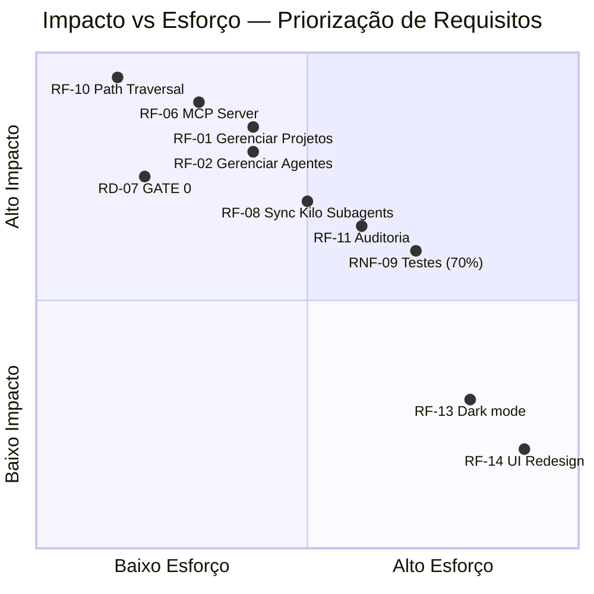
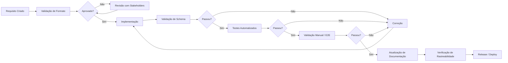
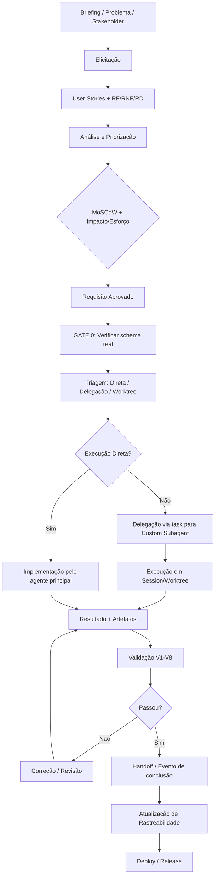

# Estrutura de Elicitação, Análise e Priorização de Requisitos — AgentMap

## Visão Geral

Este documento define o processo de engenharia de requisitos do **AgentMap**, alinhado às restrições do `BRIEFING-7-AGENTES.md`, aos schemas existentes em `esquemas/` e às 131+ tools MCP já implementadas. O objetivo é garantir que novos requisitos sejam eliciados, analisados, priorizados, rastreados e validados sem quebrar o sistema atual.

---

## 1. Processo de Elicitação de Requisitos

### 1.1 Princípios Orientadores

- **Fonte única de verdade**: todo requisito deve ter exatamente um registro canônico.
- **Backward compatibility first**: nenhum requisito pode exigir breaking change sem avaliação de impacto.
- **Reuso antes de criação**: antes de propor novo schema/tool/endpoint, verificar se asset existente já cobre a necessidade.
- **Triagem obrigatória**: requisitos pequenos → execução direta; requisitos especializados → delegação; worktree só quando necessário.

### 1.2 Fontes de Elicitação

| Fonte | Descrição | Artefato de Entrada | Responsável |
|-------|-----------|---------------------|-------------|
| **BRIEFING consolidado** | Contexto arquitetural, restrições, problemas identificados, assets obrigatórios | `BRIEFING-7-AGENTES.md` | Arquiteto / Engenheiro de requisitos |
| **Schemas existentes** | Estrutura de dados já validadas em produção | `esquemas/*.schema.json` | Backend |
| **MCP Tools (131+)** | Capacidades expostas, padrões de tool, erros estruturados | `backend/src/mcp-server/tools/*.ts` | Backend / MCP |
| **Documentação de arquitetura** | Padrões, protocolos, comunicação AgentMap ↔ Kilo | `docs/arquitetura-mcp.md`, `docs/comunicacao-agentmap-kilo.md`, `docs/protocolo-mcp.md` | Arquiteto |
| **Propostas validadas (v0021)** | Decisões arquiteturais já aceitas | `PLANO GERAL/arquivo/v0021/*.md` | Arquiteto |
| **Problemas relatados** | Gaps, dores, bugs não-resolvidos | Issues / `docs/` / `BRIEFING-7-AGENTES.md` (tabela de problemas) | Engenheiro de requisitos |
| **Entrevistas com stakeholders** | Usuários do sistema (desenvolvedores usando AgentMap, agentes filhos, planejadores) | Notas de entrevista, gravações | Engenheiro de requisitos |
| **User Stories** | Necessidades sob perspectiva de quem executa tarefas via AgentMap | US-NN (ver seção 1.3) | Product Owner / Arquiteto |

### 1.3 User Stories

Cada user story deve seguir o formato:

```text
COMO <ator>
EU QUERO <funcionalidade>
PARA <valor de negócio/técnico>

Critérios de Aceitação:
- DADO <contexto>
  QUANDO <ação>
  ENTÃO <resultado esperado>

Restrições:
- <restrição 1>
- <restrição 2>

Referência:
- Schema: esquemas/<schema>.schema.json
- Tool: agentmap_<dominio>_<acao>
- Doc: docs/<doc>.md
```

#### Exemplos aplicados ao AgentMap

**US-001 — Abertura de worktree com agente responsável**
```text
COMO agente planejador
EU QUERO abrir um worktree para uma tarefa já associada a um agente registrado
PARA executar a tarefa em ambiente isolado sem inventar identidade

Critérios de Aceitação:
- DADO uma tarefa TAREFA-ID com agenteResponsavel preenchido
  QUANDO chamo agentmap_abrir_worktree
  ENTÃO o prompt gerado inclui o perfil completo do agente responsável
  E o handoff/evento correspondente é criado

Restrições:
- Não quebrar fluxo existente de abertura de worktree
- Reutilizar KiloAgentGeneratorService para sync do perfil
- Se agente não existe, retornar erro estruturado AGENT_NOT_REGISTERED
```

**US-002 — Triagem antes de delegar**
```text
COMO agente principal
EU QUERO consultar a recomendação de agente antes de decidir delegar
PARA evitar orquestrador paralelo e respeitar triagem obrigatória

Critérios de Aceitação:
- DADO uma tarefa com complexidade média/alta
  QUANDO o agente principal avalia necessidade de delegação
  ENTÃO ele consulta agentmap_recomendar_agente antes de chamar task
  E registra a decisão em .ia/monitoramento/

Restrições:
- Tarefas pequenas continuam sendo executadas diretamente (sem triagem)
- Não criar orquestrador paralelo ao Kilo
```

**US-003 — Sync automática AgentMap → Kilo Custom Subagents**
```text
COMO sistema AgentMap
EU QUERO sincronizar automaticamente perfis de agentes para .kilo/agent/*.md
PARA garantir que a identidade do agente está sempre atualizada no Kilo

Critérios de Aceitação:
- DADO um agente registrado com alteração de perfil
  QUANDO o perfil é atualizado via agentmap_agentes_atualizar
  ENTÃO o KiloAgentGeneratorService é acionado
  E o arquivo .kilo/agent/<id>.md é regerado
```

### 1.4 Técnicas de Elicitação Aplicáveis

| Técnica | Quando Usar | Output |
|---------|-------------|--------|
| **Análise de documentos existentes** | Sempre — primeira linha | Lista de requisitos implícitos e explícitos já presentes |
| **Entrevistas estruturadas** | Novas features, mudanças de escopo | Notas, user stories, matriz de prioridade |
| **Workshops de.Domain** | Novos domínios, agentes novos | glossário, regras de negócio, user stories |
| **Análise de gaps** | Correções, melhorias | Lista de problemas, causas raiz, requisitos de correção |
| **Prototipação** | Features de frontend, fluxos complexos | Mockups, fluxos alternativos, feedback |
| **Observação** | Problemas de usabilidade, workflow real | Anotações, métricas de uso, pain points |

---

## 2. Modelo de Análise de Requisitos

### 2.1 Classificação por Tipo

#### 2.1.1 Requisitos Funcionais (RF)

Descrevem **o que o sistema deve fazer**.

| ID | Nome | Descrição | Categoria | Tool/Schema Relacionado |
|----|------|-----------|-----------|------------------------|
| RF-01 | Gerenciar Projetos | CRUD de projetos com validação de estrutura `.ia/` | Projetos | `agentmap_projetos_*`, `esquemas/projeto.schema.json` |
| RF-02 | Gerenciar Agentes | CRUD de perfis de agentes com permissões e políticas | Agentes | `agentmap_agentes_*`, `esquemas/agente-perfil.schema.json` |
| RF-03 | Gerenciar Tarefas | CRUD de tarefas com dependências, prioridade, estado | Tarefas | `agentmap_tarefas_*`, `esquemas/tarefa.schema.json` |
| RF-04 | Workflow de Handoff | Criar, atualizar, consultar handoffs entre agentes | Handoffs | `agentmap_handoffs_*`, `esquemas/handoff.schema.json` |
| RF-05 | Sistema de Eventos | Publicar, consultar, confirmar eventos assíncronos | Eventos | `agentmap_eventos_*`, `esquemas/evento.schema.json` |
| RF-06 | MCP Server | Expor 131+ tools via stdio JSON-RPC | MCP | `backend/src/mcp-server/index.ts` |
| RF-07 | Wake-up Plugin | Detectar idle, consultar mensagens, injetar prompt | Kilo Integration | `.kilo/plugin/agentmap-wakeup.ts` |
| RF-08 | Sync Kilo Subagents | Gerar `.kilo/agent/*.md` a partir de perfis AgentMap | Kilo Integration | `KiloAgentGeneratorService` |
| RF-09 | Validação de Schemas | Validar JSON via Zod (backend) + AJV (frontend/CLI) | Validação | `esquemas/*.schema.json` |
| RF-10 | Path Traversal Protection | Bloquear acesso fora dos diretórios permitidos | Segurança | `backend/src/arquivos/FileService.ts`, `security/pathValidator.ts` |
| RF-11 | Auditoria | Registrar todas as operações de escrita | Auditoria | `agentmap_auditoria_listar`, `esquemas/evento.schema.json` |
| RF-12 | Monitoramento | Consultar mensagens, verificar pendentes, wake-up | Monitoramento | `agentmap_monitoramento_*`, `kilohub_*` |

#### 2.1.2 Requisitos Não-Funcionais (RNF)

Descrevem **como o sistema deve se comportar**.

| ID | Nome | Descrição | Categoria | Métrica / Critério |
|----|------|-----------|-----------|---------------------|
| RNF-01 | Backward Compatibility | Nenhuma mudança pode quebrar clientes existentes | Compatibilidade | Sem breaking changes em schemas/tools sem versionamento |
| RNF-02 | Performance | Tools MCP devem responder em < 500ms (p95) | Performance | Medido via OpenTelemetry traces |
| RNF-03 | Disponibilidade | Servidor HTTP deve estar disponível em dev/homolog/prod | Disponibilidade | Uptime > 99% em homolog/prod |
| RNF-04 | Segurança | Path traversal bloqueado, CORS restrito, sem secrets em logs | Segurança | Audit via `security/pathValidator.ts` |
| RNF-05 | Observabilidade | Traces e métricas OpenTelemetry em todas as tools | Observabilidade | ConsoleSpanExporter em dev; OTLP em prod |
| RNF-06 | Manutenibilidade | Código seguindo convenções, modules coesos | Manutenibilidade | Lint + Typecheck passing |
| RNF-07 | Escalabilidade | Suportar múltiplos worktrees/agentes simultâneos | Escalabilidade | Validado com 6 agentes em paralelo (2026-08-18) |
| RNF-08 | Documentação | ADRs, API reference, guias atualizados | Documentação | Cobertura de todas as tools e fluxos principais |
| RNF-09 | Testabilidade | Cobertura mínima 70%, testes automatizados | Testes | Unit + Integration + E2E (Playwright) |
| RNF-10 | Reuso | Aproveitar assets existentes antes de criar novos | Reuso | Critério de avaliação: 20% peso |

#### 2.1.3 Requisitos de Domínio

Descrevem **regras de negócio e restrições específicas do domínio de agentes de IA**.

| ID | Nome | Descrição | Fonte | Regra Associada |
|----|------|-----------|-------|-----------------|
| RD-01 | Separação conceitual Agent/Session/Worktree | Agent (persistente) ≠ Session (efêmera) ≠ Worktree (ambiente físico) | BRIEFING Regra 5 | Traduzida em validações nos schemas e fluxos |
| RD-02 | Fonte da verdade AgentMap Registry | Nenhuma identidade de agente é inventada; toda vem do AgentMap | BRIEFING Regra 6 | `AGENT_NOT_REGISTERED` como erro estruturado |
| RD-03 | AGENTS.md ≠ Registry | AGENTS.md armazena regras gerais, não identidade de agentes | BRIEFING Regra 7 | Validação no `KiloAgentGeneratorService` |
| RD-04 | Triagem obrigatória | Tarefas pequenas → execução direta; especializadas → delegação | BRIEFING Regra 9 | Adicionar no fluxo de worktree |
| RD-05 | Eventos fecham o loop | TASK_COMPLETED → watcher → wake principal | BRIEFING Regra 9 | EventBus + plugin wake-up |
| RD-06 | Nada é inventado | Se agente não existe, erro estruturado; sem criação automática | BRIEFING Regra 5 | Gate antes de abrir worktree |
| RD-07 | GATE 0 primeiro | Verificar schema real do `agent_manager` antes de assumir campos | BRIEFING Regra 10 | Processo de descoberta antes de implementar |
| RD-08 | Estrutura mínima de projeto | `.ia/fluxo-trabalho.md`, `.ia/contratos/`, `.ia/tarefas/`, `.ia/dependencias/` obrigatórios | AGENTS.md | `GET /api/projetos/:id/fluxo/checklist` |
| RD-09 | Workflow de governança | Planejador cria tarefas e dependências antes de implementações | AGENTS.md | `agentmap_tarefas_criar`, `agentmap_dependencias_criar` |
| RD-10 | Handoff como transferência de contexto | Agentes transferem contexto via handoff, não informalmente | AGENTS.md | `agentmap_handoffs_criar` |

---

## 3. Framework de Priorização

### 3.1 MoSCoW

Cada requisito é classificado em uma das categorias:

| Categoria | Significado | Regra de Negócio |
|-----------|-------------|------------------|
| **Must Have** | Imprescindível para release; sem ele o sistema não funciona | Máximo 40% dos requisitos da release |
| **Should Have** | Importante, mas o sistema funciona sem ele por prazo limitado | Máximo 30% |
| **Could Have** | Desejável, melhora experiência, mas não bloqueia | Máximo 20% |
| **Won't Have** | Fora do escopo da release atual; documentado para futuro | Restante |

#### Aplicação ao AgentMap (exemplos)

| ID | Nome | MoSCoW | Justificativa |
|----|------|--------|---------------|
| RF-01 | Gerenciar Projetos | Must | Core do sistema |
| RF-06 | MCP Server | Must | Camada de acesso padrão |
| RF-10 | Path Traversal Protection | Must | Segurança, bloqueia release se ausente |
| RF-02 | Gerenciar Agentes | Must | Core do sistema |
| RF-11 | Auditoria | Should | Importante para governança |
| RF-08 | Sync Kilo Subagents | Should | Corrige problema identificado (sync automática) |
| RF-13 | Dark mode frontend | Could | Melhora UX, não bloqueia funcionalidade |
| RD-07 | GATE 0 primeiro | Must | Evita suposições erradas de schema |
| RNF-04 | Segurança | Must | CORS, path traversal, validação Zod |

### 3.2 Impacto vs Esforço

Matriz 2×2 para priorização adicional:



**Regras de decisão**:
- **Alto impacto / Baixo esforço** → Implementar primeiro (quick wins)
- **Alto impacto / Alto esforço** → Planejar como epics, quebrar em sprints
- **Baixo impacto / Baixo esforço** → Backlog, executar se sobrar tempo
- **Baixo impacto / Alto esforço** → Não implementar (Won't Have)

---

## 4. Rastreabilidade de Requisitos

### 4.1 Modelo de Rastreabilidade

Cada requisito deve ser rastreável através de:

```
REQUISITO (RF / RNF / RD / US)
    │
    ├──▶ SCHEMA (esquemas/*.schema.json)
    ├──▶ TOOL (backend/src/mcp-server/tools/*.ts)
    ├──▶ TESTE (e2e/, backend/src/__tests__/)
    ├──▶ DOCUMENTAÇÃO (docs/*.md)
    ├──▶ ADR (PLANO GERAL/arquivo/ADRs/*.md)
    └──▶ TAREFA (agentmap_tarefas_criar — se originado de trabalho)
```

### 4.2 Formato de Registro

Cada requisito é registrado em `PLANO GERAL/arquivo/requisitos/REQ-<NN>-<tipo>.md`:

```markdown
# REQ-<NN>: <Título Curto>

- **ID**: REQ-<NN>
- **Tipo**: RF | RNF | RD | US
- **MoSCoW**: Must | Should | Could | Won't
- **Impacto**: Alto | Médio | Baixo
- **Esforço**: Alto | Médio | Baixo
- **Status**: Rascunho | Aprovado | Em Implementação | Concluído | Rejeitado
- **Solicitado por**: <nome/data>
- **Aprovado por**: <nome/data>
- **Data de aprovação**: <YYYY-MM-DD>

## Descrição

<descrição completa>

## Critérios de Aceitação

- [ ] Critério 1
- [ ] Critério 2

## Rastreabilidade

- **Schema**: `esquemas/<schema>.schema.json` (linha X)
- **Tool**: `agentmap_<dominio>_<acao>` (linha Y)
- **Teste**: `e2e/<feature>.spec.ts` (linha Z)
- **Documentação**: `docs/<doc>.md` (linha W)
- **ADR**: `PLANO GERAL/arquivo/ADRs/ADR-<NN>.md`

## Dependências

- Depende de: REQ-<MM>
- Bloqueia: REQ-<KK>

## Notas

<notas adicionais, riscos, decisões>
```

### 4.3 Matriz de Rastreabilidade consolidada

| Req ID | Schema | Tool | Teste | Doc | ADR | Tarefa ID |
|--------|--------|------|-------|-----|-----|-----------|
| RF-01 | projeto.schema.json | agentmap_projetos_* | e2e/projetos.spec.ts | api-reference.md | ADR-001 | TAR-001 |
| RF-02 | agente-perfil.schema.json | agentmap_agentes_* | e2e/agentes.spec.ts | api-reference.md | ADR-002 | TAR-002 |
| RD-07 | (processo) | (gate) | e2e/gate0.spec.ts | comunicacao-agentmap-kilo.md | ADR-010 | TAR-010 |

### 4.4 Ferramentas de Rastreabilidade

- **Primária**: Arquivos Markdown versionados no Git (`PLANO GERAL/arquivo/requisitos/`)
- **Secundária**: MCP tools `agentmap_auditoria_listar` para consultar histórico de alterações
- **Consulta**: `agentmap_buscar_referencias` para localizar símbolos nos arquivos do projeto

---

## 5. Processo de Validação e Verificação

### 5.1 Pipeline de Validação



### 5.2 Níveis de Verificação

| Nível | Descrição | Responsável | Critério de Passagem |
|-------|-----------|-------------|---------------------|
| **V1 — Validação de Formato** | Verifica se o requisito está no formato correto (ID, tipo, campos obrigatórios) | Engenheiro de Requisitos | 100% dos campos preenchidos, ID único |
| **V2 — Validação de Schema** | Valida JSON gerado contra schemas existentes | Backend (Zod) + Frontend (AJV) | `zod.parse()` sem erros; AJV valid sem erros |
| **V3 — Validação de Backward Compatibility** | Verifica se mudanças quebram clientes existentes | Backend / Arquiteto | Nenhuma tool/schema removida sem versionamento |
| **V4 — Testes Unitários** | Testam unidades isoladas (serviços, validadores) | Backend | Cobertura mínima 70% (já definida) |
| **V5 — Testes de Integração** | Testam integração entre camadas (API + services + filesystem) | Backend | Todos os fluxos críticos cobertos |
| **V6 — Testes E2E** | Testam fluxos completos via MCP tools + frontend | QA / Backend | Playwright passing; cenários críticos automatizados |
| **V7 — Validação Manual** | Verificação humana de fluxos complexos ou visuais | Product Owner / Arquiteto | Checklist aprovado |
| **V8 — Verificação de Rastreabilidade** | Confirma que todos os links (schema, tool, doc, ADR) estão atualizados | Engenheiro de Requisitos | Matriz de rastreabilidade 100% completa |

### 5.3 Critérios de Aceitação por Categoria

#### Requisitos Funcionais

```text
V1: Formato correto (ID, tipo, campos)
V2: Schema válido
V4: Testes unitários cobrindo a lógica
V5: Testes de integração cobrindo o fluxo
V6: E2E cobrindo o cenário de uso
V8: Rastreabilidade completa
```

#### Requisitos Não-Funcionais

```text
V1: Formato correto (métrica, critério de medição)
V4: Testes de carga/performance quando aplicável (OpenTelemetry)
V5: Monitoramento em homologação
V6: Validação em ambiente real
V8: Rastreabilidade para ADR correspondente
```

#### Requisitos de Domínio

```text
V1: Formato correto (regra, fonte, restrição)
V2: Validação via schemas e policies existentes
V3: Backward compatibility (regras não podem quebrar fluxos existentes)
V4: Testes de regra de negócio
V6: Validação com usuários reais (stakeholders)
V8: Rastreabilidade para BRIEFING e ADR
```

### 5.4 Checklist de Validação

Antes de considerar um requisito **aprovado para implementação**:

```text
[ ] REQ-XXX segue formato definido em 4.2
[ ] MoSCoW classificado e justificado
[ ] Impacto vs Esforço avaliado
[ ] Dependências identificadas (não há bloqueios não-resolvidos)
[ ] Schema correspondente existe ou foi proposto
[ ] Tool correspondente existe ou foi proposta
[ ] Critérios de aceitação definidos
[ ] Testes planejados (unit, integration, e2e)
[ ] Backward compatibility verificada
[ ] Riscos identificados e mitigações propostas
[ ] Stakeholders consultados (entrevista ou async review)
[ ] Aprovado por revisor técnico
```

Antes de considerar uma implementação **concluída**:

```text
[ ] Código revisado (code review)
[ ] Lint passing
[ ] Typecheck passing
[ ] Testes automatizados passing (unit + integration + e2e)
[ ] Cobertura mínima 70% mantida/aumentada
[ ] Schema validado (Zod/AJV)
[ ] Documentação atualizada (docs/*.md, ADR se aplicável)
[ ] Matriz de rastreabilidade atualizada
[ ] Backward compatibility preservada
[ ] Nenhum segredo exposto em logs/código
[ ] Deploy em homologação validado
```

### 5.5 Papéis e Responsabilidades na Validação

| Papel | Responsabilidade |
|-------|-----------------|
| **Engenheiro de Requisitos** | Elabora requisitos, mantém rastreabilidade, valida formato (V1) |
| **Arquiteto** | Aprova RF/RNF/RD, valida backward compatibility (V3), escreve ADRs |
| **Backend** | Implementa tools/services, valida schemas (V2), escreve testes (V4, V5) |
| **QA / Frontend** | Executa testes E2E (V6), validação manual (V7) |
| **Product Owner / Stakeholder** | Aprova user stories, validação manual (V7) |
| **Revisor Técnico** | Code review, validação final antes de merge |

---

## 6. Integração com o Ciclo de Vida do AgentMap

### 6.1 Fluxo Consolidado



### 6.2 Reuso de Assets Existentes

| Asset | Reuso no Processo |
|-------|-------------------|
| `esquemas/*.schema.json` | Base para RF e validação (V2) |
| `backend/src/mcp-server/tools/*.ts` | Implementação de RF |
| `docs/arquitetura-mcp.md` | Referência para RF de MCP |
| `docs/comunicacao-agentmap-kilo.md` | Referência para RD de integração Kilo |
| `KiloAgentGeneratorService` | Implementação de RF-08 (sync subagents) |
| `PLANO GERAL/arquivo/v0021/*.md` | Decisões arquiteturais validadas (ADR base) |
| `BRIEFING-7-AGENTES.md` | Fonte de requisitos, restrições e problemas |

---

## 7. Glossário

| Termo | Definição |
|-------|-----------|
| **AgentMap** | Gerenciador local de agentes de IA; fonte da verdade para identidade, contratos, tarefas e governança |
| **Kilo Code** | IDE/ambiente que consome AgentMap via MCP; executa agentes via Custom Subagents + task |
| **Custom Subagent** | Agente definido em `.kilo/agent/*.md`, consumido via `task` tool pelo agente principal |
| **Agent Manager** | Extensão VS Code que cria worktrees isolados para sessões de agente |
| **Worktree** | Diretório Git separado; ambiente físico de execução, não identidade do agente |
| **Session** | Instância efêmera de execução de um agente |
| **MCP** | Model Context Protocol; camada de acesso padrão do AgentMap |
| **Tool** | Função exposta via MCP; 131+ tools no AgentMap |
| **Schema** | JSON Schema (AJV/Zod) que valida estruturas de dados |
| **ADR** | Architecture Decision Record; documento que registra decisões arquiteturais |
| **MoSCoW** | Framework de priorização: Must, Should, Could, Won't |
| **GATE 0** | Verificação obrigatória do schema real antes de implementar |

---

## 8. Referências

- `BRIEFING-7-AGENTES.md` — Contexto, restrições, assets obrigatórios, problemas identificados
- `esquemas/*.schema.json` — Schemas de validação existentes
- `docs/arquitetura-mcp.md` — Arquitetura MCP do AgentMap
- `docs/comunicacao-agentmap-kilo.md` — Integração AgentMap ↔ Kilo Code
- `docs/protocolo-mcp.md` — Protocolo MCP
- `PLANO GERAL/arquivo/v0021/*.md` — 5 propostas arquiteturais validadas
- `AGENTS.md` — Regras gerais do projeto AgentMap
- `PLANO GERAL/GERENCIADOR_LOCAL_DE_AGENTES_DE_IA-ESPECIFICACAO_DE_IMPLEMENTACAO.md` — Especificação autoritativa
