<div align="center">

# 🗺️ AgentMap

**Sistema local de coordenação, memória operacional e rastreabilidade para projetos desenvolvidos por múltiplos agentes de IA.**

[](./LICENSE)
[]()
[]()
[]()
[]()

</div>

---

## 📚 Sumário

- [Visão geral](#-visão-geral)
- [Objetivo](#-objetivo)
- [Conceito central](#-conceito-central)
- [Arquitetura](#-arquitetura)
- [MCP](#-mcp)
- [Agentes](#-agentes)
- [Ciclo operacional do agente](#-ciclo-operacional-do-agente)
- [Tarefas](#-tarefas)
- [Solicitações de alteração](#-solicitações-de-alteração)
- [Contratos](#-contratos)
- [Decisões](#-decisões)
- [Dependências](#-dependências)
- [Reservas](#-reservas)
- [Bloqueios](#-bloqueios)
- [Conflitos](#-conflitos)
- [Handoffs](#-handoffs)
- [Resultados](#-resultados)
- [Validação](#-validação)
- [Checkpoints](#-checkpoints)
- [Riscos](#-riscos)
- [Histórico e rastreabilidade](#-histórico-e-rastreabilidade)
- [Interface Web](#-interface-web)
- [Autenticação e acesso](#-autenticação-e-acesso)
- [Eventos](#-eventos)
- [MCP Resource Subscriptions](#-mcp-resource-subscriptions)
- [Como usar](#-como-usar)
- [Estrutura de projetos gerenciados](#-estrutura-de-projetos-gerenciados)
- [Organização do repositório](#-organização-do-repositório)
- [Integração com Kilo Code](#-integração-com-kilo-code)
- [Segurança](#-segurança)
- [Git](#-git)
- [Princípios arquiteturais](#-princípios-arquiteturais)
- [Estado do projeto](#-estado-do-projeto)
- [Evolução futura](#-evolução-futura)
- [Filosofia](#-filosofia)
- [Licença](#-licença)

---

## 🔎 Visão geral

O **AgentMap** é um sistema local criado para permitir que múltiplos agentes de Inteligência Artificial trabalhem de forma coordenada sobre o mesmo projeto.

Compatível com **Windows**, **Linux** e **macOS**.

O AgentMap funciona como uma **memória operacional compartilhada e uma camada de coordenação do projeto**, permitindo que os agentes consultem, registrem e atualizem informações estruturadas sobre o trabalho em andamento.

> A comunicação operacional não depende de conversas diretas entre agentes. Cada agente pode consultar o estado do projeto, executar sua tarefa, registrar resultados e deixar informações estruturadas para os próximos agentes.

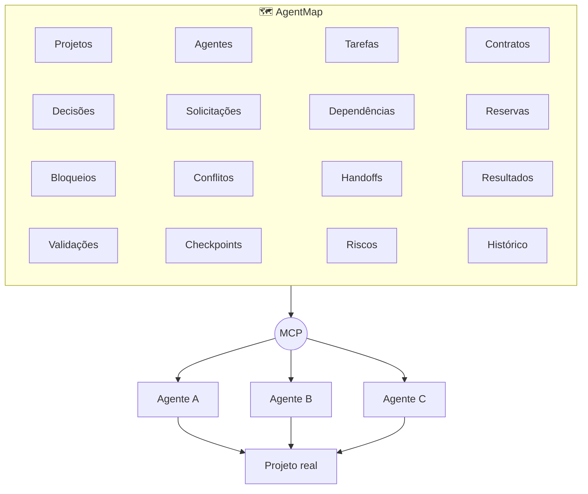

---

## 🎯 Objetivo

O AgentMap foi desenvolvido para resolver um problema comum em ambientes multiagente:

> **Como fazer agentes diferentes trabalharem sobre o mesmo projeto sem perder contexto, decisões, responsabilidades, dependências e histórico?**

Para isso, o sistema centraliza as informações operacionais do projeto. Os agentes podem descobrir:

| | | |
|---|---|---|
| ✅ Tarefas existentes | ✅ Tarefas pendentes | ✅ Tarefas concluídas |
| ✅ Alterações solicitadas | ✅ Contratos existentes | ✅ Decisões tomadas |
| ✅ Recursos em uso | ✅ Dependências existentes | ✅ Agentes responsáveis |
| ✅ Bloqueios existentes | ✅ Conflitos identificados | ✅ Resultados produzidos |
| ✅ Trabalhos a validar | ✅ Informações de agentes anteriores | |

---

## 🧠 Conceito central

O AgentMap não foi projetado como um simples sistema de mensagens entre agentes. A comunicação acontece através do **estado estruturado do projeto**.

<table>
<tr>
<th align="center">❌ Modelo tradicional</th>
<th align="center">✅ Modelo AgentMap</th>
</tr>
<tr>
<td>

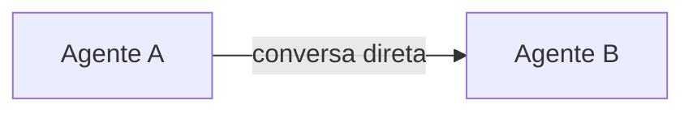

</td>
<td>

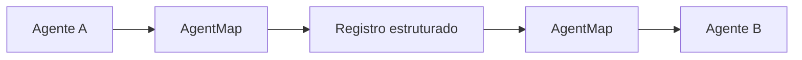

</td>
</tr>
</table>

Isso permite que os agentes trabalhem de forma **desacoplada**: um agente pode terminar seu trabalho e outro pode continuar posteriormente, sem depender da memória da conversa anterior.

---

## 🏗️ Arquitetura

O AgentMap é dividido conceitualmente em três camadas principais:

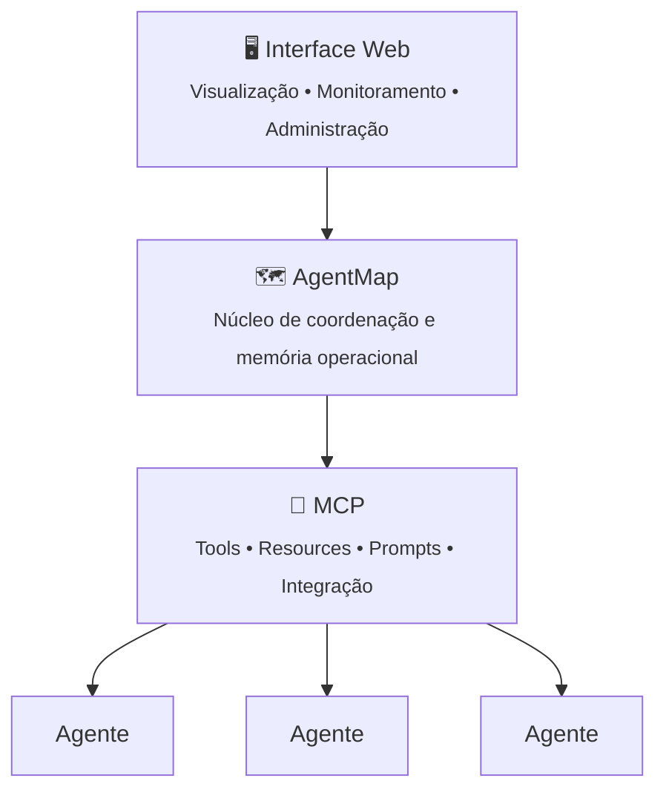

- O **AgentMap** permanece como autoridade sobre o estado operacional do projeto.
- O **MCP** funciona como camada de integração entre os agentes e o AgentMap.
- A **interface Web** funciona como camada de visualização, monitoramento e administração.

---

## 🔌 MCP

O **Model Context Protocol (MCP)** fornece a camada padronizada de comunicação entre os agentes e o AgentMap. O MCP **não** funciona como uma segunda fonte de verdade.

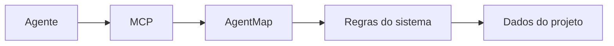

Isso permite que diferentes clientes e agentes utilizem o mesmo núcleo operacional. A arquitetura também permite que novos clientes sejam adicionados futuramente sem alterar a estrutura conceitual do AgentMap.

---

## 🤖 Agentes

Cada agente possui uma identidade própria dentro do projeto.

<details>
<summary><strong>Exemplo de identidade de agente (JSON)</strong></summary>

```json
{
  "id": "AGT-BACKEND",
  "nome": "Agente Backend",
  "responsabilidades": [
    "API",
    "Java",
    "Spring",
    "Banco de dados"
  ]
}
```

</details>

A identidade do agente permite determinar:

- quem executa uma tarefa;
- quem solicitou uma alteração;
- quem é responsável por uma pendência;
- quem produziu determinado resultado;
- quem realizou determinada ação;
- quem deve validar determinado trabalho.

---

## 🔁 Ciclo operacional do agente

O AgentMap estabelece um fluxo operacional para os agentes:

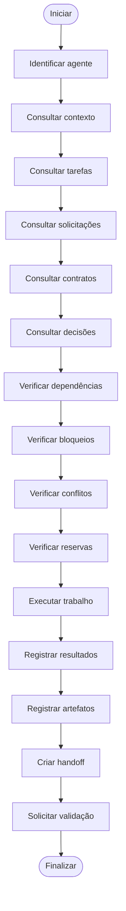

Esse processo permite que cada agente tenha acesso ao contexto necessário antes de modificar o projeto.

---

## ✅ Tarefas

As tarefas representam unidades de trabalho do projeto. Cada tarefa pode possuir:

| Campo | Campo | Campo |
|---|---|---|
| Identificação | Título | Descrição |
| Agente responsável | Prioridade | Status |
| Dependências | Artefatos | Critérios de conclusão |
| Resultados | Validação | Histórico |

As tarefas formam uma das principais estruturas de coordenação entre os agentes.

---

## 🔄 Solicitações de alteração

O AgentMap possui um sistema estruturado de **Solicitações de Alteração**, que permite que um agente registre uma alteração necessária que afete outro agente, domínio ou recurso compartilhado.

<details>
<summary><strong>Exemplo de solicitação de alteração (JSON)</strong></summary>

```json
{
  "id": "ALT-2026-00001",
  "titulo": "Adicionar campo status ao contrato",
  "descricao": "O contrato da API precisa disponibilizar o estado atual do contrato.",

  "agenteSolicitante": {
    "id": "AGT-FRONTEND"
  },

  "agenteResponsavel": {
    "id": "AGT-BACKEND"
  },

  "alvo": {
    "tipo": "CONTRATO_API",
    "nome": "Contrato de cliente",
    "identificador": "cliente-resposta"
  },

  "alteracao": {
    "tipo": "ADICAO",
    "descricao": "Adicionar o campo status ao contrato de resposta.",
    "motivo": "O frontend precisa receber o estado atual do contrato.",
    "arquivosAfetados": [
      "ContratoRespostaDTO.java",
      "cliente-resposta.json"
    ]
  },

  "impactos": [
    "BACKEND",
    "FRONTEND",
    "API"
  ],

  "prioridade": "MEDIA",
  "status": "PENDENTE",
  "requerAprovacao": true,

  "aprovacao": {
    "status": "PENDENTE",
    "agenteId": null,
    "data": null,
    "observacao": null
  }
}
```

</details>

O agente responsável consulta as solicitações destinadas a ele durante seu ciclo de trabalho, evitando alterações silenciosas em recursos compartilhados.

---

## 📄 Contratos

Contratos representam estruturas compartilhadas entre diferentes partes do sistema, como:

`Contratos de API` · `DTOs` · `Estruturas JSON` · `Interfaces` · `Eventos` · `Modelos compartilhados` · `Estruturas de banco` · `Integrações`

Antes de alterar um recurso compartilhado, o agente deve verificar o contrato vigente e suas dependências.

---

## 🧭 Decisões

Decisões importantes do projeto são registradas para evitar que agentes diferentes adotem soluções incompatíveis. Uma decisão pode registrar:

`Identificação` · `Contexto` · `Problema` · `Decisão tomada` · `Justificativa` · `Impactos` · `Agentes envolvidos` · `Data` · `Status`

Dessa forma, uma decisão importante deixa de depender da memória de uma única sessão de IA.

---

## 🔗 Dependências

O AgentMap permite registrar dependências entre tarefas, agentes, módulos, contratos, recursos e etapas de desenvolvimento.

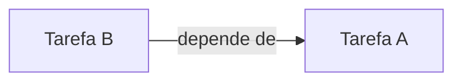

Um agente pode verificar suas dependências antes de iniciar uma tarefa.

---

## 🔒 Reservas

As reservas representam a intenção de um agente trabalhar sobre determinado recurso.

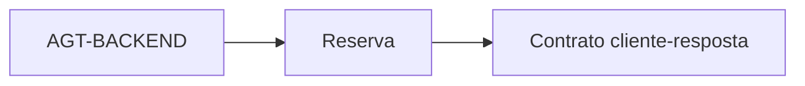

Outro agente pode consultar a reserva antes de modificar o mesmo recurso. As reservas são mecanismos de **coordenação lógica** — elas não substituem o Git e não representam bloqueio físico do arquivo.

---

## 🚧 Bloqueios

Quando um agente não consegue continuar, pode registrar um bloqueio.

> **Tarefa:** Implementar integração com API
> **Bloqueio:** Contrato da API ainda não foi aprovado.
> **Responsável:** `AGT-BACKEND`
> **Impacto:** Implementação não pode ser finalizada.

Isso permite que outros agentes descubram por que determinada tarefa não está avançando.

---

## ⚠️ Conflitos

Conflitos podem ocorrer entre agentes, tarefas, contratos, decisões, alterações, dependências e recursos.

O AgentMap registra esses conflitos para torná-los explícitos e rastreáveis. O sistema não depende de conversas informais para comunicar problemas entre agentes.

---

## 🤝 Handoffs

O **Handoff** permite transferir contexto operacional de um agente para outro. Um agente pode registrar:

`Trabalho realizado` · `Trabalho pendente` · `Arquivos modificados` · `Decisões tomadas` · `Problemas encontrados` · `Riscos` · `Próximos passos` · `Agente recomendado para continuidade`

Assim, outro agente pode assumir o trabalho sem depender da memória do agente anterior.

---

## 📦 Resultados

Ao concluir uma tarefa, o agente registra o resultado produzido, contendo:

`Descrição` · `Arquivos modificados` · `Recursos criados` · `Decisões tomadas` · `Testes realizados` · `Limitações` · `Pendências` · `Observações`

Isso cria rastreabilidade entre tarefa e resultado.

---

## 🔍 Validação

Uma tarefa concluída não é automaticamente considerada validada.

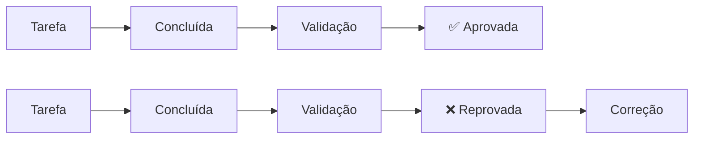

Isso permite separar claramente **quem implementou**, **quem revisou** e **quem aprovou**.

---

## 💾 Checkpoints

Checkpoints permitem registrar o estado intermediário de um trabalho, especialmente importantes para trabalhos longos ou interrompidos. Um checkpoint pode registrar:

`Estado atual` · `Progresso` · `Arquivos alterados` · `Decisões` · `Problemas` · `Próximos passos`

Isso facilita a recuperação do trabalho.

---

## ⚡ Riscos

Riscos identificados durante o desenvolvimento podem ser registrados no AgentMap, como:

`Alteração incompatível` · `Dependência externa` · `Risco de regressão` · `Contrato indefinido` · `Conflito arquitetural` · `Recurso compartilhado` · `Problema de segurança`

O registro permite acompanhar o risco até sua resolução.

---

## 🕓 Histórico e rastreabilidade

O AgentMap mantém informações necessárias para reconstruir o histórico operacional do projeto. Quando aplicável, registros podem estar associados a:

```text
projetoId · agenteId · sessaoId · tarefaId · correlationId · requestId · timestamp
```

Isso permite identificar quem realizou uma ação, quando, em qual contexto, sobre qual tarefa e qual resultado foi produzido.

---

## 🖥️ Interface Web

O AgentMap possui uma interface Web local para visualizar e administrar o estado do projeto, permitindo acompanhar:

`Projetos` · `Agentes` · `Tarefas` · `Solicitações` · `Contratos` · `Decisões` · `Dependências` · `Reservas` · `Bloqueios` · `Conflitos` · `Handoffs` · `Resultados` · `Validações` · `Checkpoints` · `Riscos` · `Histórico`

O desenvolvedor pode acompanhar o trabalho dos agentes através do navegador local, sem depender da interface do próprio agente.

---

## 🔐 Autenticação e acesso

Todas as requisições à API devem incluir a chave de API no header `x-api-key`.

A chave é gerada automaticamente na primeira execução e armazenada em `backend/.local/.api-key`.

**Obter a chave atual:**
```bash
curl http://localhost:3150/api/auth/key
```

**Verificar se uma chave é válida:**
```bash
curl -X POST http://localhost:3150/api/auth/verify \
  -H "Content-Type: application/json" \
  -d '{"apiKey":"sua-chave-aqui"}'
```

> O middleware **CSRF** está ativo para métodos não-GET, validando `Origin` e `Referer`. O **CORS** está configurado para permitir origens locais de desenvolvimento, incluindo `http://localhost:3150`.

---

## 📡 Eventos

O AgentMap registra eventos assíncronos para coordenação entre agentes. Além dos eventos automáticos gerados por ações como handoffs e solicitações, o sistema oferece:

| Endpoint | Descrição |
|---|---|
| `POST /api/eventos` | Cria eventos do sistema com validação rigorosa de schema |
| `POST /api/eventos/custom` | Cria eventos genéricos/flexíveis para casos específicos, debugging ou integrações futuras |

<details>
<summary><strong>Exemplo de evento custom (JSON)</strong></summary>

```json
{
  "tipo": "MEU_EVENTO_CUSTOM",
  "origem": "backend",
  "destino": "frontend",
  "mensagem": "Integração pronta para teste",
  "campoExtra": "valor"
}
```

</details>

## 📡 MCP Resource Subscriptions

O AgentMap suporta **subscrições de recursos MCP** para notificações em tempo real entre agentes. Isso elimina a necessidade de polling manual por mudanças em solicitações, handoffs e bloqueios.

### Recursos assináveis

| URI | Descrição |
|---|---|
| `agentmap://solicitacoes/{agenteId}` | Solicitações de alteração destinadas a um agente |
| `agentmap://handoffs/{agenteId}` | Handoffs pendentes para um agente |
| `agentmap://bloqueios/{projetoId}` | Bloqueios ativos do projeto |

### Modos de subscrição

#### 2025 — `resources/subscribe`

```json
{
  "jsonrpc": "2.0",
  "id": 1,
  "method": "resources/subscribe",
  "params": {
    "uri": "agentmap://solicitacoes/AGT-BACKEND"
  }
}
```

#### 2026 — `subscriptions/listen`

```json
{
  "jsonrpc": "2.0",
  "id": 1,
  "method": "subscriptions/listen",
  "params": {
    "notifications": {
      "resourceSubscriptions": [
        "agentmap://solicitacoes/AGT-BACKEND"
      ]
    }
  }
}
```

### Fluxo de subscrição

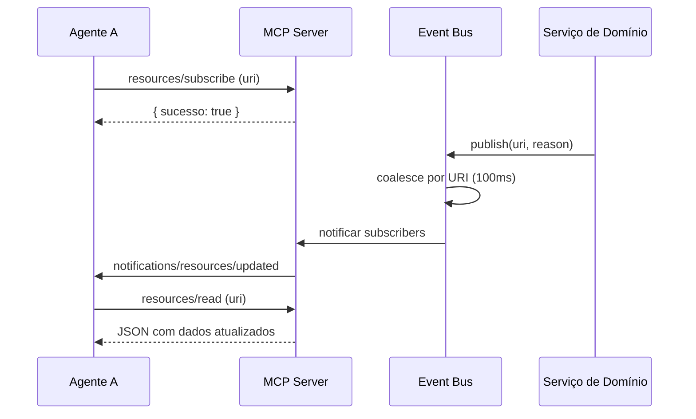

### Notificações 2026

No modo 2026, o servidor envia `notifications/subscriptions/acknowledged` e usa `_meta["io.modelcontextprotocol/subscriptionId"]` para identificar a subscription. O cliente deve re-listar após reconexão stdio; o servidor não mantém estado de subscription entre reconexões.

### Características

- **Capabilities anunciadas:** `resources.subscribe: true` e `resources.listChanged: true`
- **Subscrições por session:** cada processo stdio MCP mantém suas próprias subscrições isoladas
- **Autorização centralizada:** `authorizeResourceAccess()` valida acesso antes de inscrever ou ler
- **Coalescência:** bursts de mudanças são agrupados em 1 notificação por URI (janela de 100ms)
- **Limpeza automática:** subscrições são removidas no disconnect da sessão
- **Graceful shutdown:** streams 2026 recebem resultado vazio antes do fechamento

### Exemplo de uso (2025)

```json
{
  "jsonrpc": "2.0",
  "id": 1,
  "method": "resources/subscribe",
  "params": {
    "uri": "agentmap://solicitacoes/AGT-BACKEND"
  }
}
```

```json
{
  "jsonrpc": "2.0",
  "method": "notifications/resources/updated",
  "params": {
    "uri": "agentmap://solicitacoes/AGT-BACKEND"
  }
}
```

```json
{
  "jsonrpc": "2.0",
  "id": 2,
  "method": "resources/read",
  "params": {
    "uri": "agentmap://solicitacoes/AGT-BACKEND"
  }
}
```

```json
{
  "jsonrpc": "2.0",
  "id": 3,
  "method": "resources/unsubscribe",
  "params": {
    "uri": "agentmap://solicitacoes/AGT-BACKEND"
  }
}
```

> **Nota:** URIs usam `encodeURIComponent` para IDs com caracteres especiais. Ex: `agentmap://solicitacoes/AGT%2FBACKEND`.

---

## 🚀 Como usar

### Pré-requisitos

- Node.js 18+
- npm
- Git
- VS Code *(opcional, para integração com Kilo Code / Agent Manager)*

### Instalação

```bash
git clone <url-do-repositorio>
cd AgentMap
cd backend
npm install
```

### Iniciar o sistema

```bash
cd backend
npm run dev
```

Isso inicia:
- Backend + API REST em `http://localhost:3150`
- Frontend (interface web) servido automaticamente
- MCP Server via STDIO (para integração com Kilo Code)

### Acessar

| Recurso | URL |
|---|---|
| 🖥️ Frontend / Dashboard | http://localhost:3150 |
| 🔌 API REST | http://localhost:3150/api |
| 📊 Status | http://localhost:3150/api/status |
| 💓 Health | http://localhost:3150/api/health |
| 🔧 MCP Server (Kilo Code) | `npx tsx src/mcp-server/index.ts` |

### Criar um projeto novo

1. Acesse o frontend em `http://localhost:3150`
2. Clique em **"Novo Projeto"**
3. Preencha nome e pasta destino
4. O scaffold gera automaticamente a estrutura `.ia/` completa

> **Nota:** a pasta base de projetos é configurável. No Windows, o padrão é `G:\PROJETOS\AgenteMap_Projetos\`. Em Linux/macOS, use qualquer caminho como `~/projetos/agentmap/`. Você pode alterar o padrão nas configurações do projeto.

### Integração com Kilo Code / VS Code

1. Abra o projeto no VS Code
2. Verifique se o arquivo `kilo.jsonc` existe na raiz
3. Na extensão Kilo Code, o MCP do AgentMap deve aparecer automaticamente
4. Se não aparecer, recarregue a janela: `Ctrl+Shift+P` → `Developer: Reload Window`

> O AgentMap **não executa agentes**. Ele fornece contexto, ferramentas e governança via MCP. O paralelismo é responsabilidade do Agent Manager (extensão VS Code).

### Fluxo recomendado para agentes

1. Consultar eventos pendentes no início do ciclo
2. Verificar dependências da tarefa atual
3. Ler contratos obrigatórios antes de executar
4. Executar o trabalho respeitando diretórios permitidos
5. Registrar resultado, artefatos e handoff quando necessário
6. Confirmar eventos processados

---

## 📁 Estrutura de projetos gerenciados

- Pasta base de projetos: configurável por projeto (caminho absoluto ou relativo)
- Cada projeto recebe sua própria pasta com o **mesmo nome do projeto**
- Cada projeto gerencia uma pasta `.ia/` com contratos, tarefas, decisões, handoffs e demais entidades do AgentMap

### Regra obrigatória: fluxo e dependências

Novos projetos devem respeitar o fluxo padrão definido em `.ia/fluxo-trabalho.md`. O planejador deve criar tarefas e dependências explicitamente antes de iniciar implementações. Agentes devem consultar dependências no início de cada ciclo e só prosseguir quando elas estiverem concluídas.

> Sem dependências, tarefas podem executar em paralelo; com dependências, a execução é sequencial.

### Checklist automático de novos projetos

O AgentMap valida automaticamente a estrutura mínima de fluxo ao criar ou abrir um projeto:

- [x] `.ia/fluxo-trabalho.md` obrigatório
- [x] Pastas `.ia/contratos`, `.ia/tarefas`, `.ia/dependencias` obrigatórias
- [x] Pelo menos 1 contrato e 1 tarefa registrados
- [x] Sem dependências circulares

Se o checklist não estiver completo, a criação/abertura do projeto é bloqueada.
**Endpoint:** `GET /api/projetos/:id/fluxo/checklist`

### Coordenação entre agentes

Em projetos com múltiplos agentes:

- O planejador define a ordem e as dependências.
- Cada agente só inicia quando seus pré-requisitos estão prontos.
- O monitoramento é a fonte de verdade para o estado do projeto.
- Bloqueios devem ser registrados no AgentMap, não resolvidos informalmente.
- Handoffs devem ser usados para transferir contexto entre agentes.
- O revisor valida aderência aos contratos antes da documentação final.

---

## 🗂️ Organização do repositório

```text
AgentMap/
├── backend/          # API Node.js + TypeScript + Express + MCP Server
├── frontend/          # Interface web HTML/CSS/JS vanilla
├── .ia/               # Dados do projeto (tarefas, contratos, agentes, handoffs...)
├── esquemas/          # JSON Schemas de validação
├── banco/             # PostgreSQL opcional (não implementado; apenas expansão futura)
├── PLANO GERAL/       # Documentação de planejamento e especificações
├── docs/              # Guias e documentação adicional
├── A FAZER/           # Lista de tarefas pendentes
└── erros/             # Documentação de erros e inconsistências encontradas
```

> **Armazenamento operacional:** predominantemente **filesystem + JSON**. Os dados reais do projeto vivem em arquivos dentro de `.ia/`. PostgreSQL, se usado no futuro, será apenas para metadados/índice.
>
> A estrutura real do repositório deve ser considerada a autoridade.

---

## 🧩 Integração com Kilo Code

O AgentMap foi projetado para funcionar com agentes utilizados através do Kilo Code e de outros clientes compatíveis com MCP.

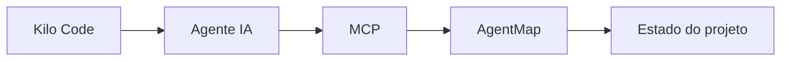

O agente utiliza as ferramentas disponibilizadas pelo MCP para consultar e atualizar o estado operacional. O AgentMap não depende exclusivamente do Kilo Code — outros clientes podem ser integrados posteriormente.

### Configuração do Kilo

O arquivo `kilo.jsonc` define a integração com o MCP do AgentMap.

O campo `data_collection_enabled` controla se dados de uso são coletados pelos provedores. Por padrão, está desabilitado no arquivo `kilo.local.jsonc` (não versionado).

Variáveis de ambiente e configurações locais devem ser definidas em `kilo.local.jsonc`, que é ignorado pelo Git.

### Padrões MCP 2026

O AgentMap segue as melhores práticas do ecossistema MCP em 2026:

- **124 tools MCP** registradas com `registerTool` do SDK `@modelcontextprotocol/sdk` v1.30.0
- **Transporte STDIO** local (sem exposição de rede)
- **`outputSchema` + `structuredContent`** para resultados estruturados
- **Validação de entrada** via Zod em todas as tools
- **Anotações** (`readOnly`, `destructive`, `idempotent`) para orientar o cliente
- **Erros via `isError: true`** com mensagens acionáveis para auto-correção do modelo
- **Subscriptions dual-era:** `resources/subscribe` (2025) e `subscriptions/listen` (2026-07-28) coexistem; o servidor roteia automaticamente conforme a versão do protocolo anunciada no `initialize`
- **Graceful shutdown:** streams `subscriptions/listen` são encerrados com resultado vazio antes do fechamento do transporte

### Ecossistema Kilo Code / VS Code 2026

- **Kilo Code** é a camada de IDE/CLI que consome o MCP do AgentMap
- **Agent Manager** é o painel de paralelismo real: worktrees isolados por agente
- **VS Code 1.115+** inclui preview de **Agents app** com sessões paralelas em worktrees
- **Worktree isolation** é o padrão do mercado para agentes paralelos (Cursor, Windsurf, Claude Code, Copilot)
- O AgentMap **não depende de CLI `kilo` standalone**; o paralelismo é via Agent Manager

---

## 🛡️ Segurança

O sistema foi projetado com segurança desde sua concepção. Entre os princípios adotados estão:

| | |
|---|---|
| ✅ Validação de entradas | ✅ Controle de permissões |
| ✅ Isolamento do workspace | ✅ Proteção contra path traversal |
| ✅ Controle das operações disponíveis | ✅ Validação das operações de escrita |
| ✅ Logs | ✅ Proteção de informações sensíveis |
| ✅ Ausência de credenciais no código | ✅ Controle de acesso às ferramentas MCP |
| ✅ Princípio do menor privilégio | ✅ Separação entre consulta e alteração |
| ✅ Prevenção de execução arbitrária de comandos | |

> O MCP não deve oferecer aos agentes acesso irrestrito ao sistema operacional.

---

## 🌿 Git

O Git continua sendo responsável pelo controle de versão do código. **O AgentMap não substitui o Git** — eles possuem responsabilidades diferentes e complementares.

| Git | AgentMap |
|---|---|
| Código | Tarefas |
| Commits | Agentes |
| Branches | Decisões |
| Diff | Contratos |
| Histórico de versões | Solicitações · Dependências · Bloqueios · Handoffs · Validações · Estado operacional |

---

## 🧱 Princípios arquiteturais

| Princípio | Descrição |
|---|---|
| **Uma única fonte de verdade** | O estado operacional do projeto pertence ao AgentMap. |
| **Agentes desacoplados** | Agentes não precisam manter comunicação direta entre si. |
| **Comunicação estruturada** | Informações importantes são registradas em estruturas previsíveis. |
| **Responsabilidades explícitas** | Solicitante, responsável e validador podem ser agentes diferentes. |
| **Rastreabilidade** | Operações importantes possuem identificação e contexto. |
| **Recuperabilidade** | O trabalho pode ser retomado por outro agente. |
| **Segurança** | Cada agente deve possuir somente as permissões necessárias. |
| **Extensibilidade** | Novos agentes e clientes podem ser adicionados sem alterar o conceito central. |
| **Observabilidade** | O desenvolvedor deve conseguir acompanhar o estado do projeto. |

---

## 📊 Estado do projeto

O AgentMap encontra-se em desenvolvimento e possui os mecanismos centrais de coordenação e memória operacional implementados.

**Funcionalidades principais:**

`Gerenciamento de projetos` · `Gerenciamento de agentes` · `Gerenciamento de tarefas` · `Contratos` · `Decisões` · `Solicitações de alteração` · `Dependências` · `Reservas` · `Bloqueios` · `Conflitos` · `Handoffs` · `Resultados` · `Validações` · `Checkpoints` · `Riscos` · `Histórico` · `Interface Web` · `Integração MCP` · `Estrutura para integração com agentes`

> A documentação deve sempre acompanhar o estado real da implementação.

---

## 🔮 Evolução futura

O projeto foi estruturado para permitir futuras extensões sem alterar seu núcleo conceitual. Possíveis evoluções:

`Novos tipos de agentes` · `Novos clientes MCP` · `Novas ferramentas` · `Automação de validações` · `Análises de dependências` · `Detecção automática de conflitos` · `Métricas de produtividade` · `Visualizações avançadas` · `Auditoria avançada` · `Recuperação automática de trabalhos` · `Integração com outras IDEs` · `Integração com outros orquestradores`

> Essas funcionalidades devem ser adicionadas somente quando fizerem sentido para o uso real do projeto.

---

## 💭 Filosofia

O AgentMap parte de uma ideia simples:

> *Agentes diferentes não precisam conversar para colaborar. Eles precisam compartilhar um estado confiável, estruturado e rastreável do projeto.*

Um agente pode iniciar um trabalho. Outro pode continuar. Um terceiro pode validar. Um quarto pode corrigir. E todos podem utilizar o mesmo contexto operacional registrado no AgentMap.

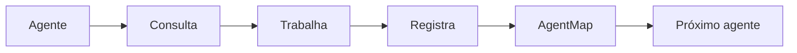

O resultado é um ambiente onde o conhecimento operacional deixa de pertencer à memória individual de cada agente e passa a pertencer ao **projeto**.

---

## 📜 Licença

Este projeto é distribuído sob a licença **MIT**. Consulte o arquivo [`LICENSE`](./LICENSE) para obter o texto completo.

<div align="center">

---

**AgentMap** — Sistema local de coordenação, memória operacional e rastreabilidade para desenvolvimento multiagente.

`Licença: MIT` · `Status: Em desenvolvimento`

</div>
