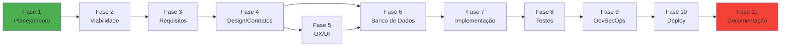
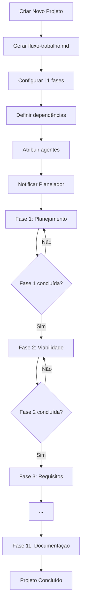

# Ordem de Execução de Projetos — AgentMap

> Este documento define a ordem obrigatória de execução das fases de engenharia de software
> para todos os projetos gerenciados pelo AgentMap.
>
> **Versão:** 1.0.0
> **Data:** 2026-08-25
> **Autor:** Equipe AgentMap

---

## Sumário

1. [Ciclo de Vida Completo](#1-ciclo-de-vida-completo)
2. [Ordem de Execução](#2-ordem-de-execução)
3. [Profissionais por Fase](#3-profissionais-por-fase)
4. [Profissionais Consolidados](#4-profissionais-consolidados)
5. [Mapeamento para Agentes do AgentMap](#5-mapeamento-para-agentes-do-agentmap)
6. [Workflow Automático](#6-workflow-automático)
7. [Checklist de Transição](#7-checklist-de-transição)
8. [Exemplo Prático](#8-exemplo-prático)

---

## 1. Ciclo de Vida Completo

O AgentMap adota o **SDLC (Software Development Life Cycle)** como base para organizar
o trabalho de agentes em projetos. O ciclo inclui **11 fases sequenciais**, com possibilidade
de paralelismo dentro de cada fase.

**Ciclo completo:**

```
Planejamento → Viabilidade → Requisitos → Design/Contratos → Design UX/UI
    → Banco de Dados → Implementação → Testes/Qualidade → DevSecOps
    → Deploy/Infra → Documentação/Manutenção
```

**Descontinuação (Sunset)** foi excluída do ciclo principal por não ser prioridade atual.

---

## 2. Ordem de Execução

A ordem abaixo é **obrigatória** para todos os projetos novos criados no AgentMap.
Nenhuma fase pode ser iniciada antes que a anterior entregue seu **checkpoint de saída**.

| # | Fase | Entregas Obrigatórias | Critério de Saída |
|---|------|----------------------|-------------------|
| 1 | **Planejamento de Projeto** | Project Charter, cronograma, risco register, RACI | Aprovado por stakeholders |
| 2 | **Análise de Viabilidade** | Estudo de viabilidade técnica, econômica, operacional | Decisão go/no-go |
| 3 | **Requisitos** | SRS, user stories, acceptance criteria | Requisitos assinados e testáveis |
| 4 | **Design e Contratos** | HLD, LLD, wireframes, contratos, schemas | Design aprovado |
| 5 | **Design UX/UI** | Design system, mockups, protótipos, acessibilidade | Design aprovado por stakeholders |
| 6 | **Banco de Dados** | Modelo conceitual, lógico, físico, scripts DDL | Schema aprovado e validado |
| 7 | **Arquitetura e Implementação** | Código revisado, mergeado, CI passing | Code review aprovado |
| 8 | **Testes e Qualidade** | Test reports, UAT sign-off, sem bugs críticos | Testes aprovados |
| 9 | **DevSecOps / Segurança** | SAST/DAST clean, threat model, security sign-off | Segurança aprovada |
| 10 | **Deploy e Infraestrutura** | Release artifact, runbook, rollback plan, monitoring | Deploy em produção |
| 11 | **Documentação e Manutenção** | ADRs, runbooks, OpenAPI, release notes, BC plan | Documentação completa |

---

## 3. Profissionais por Fase

Cada fase lista **7 ou mais profissionais reais** do mercado, com suas responsabilidades
principais no contexto do AgentMap.

### Fase 1 — Planejamento de Projeto

| # | Profissional | Responsabilidade no AgentMap |
|---|-------------|----------------------------|
| 1 | **Project Manager (PM)** | Define escopo, cronograma, recursos, riscos e comunica stakeholders |
| 2 | **Product Owner (PO)** | Define visão do produto, prioriza backlog, alinha negócio e tecnologia |
| 3 | **Product Manager** | Define estratégia de produto, roadmap, métricas de sucesso |
| 4 | **Stakeholder / Sponsor** | Aprova orçamento, escopo e decisões de go/no-go |
| 5 | **Scrum Master** | Facilita cerimônias, remove blockers, garante processo ágil |
| 6 | **Risk Manager** | Identifica riscos, planeja mitigações, mantém risk register |
| 7 | **Business Analyst (BA)** | Levanta necessidades iniciais, define critérios de sucesso |
| 8 | **Technical Lead** | Avalia viabilidade técnica inicial, define stack tecnológico |

### Fase 2 — Análise de Viabilidade

| # | Profissional | Responsabilidade no AgentMap |
|---|-------------|----------------------------|
| 1 | **Project Manager** | Lidera o estudo, coordena especialistas, produz feasibility report |
| 2 | **Software Architect** | Avalia viabilidade técnica, arquitetura, integrações, escalabilidade |
| 3 | **Business Analyst** | Levanta requisitos de negócio, traduz necessidades em critérios |
| 4 | **Financial Analyst / Advisor** | Calcula ROI, NPV, TCO, payback period, custos operacionais |
| 5 | **Legal Consultant** | Avalia conformidade legal, licenças, LGPD, propriedade intelectual |
| 6 | **Technical Lead** | Avalia expertise da equipe, tech stack maturity, gaps de conhecimento |
| 7 | **Domain Expert** | Valida pressupostos do domínio, cenários de uso reais |
| 8 | **Risk Analyst** | Quantifica riscos técnicos, econômicos e operacionais |
| 9 | **Operations Manager** | Avalia prontidão operacional, suporte, mudanças de processo |

### Fase 3 — Requisitos

| # | Profissional | Responsabilidade no AgentMap |
|---|-------------|----------------------------|
| 1 | **Business Analyst (BA)** | Elicita, documenta e valida requisitos funcionais e não-funcionais |
| 2 | **Product Owner (PO)** | Prioriza backlog, define acceptance criteria, aprova SRS |
| 3 | **Project Manager** | Gerencia escopo, prazo e recursos para levantamento |
| 4 | **Technical Lead** | Traduz requisitos em especificações técnicas viáveis |
| 5 | **Stakeholder / Usuário** | Fornece necessidades reais, valida user stories e critérios |
| 6 | **QA Lead** | Define estratégia de testes, mapeia requisitos para casos de teste |
| 7 | **UX Designer** | Levanta necessidades de usabilidade, pesquisa usuários |
| 8 | **Domain Expert** | Valida regras de negócio, fluxos e exceções do domínio |
| 9 | **Security Analyst** | Levanta requisitos de segurança, compliance, LGPD |

### Fase 4 — Design e Contratos

| # | Profissional | Responsabilidade no AgentMap |
|---|-------------|----------------------------|
| 1 | **Software Architect** | Define HLD, padrões arquiteturais, decisões tecnológicas |
| 2 | **System Architect** | Define arquitetura do sistema, componentes, integrações |
| 3 | **Technical Lead** | Define LLD, revisa designs, aprova código |
| 4 | **Backend Developer** | Define contratos de API, endpoints, DTOs, schemas |
| 5 | **Frontend Developer** | Define contratos de UI, componentes, estados |
| 6 | **Database Architect** | Define modelo de dados, relacionamentos, índices, constraints |
| 7 | **DevOps Engineer** | Define infraestrutura, deploy strategy, pipelines |
| 8 | **QA Lead** | Define test strategy, acceptance criteria, planos de teste |
| 9 | **Security Architect** | Define security architecture, threat model, controles |

### Fase 5 — Design UX/UI

| # | Profissional | Responsabilidade no AgentMap |
|---|-------------|----------------------------|
| 1 | **UX Designer** | Pesquisa usuários, fluxos, wireframes, protótipos, testes de usabilidade |
| 2 | **UI Designer** | Define design system, tokens, tipografia, cores, espaçamento |
| 3 | **UX Researcher** | Conduz entrevistas, testes de usabilidade, análise quantitativa |
| 4 | **Interaction Designer** | Define micro-interações, animações, estados de interface |
| 5 | **Visual Designer** | Define identidade visual, iconografia, layout, hierarquia |
| 6 | **Design Systems Engineer** | Constrói e mantém biblioteca de componentes reutilizáveis |
| 7 | **Accessibility Specialist (A11y)** | Valida WCAG, contraste, navegação por teclado, leitores de tela |
| 8 | **Product Designer** | Alinha design com objetivos de negócio e experiência do usuário |

### Fase 6 — Banco de Dados

| # | Profissional | Responsabilidade no AgentMap |
|---|-------------|----------------------------|
| 1 | **Database Architect** | Define modelo conceitual, lógico e físico, ERDs, normalização |
| 2 | **Database Administrator (DBA)** | Administra SGBD, performance, backup, recovery, índices |
| 3 | **Data Engineer** | Define pipelines ETL, integrações, migrações, sincronização |
| 4 | **Backend Developer** | Implementa acesso a dados, ORM, queries, transações |
| 5 | **Data Analyst** | Valida modelo de dados contra necessidades de consulta e relatórios |
| 6 | **QA Engineer** | Testa integridade, constraints, performance de queries |
| 7 | **DevOps Engineer** | Configura deploy de banco, migrations, monitoring |
| 8 | **Data Architect** | Define estratégia de dados, governança, qualidade, metadados |

### Fase 7 — Arquitetura e Implementação

| # | Profissional | Responsabilidade no AgentMap |
|---|-------------|----------------------------|
| 1 | **Software Architect** | Define estrutura de código, camadas, padrões, decisões técnicas |
| 2 | **Technical Lead** | Define convenções, revisa código, mentoring, code review |
| 3 | **Full-Stack Developer** | Implementa features end-to-end, integra frontend e backend |
| 4 | **Backend Developer** | Implementa API, serviços, lógica de negócio, integrações |
| 5 | **Frontend Developer** | Implementa interface, componentes, estados, responsividade |
| 6 | **Mobile Developer** | Implementa versões mobile, PWA, otimizações |
| 7 | **DevOps Engineer** | Configura CI/CD, ambientes, pipelines, automação |
| 8 | **QA Engineer** | Implementa testes unitários, integração, suporta debugging |

### Fase 8 — Testes e Qualidade

| # | Profissional | Responsabilidade no AgentMap |
|---|-------------|----------------------------|
| 1 | **QA Lead** | Define estratégia de testes, planos, métricas de qualidade |
| 2 | **QA Engineer** | Executa testes manuais, reporta bugs, valida correções |
| 3 | **Test Automation Engineer** | Implementa testes automatizados, frameworks, CI gates |
| 4 | **Performance Engineer** | Testa carga, stress, performance, SLOs, bottlenecks |
| 5 | **Security Engineer** | Executa SAST, DAST, testes de penetração, scanning |
| 6 | **UAT Specialist** | Representa usuários finais, valida acceptance criteria |
| 7 | **Release Manager** | Coordena release, versões, rollback, comunicação |
| 8 | **DevOps Engineer** | Configura pipelines de teste, ambientes, monitoramento |

### Fase 9 — DevSecOps / Segurança

| # | Profissional | Responsabilidade no AgentMap |
|---|-------------|----------------------------|
| 1 | **DevSecOps Engineer** | Integra segurança em todas as fases, automação, CI/CD |
| 2 | **Security Engineer** | Implementa controles, autenticação, criptografia, headers |
| 3 | **Security Analyst** | Analisa vulnerabilidades, logs, incidentes, compliance |
| 4 | **Penetration Tester (Pentester)** | Testa invasões, explora vulnerabilidades, reporta findings |
| 5 | **Compliance Officer** | Garante conformidade LGPD, GDPR, políticas, auditorias |
| 6 | **Risk Manager** | Gerencia riscos de segurança, planos de resposta |
| 7 | **Security Architect** | Define arquitetura de segurança, padrões, defesa em profundidade |
| 8 | **Application Security Engineer** | Segurança específica de aplicações, OWASP Top 10, SAST/DAST |

### Fase 10 — Deploy e Infraestrutura

| # | Profissional | Responsabilidade no AgentMap |
|---|-------------|----------------------------|
| 1 | **DevOps Engineer** | Configura deploy, pipelines, infraestrutura como código |
| 2 | **Release Manager** | Planeja releases, versionamento, rollback, comunicação |
| 3 | **Site Reliability Engineer (SRE)** | Monitora produção, SLOs, incidentes, confiabilidade |
| 4 | **Cloud Engineer** | Gerencia cloud, containers, orquestração, custos |
| 5 | **Infrastructure Engineer** | Configura servidores, redes, storage, alta disponibilidade |
| 6 | **Operations Manager** | Gerencia operações, suporte, escalonamento, processos |
| 7 | **Support Engineer** | Atende usuários, resolve incidentes, escalation |
| 8 | **Security Engineer** | Configura firewalls, CORS, TLS, security headers |

### Fase 11 — Documentação e Manutenção

| # | Profissional | Responsabilidade no AgentMap |
|---|-------------|----------------------------|
| 1 | **Technical Writer** | Escreve docs, ADRs, guias, runbooks, API docs |
| 2 | **Documentation Specialist** | Organiza documentação, versionamento, índices, glossário |
| 3 | **Maintenance Engineer** | Corrige bugs, aplica patches, otimiza performance |
| 4 | **Application Support Engineer** | Suporte a usuários, troubleshooting, escalation |
| 5 | **Site Reliability Engineer (SRE)** | Monitora produção, incidentes, alertas, capacity planning |
| 6 | **Product Owner** | Prioriza backlog de manutenção, novas features, feedback |
| 7 | **QA Engineer** | Mantém testes, valida correções, regressão |
| 8 | **DevOps Engineer** | Mantém pipelines, deploys, infraestrutura |

---

## 4. Profissionais Consolidados

Abaixo está a lista consolidada de todos os profissionais únicos que participam do ciclo,
sem repetição por fase.

### Lista consolidada (32 profissionais)

1. Project Manager (PM)
2. Product Owner (PO)
3. Product Manager
4. Stakeholder / Sponsor
5. Scrum Master
6. Risk Manager
7. Business Analyst (BA)
8. Technical Lead
9. Software Architect
10. System Architect
11. Financial Analyst / Advisor
12. Legal Consultant
13. Domain Expert
14. QA Lead
15. UX Designer
16. Security Analyst
17. UX Researcher
18. Interaction Designer
19. Visual Designer
20. Design Systems Engineer
21. Accessibility Specialist (A11y)
22. Product Designer
23. Database Architect
24. Database Administrator (DBA)
25. Data Engineer
26. Data Analyst
27. Data Architect
28. Full-Stack Developer
29. Backend Developer
30. Frontend Developer
31. Mobile Developer
32. Test Automation Engineer
33. Performance Engineer
34. Security Engineer
35. UAT Specialist
36. Release Manager
37. DevSecOps Engineer
38. Penetration Tester (Pentester)
39. Compliance Officer
40. Security Architect
41. Application Security Engineer
42. Cloud Engineer
43. Infrastructure Engineer
44. Operations Manager
45. Support Engineer
46. Technical Writer
47. Documentation Specialist
48. Maintenance Engineer
49. Application Support Engineer
50. Site Reliability Engineer (SRE)

**Total: 50 profissionais únicos** envolvidos no ciclo de vida completo.

---

## 5. Mapeamento para Agentes do AgentMap

Cada agente do AgentMap representa um profissional ou papel do mercado. A tabela abaixo
mapeia as fases para os agentes correspondentes.

| # | Fase | Agente AgentMap | Papel Principal |
|---|------|-----------------|----------------|
| 1 | Planejamento de Projeto | **Planejador** | Project Manager / Product Owner |
| 2 | Análise de Viabilidade | **Viabilidade** | Business Analyst / Software Architect |
| 3 | Requisitos | **Requisitos** | Business Analyst / Product Owner |
| 4 | Design e Contratos | **DesignContratos** | Software Architect / System Architect |
| 5 | Design UX/UI | **UXUI** | UX Designer / UI Designer |
| 6 | Banco de Dados | **BancoDados** | Database Architect / DBA |
| 7 | Implementação | **ArquiteturaImpl** | Software Architect / Technical Lead |
| 8 | Testes e Qualidade | **TestesQualidade** | QA Lead / Test Automation Engineer |
| 9 | DevSecOps / Segurança | **DevSecOps** | DevSecOps Engineer / Security Architect |
| 10 | Deploy e Infraestrutura | **DeployInfra** | DevOps Engineer / SRE |
| 11 | Documentação e Manutenção | **DocsManutencao** | Technical Writer / Maintenance Engineer |

---

## 6. Workflow Automático

### 6.1 Regra de Ouro

**Nenhuma fase pode ser iniciada antes que a anterior entregue seu checkpoint de saída.**

Isso é enforced automaticamente pelo AgentMap através do sistema de **dependências** e
**checkpoints** em `.ia/fluxo-trabalho.md`.

### 6.2 Estrutura de `.ia/fluxo-trabalho.md` para Novos Projetos

Cada projeto criado no AgentMap recebe automaticamente um `fluxo-trabalho.md` com a
seguinte estrutura:

```yaml
fases:
  - id: fase-1-planejamento
    nome: Planejamento de Projeto
    agente: planejador
    status: pending
    checkpoint:
      entrada: []
      saida:
        - project-charter-aprovado
        - cronograma-definido
        - riscos-mapeados
    dependencias: []

  - id: fase-2-viabilidade
    nome: Análise de Viabilidade
    agente: viabilidade
    status: pending
    checkpoint:
      entrada:
        - fase-1-planejamento
      saida:
        - viabilidade-tecnica-aprovada
        - viabilidade-economica-aprovada
        - decisao-go-no-go
    dependencias:
      - fase-1-planejamento

  - id: fase-3-requisitos
    nome: Requisitos
    agente: requisitos
    status: pending
    checkpoint:
      entrada:
        - fase-2-viabilidade
      saida:
        - srs-aprovado
        - user-stories-prontas
        - acceptance-criteria-definidos
    dependencias:
      - fase-2-viabilidade

  - id: fase-4-design-contratos
    nome: Design e Contratos
    agente: designcontratos
    status: pending
    checkpoint:
      entrada:
        - fase-3-requisitos
      saida:
        - hld-aprovado
        - lld-aprovado
        - contratos-versionados
    dependencias:
      - fase-3-requisitos

  - id: fase-5-design-uxui
    nome: Design UX/UI
    agente: uxui
    status: pending
    checkpoint:
      entrada:
        - fase-4-design-contratos
      saida:
        - design-system-definido
        - wireframes-aprovados
        - prototipos-validados
    dependencias:
      - fase-4-design-contratos

  - id: fase-6-banco-dados
    nome: Banco de Dados
    agente: bancodados
    status: pending
    checkpoint:
      entrada:
        - fase-4-design-contratos
        - fase-5-design-uxui
      saida:
        - modelo-conceitual-aprovado
        - modelo-logico-aprovado
        - scripts-ddl-prontos
    dependencias:
      - fase-4-design-contratos
      - fase-5-design-uxui

  - id: fase-7-implementacao
    nome: Arquitetura e Implementação
    agente: arquiteturaimpl
    status: pending
    checkpoint:
      entrada:
        - fase-6-banco-dados
      saida:
        - codigo-revisado
        - ci-passing
        - code-review-aprovado
    dependencias:
      - fase-6-banco-dados

  - id: fase-8-testes
    nome: Testes e Qualidade
    agente: testesqualidade
    status: pending
    checkpoint:
      entrada:
        - fase-7-implementacao
      saida:
        - testes-passing
        - uat-signoff
        - sem-bugs-criticos
    dependencias:
      - fase-7-implementacao

  - id: fase-9-devsecops
    nome: DevSecOps / Segurança
    agente: devsecops
    status: pending
    checkpoint:
      entrada:
        - fase-8-testes
      saida:
        - sast-dast-clean
        - threat-model-aprovado
        - security-signoff
    dependencias:
      - fase-8-testes

  - id: fase-10-deploy
    nome: Deploy e Infraestrutura
    agente: deployinfra
    status: pending
    checkpoint:
      entrada:
        - fase-9-devsecops
      saida:
        - deploy-producao
        - monitoring-ativo
        - rollback-testado
    dependencias:
      - fase-9-devsecops

  - id: fase-11-documentacao
    nome: Documentação e Manutenção
    agente: docsmantencao
    status: pending
    checkpoint:
      entrada:
        - fase-10-deploy
      saida:
        - adrs-escritos
        - openapi-atualizado
        - runbooks-disponiveis
        - bc-plan-definido
    dependencias:
      - fase-10-deploy
```

### 6.3 Regras de Paralelismo

Dentro do ciclo, algumas fases podem executar em paralelo quando não há dependência
direta entre elas:

- **Fase 5 (UX/UI)** pode iniciar em paralelo com **Fase 4 (Design/Contratos)** se o
  design system for independente dos contratos técnicos.
- **Fase 6 (Banco de Dados)** pode iniciar em paralelo com **Fase 5 (UX/UI)** pois
  depende apenas da **Fase 4 (Design/Contratos)**.



### 6.4 Enforcement Automático

O AgentMap enforce a ordem através de:

1. **Validação de dependências no `fluxo-trabalho.md`**: antes de iniciar uma fase,
   o sistema verifica se todas as fases dependentes estão concluídas.
2. **Checklist de projeto**: `GET /api/projetos/:id/fluxo/checklist` valida a estrutura
   mínima antes de permitir operações.
3. **State Machine**: transições de estado são validadas por regras — não é possível
   pular fases.
4. **Auditoria**: todas as transições são registradas em `.ia/estado/historico/` para
   rastreabilidade.

### 6.5 Instruções para Novos Projetos

Quando um novo projeto for criado no AgentMap, o sistema deve:

1. **Gerar `fluxo-trabalho.md`** com as 11 fases na ordem definida.
2. **Configurar dependências** conforme seção 6.2.
3. **Definir checkpoint de saída** para cada fase.
4. **Atribuir agente responsável** para cada fase.
5. **Notificar o planejador** para iniciar a **Fase 1**.



---

## 7. Checklist de Transição

Cada transição entre fases exige a validação de um checklist mínimo:

### Transição Fase 1 → Fase 2

- [ ] Project Charter aprovado
- [ ] Cronograma definido
- [ ] Orçamento aprovado
- [ ] Stakeholders identificados
- [ ] Riscos mapeados
- [ ] RACI definido
- [ ] Feasibility study aprovado para prosseguir

### Transição Fase 2 → Fase 3

- [ ] Viabilidade técnica confirmada
- [ ] Viabilidade econômica confirmada (ROI, TCO)
- [ ] Viabilidade operacional confirmada
- [ ] Decisão go/no-go tomada
- [ ] Riscos mitigados ou aceitos
- [ ] Recursos alocados

### Transição Fase 3 → Fase 4

- [ ] SRS aprovado e assinado
- [ ] User stories priorizadas
- [ ] Acceptance criteria definidos
- [ ] Requisitos não-funcionais documentados
- [ ] Stakeholders validaram requisitos
- [ ] Nenhuma ambiguidade crítica

### Transição Fase 4 → Fase 5

- [ ] HLD aprovado
- [ ] LLD aprovado
- [ ] Contratos versionados
- [ ] Schemas JSON validados
- [ ] Arquitetura aprovada por stakeholders
- [ ] Tecnologias escolhidas e validadas

### Transição Fase 5 → Fase 6

- [ ] Design system aprovado
- [ ] Wireframes aprovados
- [ ] Mockups aprovados
- [ ] Protótipos validados
- [ ] Acessibilidade validada (WCAG)
- [ ] Responsividade validada

### Transição Fase 6 → Fase 7

- [ ] Modelo conceitual aprovado
- [ ] Modelo lógico aprovado
- [ ] Modelo físico aprovado
- [ ] Scripts DDL prontos
- [ ] Índices definidos
- [ ] Constraints validadas
- [ ] Migração planejada (se aplicável)

### Transição Fase 7 → Fase 8

- [ ] Código revisado (code review)
- [ ] CI passing
- [ ] Linting OK
- [ ] Typecheck OK
- [ ] Sem erros críticos
- [ ] Branch mergeado

### Transição Fase 8 → Fase 9

- [ ] Testes unitários passing
- [ ] Testes de integração passing
- [ ] Testes E2E passing
- [ ] UAT sign-off
- [ ] Sem bugs críticos ou altos
- [ ] Test report assinado

### Transição Fase 9 → Fase 10

- [ ] SAST clean
- [ ] DAST clean
- [ ] Threat model aprovado
- [ ] Security sign-off
- [ ] Vulnerabilidades corrigidas
- [ ] Compliance validado

### Transição Fase 10 → Fase 11

- [ ] Deploy em produção OK
- [ ] Monitoring ativo
- [ ] SLOs definidos
- [ ] Rollback testado
- [ ] Incident response testado
- [ ] Runbook de deploy assinado

### Transição Fase 11 (Conclusão)

- [ ] ADRs escritos
- [ ] OpenAPI atualizado
- [ ] Runbooks disponíveis
- [ ] Backward compatibility documentada
- [ ] Release notes escritas
- [ ] Onboarding guide atualizado
- [ ] BC plan definido

---

## 8. Exemplo Prático

### Projeto: Sistema de Gestão de Projetos

**Fase 1 — Planejamento:**
- PM define escopo, cronograma e recursos
- PO define visão do produto
- Stakeholder aprova orçamento
- **Checkpoint:** Project Charter aprovado

**Fase 2 — Viabilidade:**
- PM lidera feasibility study
- Software Architect valida viabilidade técnica
- Financial Analyst calcula ROI
- **Checkpoint:** Decisão go

**Fase 3 — Requisitos:**
- BA elicita requisitos com stakeholders
- PO prioriza backlog
- QA Lead define test strategy
- **Checkpoint:** SRS aprovado

**Fase 4 — Design e Contratos:**
- Software Architect define HLD
- Technical Lead define LLD
- Database Architect define modelo de dados
- **Checkpoint:** Contratos versionados

**Fase 5 — UX/UI:**
- UX Designer pesquisa usuários
- UI Designer define design system
- A11y valida acessibilidade
- **Checkpoint:** Mockups aprovados

**Fase 6 — Banco de Dados:**
- Database Architect define modelo físico
- DBA otimiza índices
- Data Engineer planeja migrações
- **Checkpoint:** Scripts DDL prontos

**Fase 7 — Implementação:**
- Backend Developer implementa API
- Frontend Developer implementa UI
- Code review e CI passing
- **Checkpoint:** Código mergeado

**Fase 8 — Testes:**
- QA Engineer executa testes
- Test Automation Engineer implementa automação
- UAT Specialist valida com usuários
- **Checkpoint:** Testes passing

**Fase 9 — DevSecOps:**
- DevSecOps Engineer integra SAST/DAST
- Pentester valida segurança
- Security Architect aprova threat model
- **Checkpoint:** Security sign-off

**Fase 10 — Deploy:**
- DevOps Engineer configura deploy
- Release Manager coordena release
- SRE monitora produção
- **Checkpoint:** Deploy em produção

**Fase 11 — Documentação:**
- Technical Writer documenta API
- Maintenance Engineer planeja suporte
- QA Engineer valida regressão
- **Checkpoint:** Documentação completa

---

## Referências

- `BRIEFING-7-AGENTES.md` — Contexto e restrições do projeto
- `AGENTS.md` — Regras gerais do AgentMap
- `docs/arquitetura-mcp.md` — Arquitetura MCP
- `docs/kilo-code-docs/comunicacao-agentmap-kilo.md` — Comunicação com Kilo
- SDLC references: Atlassian, IBM, Microsoft, Netguru, Digisoft

---

**Versão:** 1.0.0
**Data:** 2026-08-25
**Autor:** Equipe AgentMap
