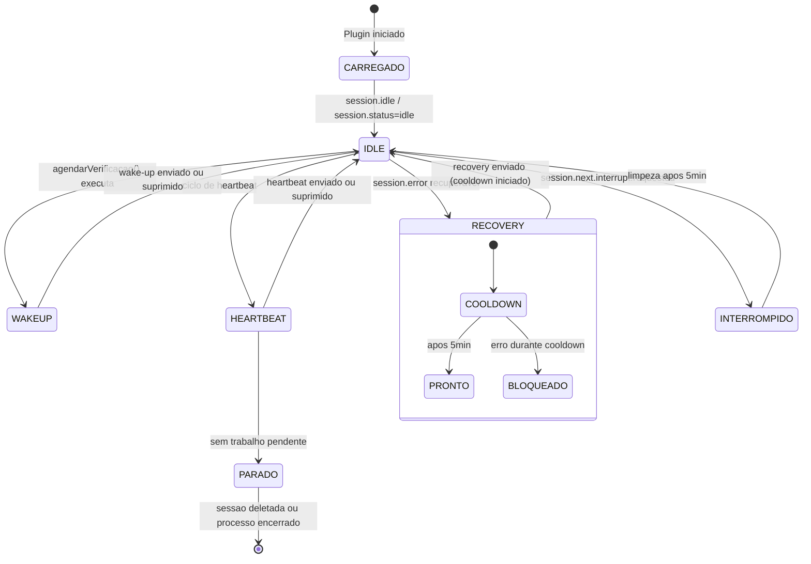
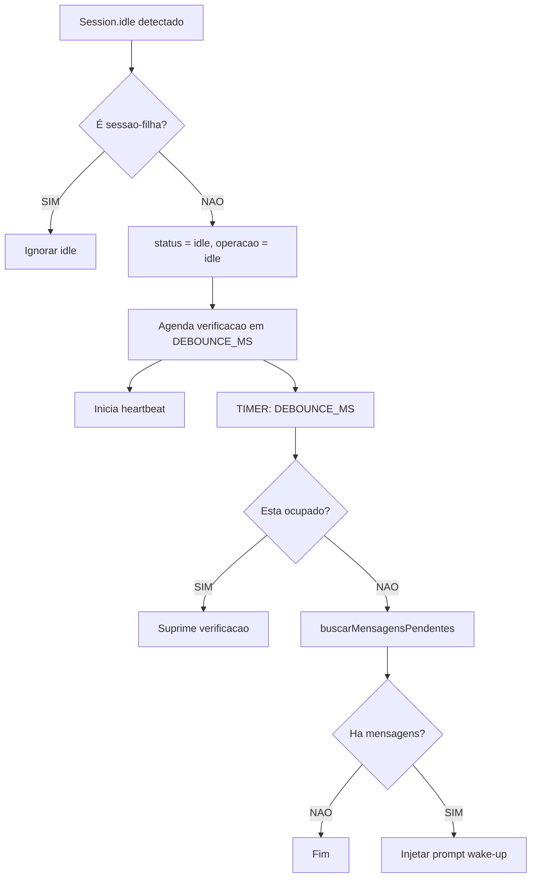
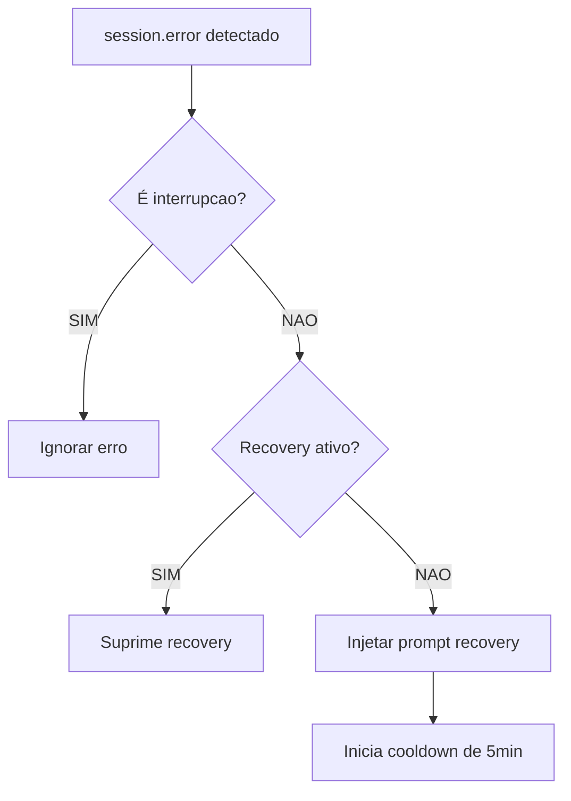
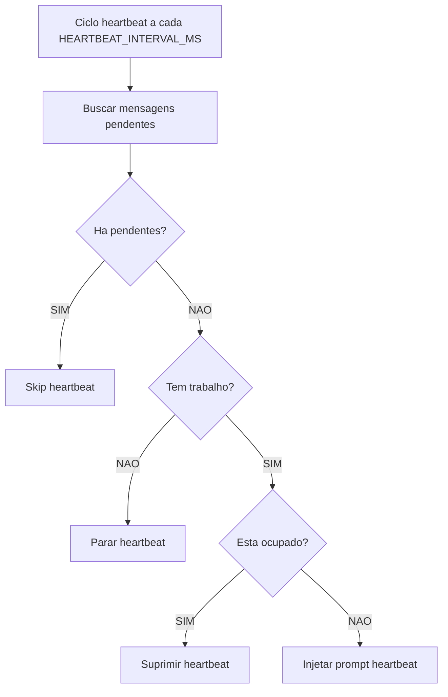
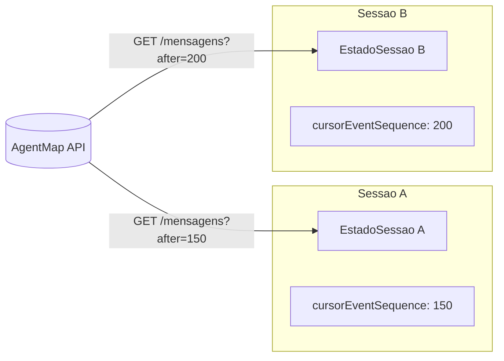

# Fluxo do Plugin `agentmap-wakeup.ts`


```mermaid
flowchart TD
    Start([Plugin carregado]) --> Register[Registra hooks no Kilo]
    Register --> H1[hook: event]
    Register --> H2[hook: tool.execute.after]
    Register --> H3[hook: chat.message]

    H2 --> TA[Evento tool.execute.after]
    TA --> MarcarAtividadeTool[marcarAtividade]
    MarcarAtividadeTool --> FimTA([fim tool])

    H3 --> CM[Evento chat.message]
    CM --> MarcarAtividadeChat[marcarAtividade]
    MarcarAtividadeChat --> FimCM([fim chat])

    H1 --> EventRecebido[Evento recebido]
    EventRecebido --> ExtrairIDs[Extrai sessionId, projectId, eventType]
    ExtrairIDs --> ChecarSessionId{sessionId existe?}
    ChecarSessionId -->|nao| IgnorarSemId[Ignora evento]
    ChecarSessionId -->|sim| ObterEstado[obterOuCriarEstado projectId:sessionId]

    ObterEstado --> ChecarTipoEvento{Que tipo?}

    %% session.created
    ChecarTipoEvento -->|session.created| ExtrairParent[extrairParentId]
    ExtrairParent --> TemParent{parentId existe?}
    TemParent -->|nao| FimCreated([fim])
    TemParent -->|sim| MarcarFilha["Marca sessao-filha\nisChildSession=true\nparentId=parentId"]
    MarcarFilha --> LogFilha[Log: Sessao-filha detectada]
    LogFilha --> FimCreated

    %% session.updated
    ChecarTipoEvento -->|session.updated| ExtrairParentUpdated[extrairParentId]
    ExtrairParentUpdated --> TemParentUpdated{parentId existe?}
    TemParentUpdated -->|nao| FimUpdated([fim])
    TemParentUpdated -->|sim| MarcarFilhaUpdated["Marca sessao-filha\nisChildSession=true"]
    MarcarFilhaUpdated --> LogFilhaUpdated[Log: Sessao-filha via updated]
    LogFilhaUpdated --> FimUpdated

    %% session.status
    ChecarTipoEvento -->|session.status| ExtrairStatus[Extrai status\ndo evento]
    ExtrairStatus --> NormalizarStatus[Normaliza status\nidle/busy/retry/unknown]
    NormalizarStatus --> AtualizarEstado[Atualiza estado.status\nLog: session.status mudou]
    AtualizarEstado --> LimparOperacao{estado estava idle\ne operacao em andamento?}
    LimparOperacao -->|sim| ResetOperacao[Reset operacaoEmAndamento=idle]
    LimparOperacao -->|nao| FimStatus([fim])
    ResetOperacao --> FimStatus

    %% session.idle
    ChecarTipoEvento -->|session.idle| ValidarSessaoIdle{sessionId existe?}
    ValidarSessaoIdle -->|nao| IgnorarIdle[Ignora - sem sessionId]
    ValidarSessaoIdle -->|sim| LogIdle[Log: session.idle detectado]
    LogIdle --> ChecarSessaoFilhaIdle{eh sessao-filha?}
    ChecarSessaoFilhaIdle -->|sim| SuprimirIdleFilha[Suprime wake-up para sessao-filha]
    SuprimirIdleFilha --> FimIdle([fim])
    ChecarSessaoFilhaIdle -->|nao| SetIdle[Define status=idle\noperacaoEmAndamento=idle]
    SetIdle --> LimparInterruptTimer[Cancela interruptCleanupTimer]
    LimparInterruptTimer --> AgendarVerificacaoIdle[agendarVerificacao\nprojectId, sessionId, client, directory]
    AgendarVerificacaoIdle --> IniciarHeartbeatIdle[iniciarHeartbeat\nprojectId, sessionId, client, directory]
    IniciarHeartbeatIdle --> LimparRecoveryFlagIdle[Limpa recoveryAtivo\ne recoveryTimer]
    LimparRecoveryFlagIdle --> FimIdleProcessado([fim session.idle])

    %% session.next.interrupt.requested
    ChecarTipoEvento -->|session.next.interrupt.requested| ValidarInterrupt{sessionId existe?}
    ValidarInterrupt -->|nao| IgnorarInterrupt[Ignora - sem sessionId]
    ValidarInterrupt -->|sim| LogInterrupt[Log: Interrupcao detectada]
    LogInterrupt --> LimparInterruptTimerExistente[Cancela interruptCleanupTimer antigo]
    LimparInterruptTimerExistente --> AgendarLimpezaInterrupt[Agenda limpeza em\nINTERRUPT_CLEANUP_MS=5min]
    AgendarLimpezaInterrupt --> FimInterrupt([fim interrupt])

    %% session.error
    ChecarTipoEvento -->|session.error| ExtrairDetalhesError[Extrai nomeErro\ne mensagemErro]
    ExtrairDetalhesError --> ChecarInterrupcao{Eh interrupcao do usuario?\nMessageAbortedError\nou regex abort/cancel/interrupt}
    ChecarInterrupcao -->|sim| LogInterrupcaoError[Log: session.error suprimido\ninterrupcao do usuario]
    LogInterrupcaoError --> FimErrorSuprimido([fim error suprimido])
    ChecarInterrupcao -->|nao| ValidarSessionIdError{sessionId existe?}
    ValidarSessionIdError -->|nao| IgnorarError[Ignora - sem sessionId]
    ValidarSessionIdError -->|sim| LogErrorReal[Log: session.error detectado]
    LogErrorReal --> PararHeartbeatError[pararHeartbeat\nprojectId, sessionId, directory]
    PararHeartbeatError --> InjetarRecoveryError[injetarRecovery\nprojectId, sessionId, client, directory]
    InjetarRecoveryError --> FimErrorReal([fim error])

    %% session.deleted
    ChecarTipoEvento -->|session.deleted| LogDeleted[Log: session.deleted\nlimpando estado]
    LogDeleted --> RemoverEstado[removerEstado\nprojectId, sessionId\nLimpa todos os timers]
    RemoverEstado --> FimDeleted([fim deleted])

    %% ============================
    %% FUNÇÃO: agendarVerificacao
    %% ============================
    AgendarVerificacaoIdle --> LimparTimerDebounce{Cancela debounceTimer\nexistente?}
    LimparTimerDebounce -->|sim| CriarTimerDebounce[Cria novo setTimeout\nDEBOUNCE_MS=3000ms]
    CriarTimerDebounce --> ExecutarDebounce[Executa apos debounce]
    ExecutarDebounce --> ChecarSessaoFilhaWake{eh sessao-filha?}
    ChecarSessaoFilhaWake -->|sim| SuprimirWakeFilha[Suprime wake-up\nLog: Wake-up suprimido sessao-filha]
    ChecarSessaoFilhaWake -->|nao| ChecarOcupadoWake{estaOcupado?\nstatus=busy/retry}
    ChecarOcupadoWake -->|sim| LogOcupadoWake[Log: Verificacao suprimida\nocupado]
    ChecarOcupadoWake -->|nao| BuscarMensagensWake[buscarMensagensPendentes\nestado\nGET /api/monitoramento/mensagens?limite=50&after=cursor]
    BuscarMensagensWake --> FiltrarWake[Filtra por eventSequence\n> cursorEventSequence\ne TIPOS_RELEVANTES]
    FiltrarWake --> AtualizarCursorWake[Atualiza cursorEventSequence\npara maior eventSequence]
    AtualizarCursorWake --> TemMensagensWake{Tem mensagens novas?}
    TemMensagensWake -->|nao| LogSemMensagensWake[Log: Nenhuma mensagem pendente]
    LogSemMensagensWake --> FimSemMensagensWake([fim])
    TemMensagensWake -->|sim| MontarResumoWake[montarResumo\nFormata mensagens em texto]
    MontarResumoWake --> InjetarPromptWake[injetarPrompt\nsessionId, client, directory, texto, tipo=wakeup, estado]
    InjetarPromptWake --> LogWakeEnviado[Log: Wake-up enviado\ncom resumo das mensagens]
    LogWakeEnviado --> FimWakeEnviado([fim wake-up])

    %% ============================
    %% FUNÇÃO: injetarPrompt
    %% ============================
    InjetarPromptWake --> DetectarMetodoPrompt[getPromptMethod\nclient.session.prompt/promptAsync]
    DetectarMetodoPrompt --> MetodoDisponivel{Metodo disponivel?}
    MetodoDisponivel -->|nao| LogErroMetodo[Log: Nenhum metodo\nde prompt disponivel]
    LogErroMetodo --> FimErroMetodo([fim erro])
    MetodoDisponivel -->|sim| ChecarOperacaoEmAndamento{operacaoEmAndamento\n== idle?}
    ChecarOperacaoEmAndamento -->|nao| LogSuprimidoOp[Log: tipo suprimido\noperacao em andamento]
    LogSuprimidoOp --> FimSuprimidoOp([fim suprimido])
    ChecarOperacaoEmAndamento -->|sim| SetOperacao[Seta operacaoEmAndamento=tipo\nwakeup/recovery/heartbeat]
    SetOperacao --> ChamarPrompt[Chama metodo.prompt\ncom parts=(text)]
    ChamarPrompt --> AguardarConfirmacao[Aguarda confirmacao\nstatus===busy ou\ntimeout CONFIRM_TIMEOUT_MS=10s]
    AguardarConfirmacao --> Confirmado{Confirmado?}
    Confirmado -->|nao| LogNaoConfirmado[Log: Entrega nao confirmada]
    Confirmado -->|sim| LogConfirmado[Log: Prompt entregue]
    LogNaoConfirmado --> ResetOperacaoFinally[Reset operacaoEmAndamento=idle\nLimpa confirmTimer]
    LogConfirmado --> ResetOperacaoFinally
    ResetOperacaoFinally --> FimPromptInjetado([fim prompt])

    %% ============================
    %% FUNÇÃO: injetarRecovery
    %% ============================
    InjetarRecoveryError --> ObterEstadoRecovery[obterOuCriarEstado\nprojectId, sessionId]
    ObterEstadoRecovery --> ChecarRecoveryAtivo{recoveryAtivo?}
    ChecarRecoveryAtivo -->|sim| LogRecoverySuprimido[Log: Recovery suprimido\ncooldown ativo]
    ChecarRecoveryAtivo -->|nao| MontarPromptRecovery[Prompt fixo:\n"Ocorreu um erro no sistema..."]
    MontarPromptRecovery --> InjetarPromptRecovery[injetarPrompt\nsessionId, client, directory, texto, tipo=recovery, estado]
    InjetarPromptRecovery --> SucessoRecovery{Sucesso?}
    SucessoRecovery -->|nao| FimRecoveryFalhou([fim recovery falhou])
    SucessoRecovery -->|sim| SetRecoveryAtivo[Seta recoveryAtivo=true\n Agenda recoveryTimer\nRECOVERY_COOLDOWN_MS=5min]
    SetRecoveryAtivo --> FimRecoverySucesso([fim recovery injetado])

    %% ============================
    %% FUNÇÃO: iniciarHeartbeat / cicloHeartbeat
    %% ============================
    IniciarHeartbeatIdle --> ObterEstadoHB[obterOuCriarEstado\nprojectId, sessionId]
    ObterEstadoHB --> LimparHeartbeatTimer[Cancela heartbeatTimer\nexistente]
    LimparHeartbeatTimer --> CriarIntervalo[Cria setInterval\nHEARTBEAT_INTERVAL_MS=2min]
    CriarIntervalo --> CicloHeartbeatHB[Ciclo de heartbeat\na cada 2min]
    CicloHeartbeatHB --> ChecarSessaoFilhaHB{eh sessao-filha?}
    ChecarSessaoFilhaHB -->|sim| PararHBFilha[pararHeartbeat\npara sessao-filha]
    ChecarSessaoFilhaHB -->|nao| BuscarMensagensHB[buscarMensagensPendentes\nestado]
    BuscarMensagensHB --> TemMensagensHB{Tem mensagens\npendentes?}
    TemMensagensHB -->|sim| LogSkipHB[Log: heartbeat skip\nX mensagens pendentes]
    TemMensagensHB -->|nao| ChecarTrabalhoPendente[temTrabalhoPendente\nGET /api/estado-projeto]
    ChecarTrabalhoPendente --> TemTrabalho{Tem trabalho pendente?\ntarefas/solicitacoes/handoffs\nbloqueios/validacoes}
    TemTrabalho -->|nao| LogPararHB[Log: heartbeat parado\nsem trabalho pendente]
    LogPararHB --> PararHBSemTrabalho[pararHeartbeat\nprojectId, sessionId, directory]
    TemTrabalho -->|sim| ChecarOcupadoHB{estaOcupado?\nstatus=busy/retry}
    ChecarOcupadoHB -->|sim| LogOcupadoHB[Log: heartbeat suprimido\nocupado]
    ChecarOcupadoHB -->|nao| InjetarPromptHB[injetarPrompt\nsessionId, client, directory\nHEARTBEAT_PROMPT, tipo=heartbeat, estado]
    LogSkipHB --> AguardarProximoCiclo[Aguarda proximo ciclo\n2min]
    LogOcupadoHB --> AguardarProximoCiclo
    InjetarPromptHB --> AguardarProximoCiclo
    PararHBSemTrabalho --> FimHBPausado([heartbeat parado])
    PararHBFilha --> FimHBPausado
    AguardarProximoCiclo --> CicloHeartbeatHB

    %% ============================
    %% FUNÇÕES AUXILIARES
    %% ============================
    MarcarAtividadeTool --> AtividadeMap[Atualiza estado\npara busy/retry]
    MarcarAtividadeChat --> AtividadeMap

    ChecarOcupadoWake -.-> FuncaoOcupado[estaOcupado:\nestado.status === busy\nou estado.status === retry]
    ChecarOcupadoHB -.-> FuncaoOcupado

    BuscarMensagensWake -.-> FiltrarWake
    BuscarMensagensHB -.-> FiltrarHB[Filtra mensagens por:\neventSequence > cursor\nTIPOS_RELEVANTES]

    InjetarPromptRecovery -.-> PromptRecovery[Prompt recovery:\n"Ocorreu um erro no sistema..."]
    InjetarPromptWake -.-> PromptWakeup[Prompt wake-up:\n"Novas atualizacoes no AgentMap..."]
    InjetarPromptHB -.-> PromptHB[Prompt heartbeat:\n"AVISO DO AGENTMAP..."]

    %% ============================
    %% ESTILOS
    %% ============================
    classDef decisao fill:#ff9800,stroke:#e65100,color:#000,stroke-width:2px
    classDef processo fill:#2196f3,stroke:#0d47a1,color:#fff,stroke-width:2px
    classDef terminal fill:#4caf50,stroke:#1b5e20,color:#fff,stroke-width:2px
    classDef sucesso fill:#8bc34a,stroke:#33691e,color:#000,stroke-width:2px
    classDef erro fill:#f44336,stroke:#b71c1c,color:#fff,stroke-width:2px

    class ChecarSessionId,ChecarTipoEvento,TemParent,ChecarSessaoFilhaIdle,ValidarSessaoIdle,ChecarSessaoFilhaWake,ChecarOcupadoWake,TemMensagensWake,ChecarTipoEvento,TemParentUpdated,ChecarOcupadoHB,TemMensagensHB,TemTrabalho,ChecarInterrupcao,ValidarSessionIdError,MetodoDisponivel,ChecarOperacaoEmAndamento,Confirmado,ChecarRecoveryAtivo,SucessoRecovery,ChecarSessaoFilhaHB,ValidarInterrupt,ChecarSessaoFilhaIdle,ChecarOcupadoWake,TemMensagensWake decisao
    class ObterEstado,ExtrairIDs,ExtrairParent,ExtrairParentUpdated,ExtrairStatus,NormalizarStatus,AtualizarEstado,ResetOperacao,SetIdle,LimparInterruptTimer,AgendarVerificacaoIdle,IniciarHeartbeatIdle,LimparRecoveryFlagIdle,LogIdle,MarcarFilha,LogFilha,MarcarFilhaUpdated,LogFilhaUpdated,LogInterrupt,LimparInterruptTimerExistente,AgendarLimpezaInterrupt,LogDeleted,RemoverEstado,ExtrairDetalhesError,LogErrorReal,PararHeartbeatError,InjetarRecoveryError,LimparTimerDebounce,CriarTimerDebounce,ExecutarDebounce,ChecarSessaoFilhaWake,SuprimirWakeFilha,ChecarOcupadoWake,LogOcupadoWake,BuscarMensagensWake,FiltrarWake,AtualizarCursorWake,MontarResumoWake,InjetarPromptWake,LogWakeEnviado,DetectarMetodoPrompt,SetOperacao,ChamarPrompt,AguardarConfirmacao,ResetOperacaoFinally,ObterEstadoRecovery,MontarPromptRecovery,InjetarPromptRecovery,SetRecoveryAtivo,ObterEstadoHB,LimparHeartbeatTimer,CriarIntervalo,CicloHeartbeatHB,BuscarMensagensHB,FiltrarHB,ChecarTrabalhoPendente,LogSkipHB,LogPararHB,PararHBSemTrabalho,ChecarOcupadoHB,LogOcupadoHB,InjetarPromptHB,MarcarAtividadeTool,MarcarAtividadeChat processo
    class FimTA,FimCM,FimIdle,FimInterrupt,FimErrorSuprimido,FimErrorReal,FimDeleted,FimAborta,FimSemMensagensWake,FimWakeEnviado,FimErroMetodo,FimSuprimidoOp,FimPromptInjetado,FimRecoveryFalhou,FimRecoverySucesso,FimHBPausado,AguardarProximoCiclo terminal
    class LogSemMensagensWake,LogWakeEnviado,SkipHB,SuppressHB,PararHB,LogConfirmado sucesso
    class IgnorarSemId,IgnorarIdle,IgnorarInterrupt,IgnorarError,SuprimirIdleFilha,SuprimirWakeFilha,LogOcupadoWake,LogInterrupcaoError,LogRecoverySuprimido,LogNaoConfirmado,LogErroMetodo erro
```

## Nova Arquitetura de Estados



## Eventos Kilo Utilizados

| Evento | Funcao no plugin |
|--------|-----------------|
| `session.created` | Detecta sessao-filha via `parentID` no payload |
| `session.updated` | Detecta tardia de sessao-filha via `parentID` |
| `session.status` | Atualiza status real da sessao (`idle`, `busy`, `retry`, `unknown`) |
| `session.idle` | Gatilho principal para wake-up e heartbeat |
| `session.next.interrupt.requested` | Marca interrupcao do usuario |
| `session.error` | Dispara recovery (exceto interrupcao) |
| `session.deleted` | Limpa todo estado e timers da sessao |
| `tool.execute.after` | Indica atividade (hook mantido para compatibilidade) |
| `chat.message` | Indica atividade (hook mantido para compatibilidade) |

## Regras de Roteamento

### Isolamento por sessao
- Cada sessao tem seu proprio `EstadoSessao` no `Map` interno, chaveado por `${projectId}:${sessionId}`.
- O cursor `cursorEventSequence` e isolado por sessao — mensagens processadas por uma sessao nao afetam o cursor de outra.

### Sessoes-filhas
- Sessoes cujo `parentID` e detectado em `session.created` ou `session.updated` sao marcadas como `isChildSession = true`.
- Sessoes-filhas nunca recebem wake-up, heartbeat ou recovery automatico.

### Limitacao do contrato
- `MensagemMonitoramento` nao possui `sessionIdDestino`. O plugin nao pode filtrar mensagens por destinatario.
- O isolamento entre sessoes do mesmo agente no mesmo projeto e aproximado via cursor separado.

## Fluxo Detalhado de `session.idle`



## Fluxo Detalhado de `session.error`



## Fluxo de Heartbeat



## Isolamento Entre Sessoes



## Constantes Configuraveis

| Variavel de ambiente | Padrao | Funcao |
|---------------------|--------|--------|
| `AGENTMAP_API_URL` | `http://localhost:3150` | URL base do AgentMap |
| `AGENTMAP_API_KEY` | `""` | Chave API (opcional) |
| `AGENTMAP_WAKEUP_DEBOUNCE_MS` | `3000` | Debounce apos idle |
| `AGENTMAP_WAKEUP_HEARTBEAT_MS` | `120000` | Intervalo de heartbeat |
| `AGENTMAP_WAKEUP_CONFIRM_MS` | `10000` | Timeout para confirmacao de entrega |
