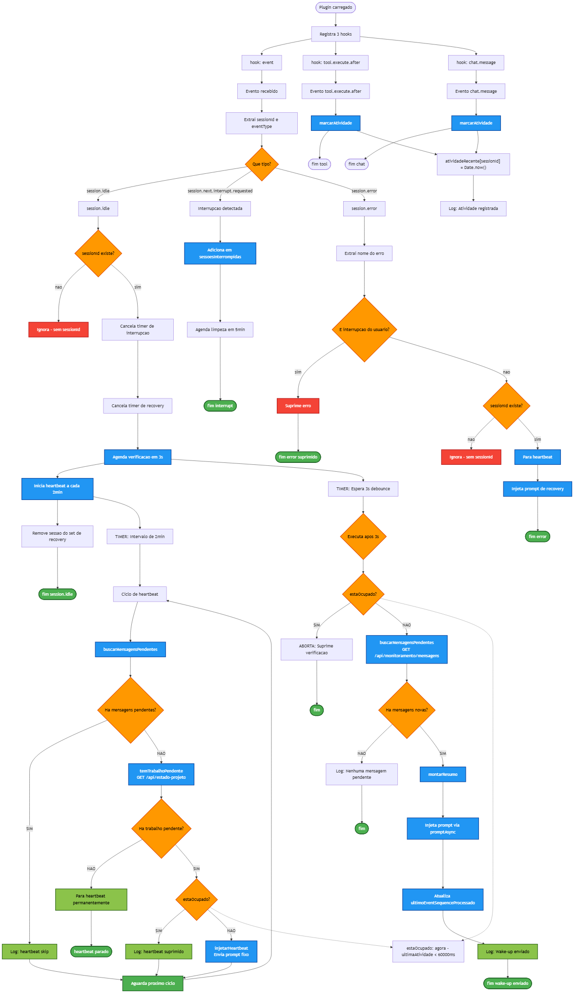

# Fluxo do Plugin `agentmap-wakeup.ts`



```mermaid
flowchart TD
    Start([Plugin carregado pelo Kilo]) --> Register[Registra 3 hooks no ciclo do Kilo]
    Register --> H1[hook: event]
    Register --> H2[hook: tool.execute.after]
    Register --> H3[hook: chat.message]

    %% ============================
    %% tool.execute.after
    %% ============================
    H2 --> TA[Evento tool.execute.after dispara]
    TA --> MarcarAtividadeTool[marcarAtividade(sessionId)]
    MarcarAtividadeTool --> FimTA([fim tool])

    %% ============================
    %% chat.message
    %% ============================
    H3 --> CM[Evento chat.message dispara]
    CM --> MarcarAtividadeChat[marcarAtividade(sessionId)]
    MarcarAtividadeChat --> FimCM([fim chat])

    %% ============================
    %% hook principal: event
    %% ============================
    H1 --> EventRecebido[Evento genérico recebido]
    EventRecebido --> ExtrairIDs[Extrai sessionId e eventType]
    ExtrairIDs --> ChecarTipoEvento{Que tipo de evento?}

    %% ---------- session.idle ----------
    ChecarTipoEvento -->|session.idle| IdleDetectado[session.idle detectado]
    IdleDetectado --> ValidarSessionId{sessionId existe?}
    ValidarSessionId -->|não| IgnorarIdle[Ignora evento - sem sessionId]
    ValidarSessionId -->|sim| LimparInterrupcoes[Cancela timer de interrupção antiga]
    LimparInterrupcoes --> LimparRecovery[Cancela timer de recovery antigo]
    LimparRecovery --> AgendarVerificacao[Agenda verificação em 3s\nagendarVerificacao()]
    AgendarVerificacao --> IniciarHeartbeat[Inicia heartbeat a cada 2min\niniciarHeartbeat()]
    IniciarHeartbeat --> LimparRecoveryFlag[Remove sessão do set de recovery]
    LimparRecoveryFlag --> FimIdle([fim session.idle])

    %% ---------- session.next.interrupt.requested ----------
    ChecarTipoEvento -->|session.next.interrupt.requested| InterruptDetectado[Interrupção (stop) detectada]
    InterruptDetectado --> MarcarInterrompida[Adiciona sessionId em sessoesInterrompidas]
    MarcarInterrompida --> AgendarLimpezaInterrupcao[Agenda limpeza automática em 5min]
    AgendarLimpezaInterrupcao --> FimInterrupt([fim interrupt])

    %% ---------- session.error ----------
    ChecarTipoEvento -->|session.error| ErrorDetectado[session.error detectado]
    ErrorDetectado --> ExtrairDetalhesErro[Extrai nome do erro e mensagem]
    ExtrairDetalhesErro --> ChecarInterrupcao{É interrupção do usuário?}
    ChecarInterrupcao -->|sim\n(MessageAbortedError, abort, cancel, interrupt)| SuprimirError[Suprime erro - não faz nada]
    SuprimirError --> FimErrorSuprimido([fim error suprimido])
    ChecarInterrupcao -->|não| ValidarSessionIdError{sessionId existe?}
    ValidarSessionIdError -->|não| IgnorarError[Ignora erro - sem sessionId]
    ValidarSessionIdError -->|sim| PararHeartbeatError[Para heartbeat da sessão]
    PararHeartbeatError --> InjetarRecovery[Injeta prompt de recovery\ninjetarPromptRecovery()]
    InjetarRecovery --> FimError([fim error])

    %% ============================
    %% FUNÇÃO: agendarVerificacao (chamada no session.idle)
    %% ============================
    AgendarVerificacao --> Timer3s[TIMER: Espera 3 segundos\n(debounce)]
    Timer3s --> ExecutarAposDebounce{Executa após 3s}
    ExecutarAposDebounce --> ChecarOcupadoAgora{estaOcupado(sessionId)?}

    ChecarOcupadoAgora -->|SIM\n(atividade nos últimos 60s)| AbortaVerificacao[ABORTA: Suprime verificação\nLog: "Verificacao suprimida (ocupado)"]
    AbortaVerificacao --> FimAborta([fim])

    ChecarOcupadoAgora -->|NÃO| BuscarMensagens[buscarMensagensPendentes()\nGET /api/monitoramento/mensagens?limite=50&after=<cursor>]
    BuscarMensagens --> TemMensagens{Há mensagens novas?}

    TemMensagens -->|NÃO| LogSemMensagens[Log: "Nenhuma mensagem pendente"]
    LogSemMensagens --> FimSemMensagens([fim])

    TemMensagens -->|SIM| MontarResumo[montarResumo()\nFormata lista de mensagens em texto]
    MontarResumo --> InjetarPromptWakeup[Injeta prompt via client.session.promptAsync()]
    InjetarPromptWakeup --> AtualizarCursor[Atualiza ultimoEventSequenceProcessado\ncom maior eventSequence recebido]
    AtualizarCursor --> LogSucesso[Log: "Wake-up enviado para sessão X\n(Y mensagem(ns))"]
    LogSucesso --> FimSucesso([fim wake-up enviado])

    %% ============================
    %% FUNÇÃO: iniciarHeartbeat (chamada no session.idle)
    %% ============================
    IniciarHeartbeat --> Timer2min[TIMER: Intervalo de 2 minutos\nHEARTBEAT_INTERVAL_MS]
    Timer2min --> CicloHeartbeat[Ciclo de heartbeat a cada 2min]
    CicloHeartbeat --> BuscarMensagensHB[buscarMensagensPendentes()]
    BuscarMensagensHB --> TemMensagensHB{Há mensagens pendentes?}

    TemMensagensHB -->|SIM| SkipHB[Log: "heartbeat skip: X mensagens pendentes"]
    SkipHB --> AguardaProximoCiclo[Aguarda próximo ciclo de 2min]
    AguardaProximoCiclo --> CicloHeartbeat

    TemMensagensHB -->|NÃO| ChecarTrabalhoPendente[temTrabalhoPendente()\nGET /api/estado-projeto]
    ChecarTrabalhoPendente --> TemTrabalho{Há trabalho pendente?\n(tarefas, solicitações, handoffs,\nbloqueios, validações)}

    TemTrabalho -->|NÃO| PararHB[Para heartbeat permanentemente\npararHeartbeat()]
    PararHB --> FimParado([heartbeat parado - sem trabalho])

    TemTrabalho -->|SIM| ChecarOcupadoHB{estaOcupado(sessionId)?}
    ChecarOcupadoHB -->|SIM| SuppressHB[Log: "heartbeat suprimido (ocupado)"]
    SuppressHB --> AguardaProximoCiclo

    ChecarOcupadoHB -->|NÃO| InjetarHB[injetarHeartbeat()\nEnvia prompt fixo:\n"Aviso do AgentMap: verifique o status das tarefas..."]
    InjetarHB --> AguardaProximoCiclo

    %% ============================
    %% FUNÇÕES AUXILIARES
    %% ============================
    MarcarAtividadeTool --> AtividadeMap[atividadeRecente[sessionId] = Date.now()]
    MarcarAtividadeChat --> AtividadeMap

    AtividadeMap --> LogAtividade[Log: "Atividade registrada para session X"]

    ChecarOcupadoAgora -.-> FuncaoOcupado[estaOcupado():\nagora - ultimaAtividade < 60.000ms]
    ChecarOcupadoHB -.-> FuncaoOcupado

    BuscarMensagens --> FiltrarRelevantes[Filtra por:\n- eventSequence > ultimoEventSequenceProcessado\n- tipo em TIPOS_RELEVANTES\n(50 tipos: KILO_CHAT, HANDOFF_*, TAREFA_*, etc.)]
    FiltrarRelevantes --> TemMensagens

    InjetarRecovery --> PromptRecovery[Prompt injetado:\n"Ocorreu um erro no sistema. Não tente resolver agora.\nApenas continue sua tarefa de onde parou..."]
    InjetarPromptWakeup --> PromptWakeup[Prompt injetado:\n"Novas atualizações no AgentMap enquanto você estava ocioso:\n- [agente] resumo\n..."]
    InjetarHB --> PromptHB[Prompt injetado:\n"Aviso do AgentMap: verifique o status das tarefas..."]

    %% ============================
    %% ESTILOS
    %% ============================
    classDef decisao fill:#ff9800,stroke:#e65100,color:#000,stroke-width:2px
    classDef processo fill:#2196f3,stroke:#0d47a1,color:#fff,stroke-width:2px
    classDef terminal fill:#4caf50,stroke:#1b5e20,color:#fff,stroke-width:2px
    classDef sucesso fill:#8bc34a,stroke:#33691e,color:#000,stroke-width:2px
    classDef erro fill:#f44336,stroke:#b71c1c,color:#fff,stroke-width:2px

    class ChecarTipoEvento,ExecutarAposDebounce,ChecarOcupadoAgora,TemMensagens,TemMensagensHB,TemTrabalho,ChecarOcupadoHB,ValidarSessionId,ValidarSessionIdError,ChecarInterrupcao decisao
    class AgendarVerificacao,BuscarMensagens,MontarResumo,InjetarPromptWakeup,AtualizarCursor,IniciarHeartbeat,BuscarMensagensHB,ChecarTrabalhoPendente,InjetarHB,InjetarRecovery,PararHeartbeatError,MarcarAtividadeTool,MarcarAtividadeChat,MarcarInterrompida processo
    class FimIdle,FimInterrupt,FimErrorSuprimido,FimError,FimAborta,FimSemMensagens,FimSucesso,FimParado,AguardaProximoCiclo terminal
    class LogSucesso,SkipHB,SuppressHB,PararHB sucesso
    class SuprimirError,IgnorarIdle,IgnorarError erro
```

---

## Descrição detalhada dos termos técnicos

### Hooks registrados no Kilo

| Nome do hook | O que é | Quando dispara |
|---|---|---|
| `event` | Evento genérico do ciclo de vida do Kilo | Qualquer evento: idle, interrupt, error, etc. |
| `tool.execute.after` | Evento pós-execução de tool | Depois que **qualquer tool** do Kilo termina de executar |
| `chat.message` | Evento de mensagem de chat | Quando o usuário ou agente envia uma mensagem |

### Estruturas de dados em memória

| Estrutura | Tipo | Função |
|---|---|---|
| `atividadeRecente` | `Map<sessionId, timestamp>` | Armazena a última vez que a sessão teve atividade |
| `debounceTimers` | `Map<sessionId, Timeout>` | Timers de 3s aguardando verificação pós-idle |
| `heartbeatTimers` | `Map<sessionId, Interval>` | Intervalos de 2min para heartbeat contínuo |
| `recoveryTimers` | `Map<sessionId, Timeout>` | Timers de 5min para limpar flag de recovery |
| `interruptTimers` | `Map<sessionId, Timeout>` | Timers de 5min para limpar marca de interrupção |
| `sessoesInterrompidas` | `Set<sessionId>` | Sessões que tiveram interrupção solicitada pelo usuário |
| `sessoesComRecovery` | `Set<sessionId>` | Sessões em estado de recovery após erro |
| `ultimoEventSequenceProcessado` | `number` | Cursor do último evento processado (polling incremental) |

### Constantes de tempo

| Constante | Valor | Função |
|---|---|---|
| `DEBOUNCE_MS` | 3000ms | Tempo de espera antes de verificar mensagens após idle |
| `HEARTBEAT_INTERVAL_MS` | 120000ms (2min) | Intervalo entre heartbeats |
| `ATIVIDADE_MAX_MS` | 60000ms (1min) | Janela de atividade — se sessão teve atividade nos últimos 60s, está "ocupada" |
| `INTERRUPT_CLEANUP_MS` | 300000ms (5min) | Tempo para limpar marca de interrupção |
| `RECOVERY_COOLDOWN_MS` | 300000ms (5min) | Tempo antes de permitir novo recovery na mesma sessão |

### Funções principais

| Função | O que faz |
|---|---|
| `marcarAtividade(sessionId)` | Registra timestamp atual em `atividadeRecente[sessionId]` |
| `estaOcupado(sessionId)` | Retorna `true` se `agora - ultimaAtividade < 60000ms` |
| `buscarMensagensPendentes()` | Consulta `/api/monitoramento/mensagens` com cursor `after`, filtra por `TIPOS_RELEVANTES` e `eventSequence > ultimo` |
| `montarResumo(mensagens)` | Formata mensagens em texto legível para o agente |
| `agendarVerificacao()` | Agenda verificação em 3s com debounce; checa ocupação antes de executar |
| `iniciarHeartbeat()` | Cria intervalo de 2min que verifica mensagens e trabalho pendente |
| `pararHeartbeat()` | Limpa intervalo de heartbeat |
| `injetarPromptRecovery()` | Injeta prompt de recovery após erro não-interrupção |
| `temTrabalhoPendente()` | Consulta `/api/estado-projeto` e verifica se há tarefas/solicitações/handoffs/bloqueios/validações pendentes |
| `injetarHeartbeat()` | Injeta prompt fixo de heartbeat (se não estiver ocupado) |

### Tipos de eventos monitorados (`TIPOS_RELEVANTES`)

São **50 tipos** de eventos do AgentMap que disparam wake-up:

- **Kilo:** `KILO_CHAT_REPLY`, `KILO_REPLY`, `KILO_RESULT`, `KILO_CHAT`, `WAKEUP_PARENT`
- **Handoffs:** `HANDOFF_CRIADO`, `HANDOFF_ACEITO`, `HANDOFF_CONCLUIDO`
- **Solicitações:** `SOLICITACAO_CRIADA`, `SOLICITACAO_APROVADA`, `SOLICITACAO_REJEITADA`, `SOLICITACAO_EXCLUIDA`, `SOLICITACAO_ALTERADA`
- **Tarefas:** `TAREFA_CRIADA`, `TAREFA_ATRIBUIDA`, `TAREFA_INICIADA`, `TAREFA_CONCLUIDA`, `TAREFA_CANCELADA`, `TAREFA_BLOQUEADA`, `TAREFA_DESBLOQUEADA`, `TAREFA_ESTADO_ALTERADO`, `TAREFA_EXCLUIDA`, `TAREFA_RECONCILIADA`
- **Bloqueios:** `BLOQUEIO_CRIADO`, `BLOQUEIO_RESOLVIDO`
- **Outros:** `RESULTADO_REGISTRADO`, `ARTEFATO_CRIADO`, `VALIDACAO_INICIADA`, `VALIDACAO_CONCLUIDA`, `RESERVA_CRIADA`, `RESERVA_LIBERADA`, `SESSAO_INICIADA`, `SESSAO_FINALIZADA`, etc.

---

## Regras de decisão antes de enviar qualquer mensagem

### Verificação pós-idle (`agendarVerificacao`)
```
1. Sessão ficou ociosa?
   SIM → agenda verificação em 3s
   NÃO → não faz nada

2. Após 3s, sessão está ocupada? (atividade nos últimos 60s)
   SIM → SUPRIME verificação, não envia nada
   NÃO → continua

3. Busca mensagens pendentes no AgentMap (cursor after)
   SIM → injeta prompt na sessão com resumo das mensagens
   NÃO → apenas loga "nenhuma mensagem pendente"
```

### Heartbeat contínuo (`iniciarHeartbeat`)
```
A cada 2 minutos:
1. Há mensagens pendentes?
   SIM → SKIP heartbeat (a verificação normal vai tratar)
   NÃO → continua

2. Há trabalho pendente no projeto? (tarefas, handoffs, bloqueios, etc.)
   NÃO → PARA heartbeat permanentemente
   SIM → continua

3. Sessão está ocupada? (atividade nos últimos 60s)
   SIM → SUPRIME heartbeat
   NÃO → INJETA heartbeat prompt
```

### Regra de ouro
> **Se a sessão teve qualquer atividade nos últimos 60 segundos, nenhuma mensagem automática é enviada.**

Isso inclui:
- Tool executada (`tool.execute.after`)
- Mensagem enviada (`chat.message`)
- Qualquer evento não-idle
