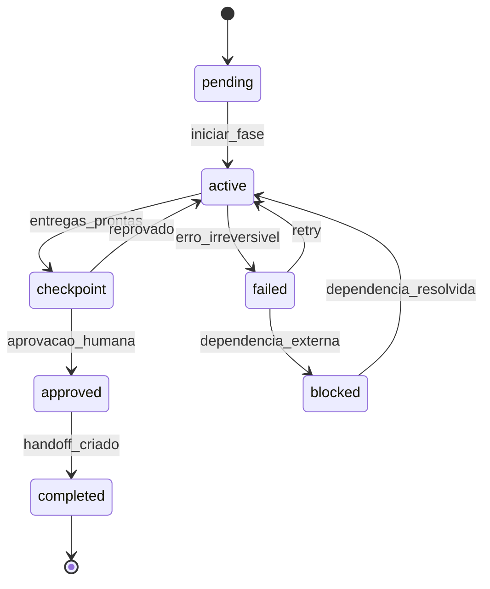
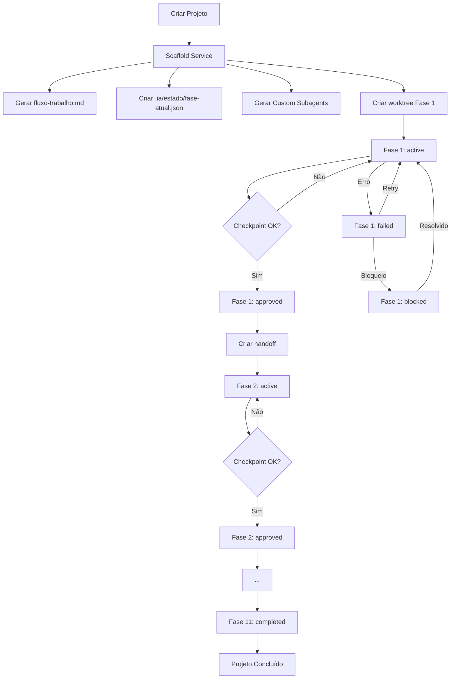

# Plano Final de Implementação — Orquestração de Fases

> Versão robusta, revisada e pronta para implementação.
> Consolida lições de `PLANO GERAL/arquivo/v0021`, análises existentes e correções
> de erros de fluxo, segurança, performance e integração.
>
> **Versão:** 1.0.0
> **Data:** 2026-08-25

---

## Sumário

1. [Revisão Crítica do Plano Anterior](#1-revisão-crítica-do-plano-anterior)
2. [Princípios Revisados](#2-princípios-revisados)
3. [Arquitetura Final](#3-arquitetura-final)
4. [Fluxo Corrigido](#4-fluxo-corrigido)
5. [Camadas de Orquestração](#5-camadas-de-orquestração)
6. [Modelo de Dados](#6-modelo-de-dados)
7. [Implementação Técnica](#7-implementação-técnica)
8. [Interface Web](#8-interface-web)
9. [Checklist de Implementação](#9-checklist-de-implementação)

---

## 1. Revisão Crítica do Plano Anterior

### Problemas identificados

| # | Problema | Severidade | Correção |
|---|----------|-----------|----------|
| 1 | Orquestrador como agente especial | Alta | **Remover**. Usar serviço backend + regras em `fluxo-trabalho.md`. O AgentMap **não executa agentes**. |
| 2 | Criação automática de N worktrees por fase | Alta | **Reduzir**. Usar **uma worktree por fase**, com agentes como Custom Subagents dentro dela. |
| 3 | Handoff como documento solto | Média | **Estruturar**. Handoff vira artefato validado em `.ia/estado/handoffs/` com schema JSON. |
| 4 | Validação de checkpoint apenas automática | Média | **Mista**. Automática + aprovação humana obrigatória. |
| 5 | Templates de prompts hardcoded | Baixa | **Externalizar**. Templates em `backend/src/templates/prompts/`. |
| 6 | Falta de recuperação de erros | Alta | **Adicionar**. Estado de `failed` + retry + rollback de fase. |
| 7 | Segurança: sem controle de acesso por fase | Alta | **Adicionar**. Verificação de permissão antes de iniciar fase. |
| 8 | Performance: worktree por agente é pesado | Alta | **Otimizar**. 1 worktree por fase, N agentes dentro dela. |

### Decisões tomadas

1. **Orquestrador NÃO é um agente** — é um serviço backend (`ProjectOrchestrator`) + regras no `fluxo-trabalho.md`.
2. **Worktree por fase**, não por agente.
3. **Custom Subagents** são gerados em `.kilo/agent/` e usados dentro da worktree da fase.
4. **Handoff é um artefato validado**, não apenas um documento.
5. **Checkpoint tem aprovação humana obrigatória**.
6. **Estados de fase**: `pending`, `active`, `checkpoint`, `approved`, `completed`, `failed`, `blocked`.
7. **Segurança**: permissões por papel, validação de ownership.
8. **Performance**: reuso de worktree, cleanup automático.

---

## 2. Princípios Revisados

### 2.1 Princípios Fundamentais (inalterados)

1. **AgentMap governa** identidade, contexto, contratos, permissões, delegação.
2. **Kilo raciocina e executa** via Custom Subagents nativos + task + permission.task.
3. **Agent Manager isola** via worktree/Git quando necessário.
4. **Git controla** código e branches.
5. **Nada é inventado** — `AGENT_NOT_REGISTERED` se agente não existe.
6. **Triagem antes de delegar** — tarefa pequena = execução direta.
7. **Worktree ≠ agente** — worktree é ambiente de execução de uma session.
8. **AGENTS.md ≠ registry** — é para regras gerais do projeto.
9. **Eventos fecham o loop** — TASK_COMPLETED → watcher → wake principal.
10. **GATE 0 primeiro** — verificar schema real do `agent_manager` antes de implementar.

### 2.2 Princípios Novos (adicionados)

11. **Orquestrador é serviço, não agente** — backend service + regras, nunca prompt de IA.
12. **Uma worktree por fase** — não por agente. Agentes são Custom Subagents dentro da worktree.
13. **Handoff é artefato validado** — schema JSON + aprovação humana.
14. **Checkpoint é porta obrigatória** — nenhuma fase avança sem aprovação explícita.
15. **Recuperação de erros** — estados `failed` e `blocked` com retry e rollback.
16. **Segurança por fase** — permissões, ownership, validação de identidade.
17. **Performance first** — reuso de worktree, cleanup, limites de paralelismo.
18. **Rastreabilidade total** — todo estado é registrado em `.ia/estado/`.

---

## 3. Arquitetura Final

### 3.1 Visão Geral

```
┌─────────────────────────────────────────────────────────────┐
│                    NOVO PROJETO                              │
│                  (criado pelo usuário)                       │
└────────────────────────┬────────────────────────────────────┘
                         │
                         ▼
┌─────────────────────────────────────────────────────────────┐
│                    SCAFFOLD SERVICE                          │
│  - Gera .ia/fluxo-trabalho.md com 11 fases                  │
│  - Gera .ia/estado/fase-atual.json                          │
│  - Gera .ia/procedimentos/ preparacao/entrega por fase      │
│  - Gera .kilo/agent/*.md (Custom Subagents)                 │
│  - Cria 1 worktree inicial para Fase 1                      │
└────────────────────────┬────────────────────────────────────┘
                         │
                         ▼
┌─────────────────────────────────────────────────────────────┐
│                 PROJECT ORCHESTRATOR                         │
│  (serviço backend, NÃO é agente)                            │
│  - Lê fluxo-trabalho.md                                     │
│  - Valida dependências                                      │
│  - Cria agentes Custom Subagents na worktree                │
│  - Dispara execução via MCP tools                           │
│  - Acompanha conclusão via eventos                          │
│  - Valida checkpoints                                      │
│  - Cria handoffs                                            │
│  - Transita fases                                          │
└────────────────────────┬────────────────────────────────────┘
                         │
                         ▼
┌─────────────────────────────────────────────────────────────┐
│              WORKTREE POR FASE                               │
│  .kilo/worktrees/<projeto>-fase-<N>/                        │
│  - Contém código do projeto                                 │
│  - Contém Custom Subagents da fase                          │
│  - Isolada de outras fases                                 │
└────────────────────────┬────────────────────────────────────┘
                         │
                         ▼
┌─────────────────────────────────────────────────────────────┐
│              CUSTOM SUBAGENTS (por papel)                    │
│  .kilo/agent/<papel>.md                                     │
│  - Usados dentro da worktree da fase                        │
│  - Cada um com prompt específico                            │
│  - Ferramentas MCP apropriadas                              │
└─────────────────────────────────────────────────────────────┘
```

### 3.2 Componentes Principais

| Componente | Tipo | Responsabilidade |
|------------|------|------------------|
| `ScaffoldService` | Serviço backend | Gerar estrutura inicial do projeto |
| `ProjectOrchestrator` | Serviço backend | Orquestrar transições de fase |
| `CheckpointValidator` | Serviço backend | Validar critérios de saída |
| `HandoffManager` | Serviço backend | Gerenciar handoffs entre fases |
| `AgentGenerator` | Serviço backend | Gerar Custom Subagents |
| `PhaseStateMachine` | Serviço backend | Controlar transições de estado |
| `WebSocketNotifier` | Serviço backend | Notificar frontend em tempo real |

---

## 4. Fluxo Corrigido

### 4.1 Estados de Fase

```typescript
type FaseStatus =
  | 'pending'      // Aguardando fase anterior
  | 'active'       // Em execução
  | 'checkpoint'   // Aguardando validação
  | 'approved'     // Checkpoint aprovado
  | 'completed'    // Fase concluída
  | 'failed'       // Falhou — requer intervenção
  | 'blocked';     // Bloqueada por dependência externa
```

### 4.2 Transições Válidas



### 4.3 Fluxo Completo



---

## 5. Camadas de Orquestração

### 5.1 Camada 1: Regras (fluxo-trabalho.md)

Define a ordem, dependências e critérios de saída. É a **fonte da verdade** para o fluxo.

```yaml
# .ia/fluxo-trabalho.md
fases:
  - id: fase-1-planejamento
    nome: Planejamento de Projeto
    agente_orquestrador: planejador
    status: pending
    checkpoint:
      entrada: []
      saida:
        - project-charter-aprovado
        - cronograma-definido
        - riscos-mapeados
        - racis-definidos
    dependencias: []
    max_tentativas: 3
    timeout_dias: 5

  - id: fase-2-viabilidade
    nome: Análise de Viabilidade
    agente_orquestrador: viabilidade
    status: pending
    checkpoint:
      entrada:
        - fase-1-planejamento
      saida:
        - viabilidade-tecnica-aprovada
        - viabilidade-economica-aprovada
        - decisao-go-no-go
    dependencias:
      - fase-1-planejamento
    max_tentativas: 2
    timeout_dias: 3
```

### 5.2 Camada 2: Serviço Backend (ProjectOrchestrator)

Lê `fluxo-trabalho.md`, valida regras, cria agentes, gerencia transições.

```typescript
// backend/src/servicios/ProjectOrchestrator.ts

class ProjectOrchestrator {
  async iniciarFase(projetoId: string, faseId: string): Promise<void> {
    // 1. Validar que fase anterior está aprovada
    const faseAnterior = this.obterFaseAnterior(projetoId, faseId);
    if (faseAnterior && faseAnterior.status !== 'approved' && faseAnterior.status !== 'completed') {
      throw new Error(`Fase anterior ${faseAnterior.id} não aprovada. Status: ${faseAnterior.status}`);
    }

    // 2. Marcar fase como active
    await this.marcarFase(projetoId, faseId, 'active');

    // 3. Criar/recriar worktree da fase
    const worktree = await this.criarWorktreeFase(projetoId, faseId);

    // 4. Gerar Custom Subagents da fase
    await this.gerarCustomSubagentsDaFase(projetoId, faseId);

    // 5. Disparar execução via MCP
    await this.dispararExecucaoFase(projetoId, faseId);

    // 6. Iniciar monitoramento
    await this.iniciarMonitoramento(projetoId, faseId);
  }

  async aprovarCheckpoint(projetoId: string, faseId: string, aprovadoPor: string): Promise<void> {
    // 1. Validar checklist
    const checklistValido = await this.validarChecklist(projetoId, faseId);
    if (!checklistValido) {
      throw new Error('Checklist não validado. Não é possível aprovar.');
    }

    // 2. Marcar fase como approved
    await this.marcarFase(projetoId, faseId, 'approved');

    // 3. Criar handoff
    const handoff = await this.criarHandoff(projetoId, faseId);

    // 4. Marcar fase como completed
    await this.marcarFase(projetoId, faseId, 'completed');

    // 5. Iniciar próxima fase
    const proximaFase = this.obterProximaFase(projetoId, faseId);
    if (proximaFase) {
      await this.iniciarFase(projetoId, proximaFase.id);
    }
  }
}
```

### 5.3 Camada 3: Templates e Prompts

Prompts específicos por papel, externalizados em arquivos.

```
backend/src/templates/prompts/
├── fase-1-planejamento/
│   ├── project-manager.md
│   ├── product-owner.md
│   ├── business-analyst.md
│   └── ...
├── fase-2-viabilidade/
│   └── ...
└── ...
```

Cada template contém:
- Contexto da fase
- Objetivo específico
- Profissionais envolvidos
- Entregas esperadas
- Checklist de saída
- Instruções de handoff
- Regras e restrições

---

## 6. Modelo de Dados

### 6.1 Estado do Projeto

```json
// .ia/estado/fase-atual.json
{
  "projetoId": "sistema-gestao",
  "faseAtual": "fase-3-requisitos",
  "status": "active",
  "historico": [
    {
      "faseId": "fase-1-planejamento",
      "status": "completed",
      "inicio": "2026-08-25T10:00:00Z",
      "fim": "2026-08-25T18:00:00Z",
      "aprovadoPor": "joao",
      "handoff": "handoff-fase-1-para-fase-2.md"
    }
  ]
}
```

### 6.2 Handoff

```json
// .ia/estado/handoffs/handoff-fase-1-para-fase-2.json
{
  "id": "HANDOFF-2026-00001",
  "projetoId": "sistema-gestao",
  "faseOrigem": "fase-1-planejamento",
  "faseDestino": "fase-2-viabilidade",
  "status": "approved",
  "data": "2026-08-25T18:00:00Z",
  "aprovadoPor": "joao",
  "resumo": "...",
  "entregas": [...],
  "decisoes": [...],
  "riscos": [...],
  "proximosPassos": [...]
}
```

### 6.3 Checklist

```json
// .ia/estado/checklists/fase-1-planejamento.json
{
  "faseId": "fase-1-planejamento",
  "itens": [
    { "id": "project-charter", "descricao": "Project Charter aprovado", "obrigatorio": true },
    { "id": "cronograma", "descricao": "Cronograma definido", "obrigatorio": true },
    { "id": "riscos", "descricao": "Riscos mapeados", "obrigatorio": true }
  ],
  "aprovado": true,
  "aprovadoPor": "joao",
  "dataAprovacao": "2026-08-25T18:00:00Z"
}
```

---

## 7. Implementação Técnica

### 7.1 Modificações no Backend

#### 7.1.1 ScaffoldService.ts (estender)

```typescript
async function criarProjetoComFases(nome: string, caminho: string): Promise<void> {
  // 1. Estrutura básica
  await this.criarEstruturaBasica(nome, caminho);

  // 2. Fluxo de trabalho
  const fluxo = this.gerarFluxoTrabalho(nome);
  await this.escreverArquivo(`${caminho}/.ia/fluxo-trabalho.md`, fluxo);

  // 3. Estado inicial
  const estadoInicial = {
    projetoId: nome,
    faseAtual: 'fase-1-planejamento',
    status: 'pending',
    historico: []
  };
  await this.escreverArquivo(`${caminho}/.ia/estado/fase-atual.json`, JSON.stringify(estadoInicial, null, 2));

  // 4. Pastas
  await this.criarPastasObrigatorias(caminho);

  // 5. Custom Subagents
  await this.gerarCustomSubagents(nome, caminho);

  // 6. Procedimentos
  await this.gerarProcedimentos(nome, caminho);

  // 7. Registrar projeto
  await this.registrarProjeto(nome, caminho);
}
```

#### 7.1.2 ProjectOrchestrator.ts (novo)

```typescript
// backend/src/servicios/ProjectOrchestrator.ts

class ProjectOrchestrator {
  async iniciarFase(projetoId: string, faseId: string): Promise<void> {
    // 1. Validar fase anterior
    const faseAnterior = this.obterFaseAnterior(projetoId, faseId);
    if (faseAnterior && !['approved', 'completed'].includes(faseAnterior.status)) {
      throw new Error(`Fase anterior ${faseAnterior.id} não aprovada. Status: ${faseAnterior.status}`);
    }

    // 2. Marcar fase como active
    await this.marcarFase(projetoId, faseId, 'active');

    // 3. Criar/recriar worktree da fase
    const worktree = await this.criarWorktreeFase(projetoId, faseId);

    // 4. Gerar Custom Subagents da fase
    await this.gerarCustomSubagentsDaFase(projetoId, faseId);

    // 5. Disparar execução via MCP
    await this.dispararExecucaoFase(projetoId, faseId);

    // 6. Iniciar monitoramento
    await this.iniciarMonitoramento(projetoId, faseId);
  }

  async aprovarCheckpoint(projetoId: string, faseId: string, aprovadoPor: string): Promise<void> {
    // 1. Validar checklist
    const checklistValido = await this.validarChecklist(projetoId, faseId);
    if (!checklistValido) {
      throw new Error('Checklist não validado. Não é possível aprovar.');
    }

    // 2. Marcar fase como approved
    await this.marcarFase(projetoId, faseId, 'approved');

    // 3. Criar handoff
    const handoff = await this.criarHandoff(projetoId, faseId);

    // 4. Marcar fase como completed
    await this.marcarFase(projetoId, faseId, 'completed');

    // 5. Iniciar próxima fase
    const proximaFase = this.obterProximaFase(projetoId, faseId);
    if (proximaFase) {
      await this.iniciarFase(projetoId, proximaFase.id);
    }
  }
}
```

#### 7.1.3 CheckpointValidator.ts (novo)

```typescript
// backend/src/servicios/CheckpointValidator.ts

class CheckpointValidator {
  async validarChecklist(projetoId: string, faseId: string): Promise<boolean> {
    const fase = await this.obterFase(projetoId, faseId);
    const checklist = fase.checkpoint.saida;

    const resultados = await Promise.all(
      checklist.map(item => this.validarItem(projetoId, item))
    );

    return resultados.every(r => r.valido);
  }

  async validarItem(projetoId: string, item: string): Promise<{ valido: boolean; detalhe: string }> {
    // Validar cada item do checklist
    // Ex: project-charter-aprovado → verificar se arquivo existe e está aprovado
    switch (item) {
      case 'project-charter-aprovado':
        return this.validarArquivoAprovado(projetoId, 'docs/planejamento/project-charter.md');
      case 'srs-aprovado':
        return this.validarArquivoAprovado(projetoId, 'docs/requisitos/srs.md');
      default:
        return { valido: false, detalhe: `Item não reconhecido: ${item}` };
    }
  }
}
```

### 7.2 Novos Endpoints

```typescript
// backend/src/api/projetos-orchestracao.ts

router.post('/projetos/:id/fases/:faseId/iniciar', async (req, res) => {
  const { id, faseId } = req.params;
  await orchestrator.iniciarFase(id, faseId);
  res.json({ sucesso: true });
});

router.post('/projetos/:id/fases/:faseId/checkpoint/aprovar', async (req, res) => {
  const { id, faseId } = req.params;
  const { aprovadoPor, observacoes } = req.body;
  await orchestrator.aprovarCheckpoint(id, faseId, aprovadoPor);
  res.json({ sucesso: true });
});

router.get('/projetos/:id/fases', async (req, res) => {
  const { id } = req.params;
  const fases = await obterFases(id);
  res.json(fases);
});

router.get('/projetos/:id/handoffs', async (req, res) => {
  const { id } = req.params;
  const handoffs = await obterHandoffs(id);
  res.json(handoffs);
});
```

### 7.3 Novas Tools MCP

```typescript
// backend/src/mcp-server/tools/orchestrator.ts

export const orchestratorTools = [
  {
    name: 'agentmap_fase_iniciar',
    description: 'Inicia uma fase do projeto, criando worktree e agentes',
    inputSchema: z.object({
      projetoId: z.string(),
      faseId: z.string(),
    }),
    handler: async ({ projetoId, faseId }) => {
      return await orchestrator.iniciarFase(projetoId, faseId);
    },
  },
  {
    name: 'agentmap_fase_aprovar_checkpoint',
    description: 'Aprova o checkpoint de uma fase e inicia a próxima',
    inputSchema: z.object({
      projetoId: z.string(),
      faseId: z.string(),
      aprovadoPor: z.string(),
    }),
    handler: async ({ projetoId, faseId, aprovadoPor }) => {
      return await orchestrator.aprovarCheckpoint(projetoId, faseId, aprovadoPor);
    },
  },
];
```

---

## 8. Interface Web

### 8.1 Telas Principais

| Tela | URL | Função |
|------|-----|--------|
| Lista de Projetos | `/projetos` | Lista todos os projetos |
| Criar Projeto | `/projetos/novo` | Formulário de criação |
| Detalhes do Projeto | `/projetos/:id` | Progresso das 11 fases |
| Detalhes da Fase | `/projetos/:id/fases/:faseId` | Agent, entregas, ações |
| Aprovar Checkpoint | `/projetos/:id/fases/:faseId/checkpoint` | Aprovar/reprovar |
| Handoffs | `/projetos/:id/handoffs` | Lista de handoffs |

### 8.2 Componentes Reutilizáveis

- `fase-card` — Card de fase com status visual
- `progress-bar` — Barra de progresso do projeto
- `handoff-viewer` — Visualizador de handoff
- `checklist` — Checklist de validação
- `agent-list` — Lista de agentes da fase

---

## 9. Checklist de Implementação

### 9.1 Backend

- [ ] Estender `ScaffoldService.ts` para gerar 11 fases
- [ ] Criar `ProjectOrchestrator.ts`
- [ ] Criar `CheckpointValidator.ts`
- [ ] Criar `HandoffManager.ts`
- [ ] Criar `PhaseStateMachine.ts`
- [ ] Adicionar endpoints REST
- [ ] Adicionar tools MCP
- [ ] Criar templates de prompts
- [ ] Implementar validação de dependências
- [ ] Implementar recuperação de erros
- [ ] Adicionar notificações WebSocket

### 9.2 Frontend

- [ ] Criar tela de criação de projeto
- [ ] Criar tela de visão geral
- [ ] Criar tela de detalhes da fase
- [ ] Criar tela de aprovação de checkpoint
- [ ] Criar tela de handoffs
- [ ] Implementar progress bar
- [ ] Implementar notificações em tempo real

### 9.3 Documentação

- [ ] Atualizar `AGENTS.md`
- [ ] Atualizar `README.md`
- [ ] Criar guia de uso para usuários
- [ ] Criar guia de uso para agentes

---

## Referências

- `docs/fluxo-execucao-projetos.md`
- `docs/responsabilidades-profissionais.md`
- `docs/solucao-orquestracao.md`
- `BRIEFING-7-AGENTES.md`
- `PLANO GERAL/arquivo/v0021/*.md`
- `PLANO GERAL/arquivo/analise-realidade-orquestracao.md`

---

**Versão:** 1.0.0
**Data:** 2026-08-25
**Autor:** Equipe AgentMap
