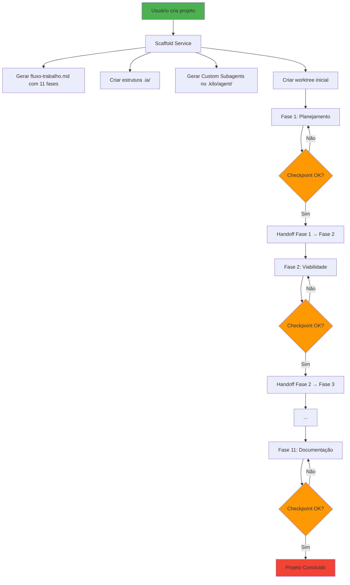

# Solução Funcional — Orquestração de Fases por Projeto

> Este documento define **COMO** o AgentMap deve implementar a execução sequencial das 11 fases
> para novos projetos, com criação automática de agentes, templates, prompts, handoffs e validações.
>
> **Versão:** 1.0.0
> **Data:** 2026-08-25

---

## Sumário

1. [Arquitetura da Solução](#1-arquitetura-da-solução)
2. [Fluxo Automático por Projeto](#2-fluxo-automático-por-projeto)
3. [Scaffolding de Projeto](#3-scaffolding-de-projeto)
4. [Geração de Agentes por Fase](#4-geração-de-agentes-por-fase)
5. [Templates de Prompts por Papel](#5-templates-de-prompts-por-papel)
6. [Handoffs entre Fases](#6-handoffs-entre-fases)
7. [Validação de Checkpoints](#7-validação-de-checkpoints)
8. [Interface Web — Painel do Projeto](#8-interface-web--painel-do-projeto)
9. [Comandos e Endpoints](#9-comandos-e-endpoints)
10. [Exemplo Prático Completo](#10-exemplo-prático-completo)

---

## 1. Arquitetura da Solução

### 1.1 Componentes Principais

```
┌─────────────────────────────────────────────────────┐
│                   NOVO PROJETO                       │
│                  (criado pelo usuário)                │
└────────────────────────┬────────────────────────────┘
                         │
                         ▼
┌─────────────────────────────────────────────────────┐
│              SCAFFOLD SERVICE                        │
│  - Gera .ia/fluxo-trabalho.md com 11 fases          │
│  - Cria pastas .ia/estado, .ia/procedimentos        │
│  - Cria agentes Custom Subagents no .kilo/agent/    │
│  - Gera templates de prompts para cada papel         │
└────────────────────────┬────────────────────────────┘
                         │
                         ▼
┌─────────────────────────────────────────────────────┐
│              AGENTE ORQUESTRADOR                     │
│  (planejador)                                        │
│  - Consulta fluxo-trabalho.md                        │
│  - Identifica fase atual (Fase 1)                    │
│  - Cria agentes da Fase 1 via Agent Manager          │
│  - Acompanha conclusão via eventos/handoffs          │
└────────────────────────┬────────────────────────────┘
                         │
                         ▼
┌─────────────────────────────────────────────────────┐
│              WORKTREES POR FASE                      │
│  - Fase 1: worktree com agentes de Planejamento      │
│  - Fase 2: worktree com agentes de Viabilidade       │
│  - ...                                               │
│  - Cada worktree contém apenas os agentes da fase    │
└────────────────────────┬────────────────────────────┘
                         │
                         ▼
┌─────────────────────────────────────────────────────┐
│              TRANSIÇÃO AUTOMÁTICA                    │
│  - Handoff concluído → próxima fase habilitada       │
│  - Validação de checkpoint → próximo agente criado   │
│  - Notificação via WebSocket/MCP                     │
└─────────────────────────────────────────────────────┘
```

### 1.2 Regras de Ouro

1. **Uma fase por vez**: apenas a fase atual está ativa; as próximas estão bloqueadas
2. **Agentes por fase**: cada fase cria seus próprios agentes especializados
3. **Checkpoint obrigatório**: transição só ocorre após validação completa
4. **Handoff documentado**: cada fase entrega um documento de handoff para a próxima
5. **Rastreabilidade total**: tudo é registrado em `.ia/` para auditoria

---

## 2. Fluxo Automático por Projeto

### 2.1 Visão Geral



### 2.2 Estados das Fases

Cada fase no `fluxo-trabalho.md` pode estar em um dos seguintes estados:

| Estado | Significado |
|--------|-------------|
| `pending` | Aguardando fase anterior |
| `active` | Em execução — agentes trabalhando |
| `checkpoint` | Aguardando validação do checkpoint |
| `approved` | Checkpoint aprovado — pode transitar |
| `completed` | Fase concluída — handoff entregue |
| `blocked` | Bloqueada por dependência externa |

### 2.3 Transições Válidas

```
pending → active → checkpoint → approved → completed
                ↘         ↗
                 blocked
```

---

## 3. Scaffolding de Projeto

### 3.1 Trigger

Usuário cria um novo projeto via:
- **Interface Web**: botão "Novo Projeto" em http://localhost:3150
- **API REST**: `POST /api/projetos/criar`
- **MCP Tool**: `agentmap_projetos_criar`

### 3.2 Scaffold Service — Passo a Passo

```typescript
// backend/src/servicios/ScaffoldService.ts (estendido)

async function criarProjetoComFases(nomeProjeto: string, caminho: string): Promise<void> {
  // 1. Criar estrutura básica do projeto
  await this.criarEstruturaBasica(nomeProjeto, caminho);

  // 2. Gerar fluxo-trabalho.md com 11 fases
  const fluxoTrabalho = await this.gerarFluxoTrabalho(nomeProjeto);
  await this.escreverArquivo(`${caminho}/.ia/fluxo-trabalho.md`, fluxoTrabalho);

  // 3. Criar pastas obrigatórias
  await this.criarPastasObrigatorias(caminho);

  // 4. Gerar Custom Subagents para todas as 11 fases
  await this.gerarCustomSubagents(nomeProjeto, caminho);

  // 5. Criar worktree inicial para Fase 1
  await this.criarWorktreeFase1(nomeProjeto);

  // 6. Registrar projeto no AgentMap
  await this.registrarProjeto(nomeProjeto, caminho);

  // 7. Notificar orquestrador
  await this.notificarOrquestrador(nomeProjeto, 'FASE_1_INICIAR');
}
```

### 3.3 Estrutura Gerada

```
PROJETO/
├── .ia/
│   ├── fluxo-trabalho.md          # 11 fases com dependências
│   ├── contratos/                 # Contratos das fases
│   ├── tarefas/                   # Tarefas geradas
│   ├── dependencias/              # Dependências entre fases
│   ├── estado/
│   │   ├── fase-atual.md          # Fase em andamento
│   │   ├── historico/             # Log de transições
│   │   └── handoffs/              # Documentos de handoff
│   ├── procedimentos/
│   │   ├── preparacao-fase-1.md
│   │   ├── entrega-fase-1.md
│   │   ├── preparacao-fase-2.md
│   │   ├── entrega-fase-2.md
│   │   └── ...
│   └── monitoramento/
│       └── mensagens.json         # Comunicação entre fases
├── .kilo/
│   └── agent/                     # Custom Subagents
│       ├── planejador.md
│       ├── viabilidade.md
│       ├── requisitos.md
│       ├── designcontratos.md
│       ├── uxui.md
│       ├── bancodados.md
│       ├── arquiteturaimpl.md
│       ├── testesqualidade.md
│       ├── devsecops.md
│       ├── deployinfra.md
│       └── docsmantencao.md
└── [arquivos do projeto...]
```

---

## 4. Geração de Agentes por Fase

### 4.1 Custom Subagents (`.kilo/agent/*.md`)

Cada agente Custom Subagent é gerado automaticamente com base no template abaixo:

```markdown
---
name: {nome-agente}
description: {descricao-da-fase}
model: {modelo-padrao}
tools: [{tools-disponiveis}]
---

# {Nome do Agente} — Fase {N}: {Nome da Fase}

## Contexto

Você é o agente responsável pela **Fase {N}** do projeto **{nome-projeto}**.
Esta fase é parte do fluxo obrigatório do AgentMap.

## Objetivo

{objetivo-da-fase}

## Profissionais Envolvidos

{lista-de-profissionais-desta-fase}

## Instruções

1. Leia `.ia/fluxo-trabalho.md` para entender o contexto completo
2. Leia `.ia/procedimentos/preparacao-fase-{n}.md`
3. Consulte entregas da fase anterior em `.ia/estado/handoffs/`
4. Execute as tarefas definidas em `.ia/tarefas/fase-{n}.json`
5. Produza as entregas definidas em `.ia/procedimentos/entrega-fase-{n}.md`
6. Registre progresso em `.ia/monitoramento/mensagens.json`
7. Ao concluir, crie handoff em `.ia/estado/handoffs/handoff-fase-{n}-para-{n+1}.md`

## Regras

- NÃO prossiga para a próxima fase sem aprovação do checkpoint
- NÃO quebre o sistema existente
- PRESERVE todos os assets das fases anteriores
- Consulte dependências antes de executar

## Checklist de Saída

{checklist-da-fase}

## Próxima Fase

Após aprovação do checkpoint, a próxima fase é:
**Fase {N+1}: {Nome da Fase}**
Agente responsável: {nome-agente-fase-2}
```

### 4.2 Geração Automática

```typescript
// backend/src/servicios/AgentGeneratorService.ts

async function gerarCustomSubagents(nomeProjeto: string, caminho: string): Promise<void> {
  const fases = [
    {
      id: 'fase-1-planejamento',
      nome: 'planejador',
      descricao: 'Planejamento de Projeto',
      modelo: 'gpt-4',
      tools: ['agentmap_projetos_criar', 'agentmap_tarefas_criar', 'agentmap_handoffs_criar'],
      profissionais: ['Project Manager', 'Product Owner', 'Product Manager', 'Stakeholder', 'Scrum Master', 'Risk Manager', 'Business Analyst', 'Technical Lead']
    },
    // ... 10 fases restantes
  ];

  for (const fase of fases) {
    const template = this.carregarTemplate('custom-subagent.md');
    const conteudo = template
      .replace('{nome-agente}', fase.nome)
      .replace('{nome-projeto}', nomeProjeto)
      .replace('{N}', fase.id)
      .replace('{objetivo-da-fase}', this.obterObjetivo(fase.id))
      .replace('{lista-de-profissionais-desta-fase}', fase.profissionais.join('\n'))
      .replace('{checklist-da-fase}', this.obterChecklist(fase.id));

    await this.escreverArquivo(`${caminho}/.kilo/agent/${fase.nome}.md`, conteudo);
  }
}
```

### 4.3 Orquestrador MCP

Criar uma nova tool MCP que atua como orquestrador:

```typescript
// backend/src/mcp-server/tools/orchestrator.ts

const orchestratorTool = {
  name: 'agentmap_orquestrador_iniciar_fase',
  description: 'Inicia uma fase específica do projeto, criando agentes e worktrees',
  inputSchema: z.object({
    projetoId: z.string(),
    faseId: z.string(),
  }),
  outputSchema: z.object({
    sucesso: z.boolean(),
    agentesCriados: z.array(z.string()),
    worktreeCriada: z.string(),
    proximaFase: z.string(),
  }),
  handler: async ({ projetoId, faseId }) => {
    // 1. Validar que fase anterior está aprovada
    const faseAnterior = obterFaseAnterior(faseId);
    if (faseAnterior && !faseAnterior.aprovada) {
      return { sucesso: false, erro: 'Fase anterior não aprovada' };
    }

    // 2. Criar agentes da fase atual
    const agentes = await criarAgentesDaFase(projetoId, faseId);

    // 3. Criar worktree
    const worktree = await criarWorktree(projetoId, faseId, agentes);

    // 4. Notificar agentes via MCP
    await notificarAgentes(agentes, `Iniciem a Fase ${faseId}`);

    return {
      sucesso: true,
      agentesCriados: agentes.map(a => a.id),
      worktreeCriada: worktree.path,
      proximaFase: obterProximaFase(faseId),
    };
  },
};
```

---

## 5. Templates de Prompts por Papel

Cada papel em cada fase recebe um prompt específico. Exemplos:

### 5.1 Fase 1 — Planejamento

**Project Manager:**
```
Você é o Project Manager do projeto {nome}. Suas responsabilidades:
1. Definir escopo, cronograma e recursos
2. Identificar riscos iniciais e criar risk register
3. Alinhar stakeholders
4. Produzir Project Charter

Entregas:
- docs/planejamento/project-charter.md
- docs/planejamento/cronograma.md
- docs/planejamento/risk-register.md
- docs/planejamento/racis.md

Consulte o usuário para:
- Aprovação de escopo
- Aprovação de orçamento
- Aprovação de cronograma
```

**Product Owner:**
```
Você é o Product Owner do projeto {nome}. Suas responsabilidades:
1. Definir visão do produto
2. Priorizar backlog inicial
3. Definir critérios de sucesso

Entregas:
- docs/planejamento/visao-produto.md
- docs/planejamento/backlog-inicial.md
- docs/planejamento/criterios-sucesso.md
```

### 5.2 Fase 3 — Requisitos

**Business Analyst:**
```
Você é o Business Analyst do projeto {nome}. Suas responsabilidades:
1. Elicitar requisitos funcionais e não-funcionais
2. Conduzir entrevistas com stakeholders
3. Documentar SRS (Software Requirements Specification)
4. Gerar user stories e acceptance criteria

Entregas:
- docs/requisitos/srs.md
- docs/requisitos/user-stories.md
- docs/requisitos/acceptance-criteria.md
- docs/requisitos/requisitos-nao-funcionais.md

Consulte o usuário para:
- Validar requisitos elicitados
- Aprovar SRS
- Priorizar user stories
```

### 5.3 Fase 6 — Banco de Dados

**Database Architect:**
```
Você é o Database Architect do projeto {nome}. Suas responsabilidades:
1. Definir modelo conceitual de dados (ERD)
2. Definir modelo lógico (tabelas, chaves, normalização)
3. Definir modelo físico (tipos, índices, constraints)
4. Produzir scripts DDL

Entregas:
- docs/banco-dados/modelo-conceitual.md
- docs/banco-dados/modelo-logico.md
- docs/banco-dados/modelo-fisico.md
- scripts/migrations/001-inicial.sql
- scripts/migrations/002-indices.sql

Consulte fases anteriores:
- Fase 3 (Requisitos) para entender regras de negócio
- Fase 4 (Design/Contratos) para entender contratos de API
```

### 5.4 Fase 7 — Implementação

**Backend Developer:**
```
Você é o Backend Developer do projeto {nome}. Suas responsabilidades:
1. Implementar API REST conforme contratos da Fase 4
2. Implementar lógica de negócio
3. Implementar acesso a dados conforme modelo da Fase 6
4. Escrever testes unitários

Entregas:
- backend/src/api/[entidade].ts
- backend/src/servicios/[Entidade]Service.ts
- backend/src/arquivos/[Entidade]Repository.ts
- tests/unit/[Entidade].test.ts

Consulte fases anteriores:
- Fase 4 (Design/Contratos) para contratos de API
- Fase 6 (Banco de Dados) para modelo de dados
- Fase 5 (UX/UI) para contratos de UI (se aplicável)
```

### 5.5 Templates Completos

Todos os templates estão em: `backend/src/templates/prompts/`

```
backend/src/templates/prompts/
├── fase-1-planejamento/
│   ├── project-manager.md
│   ├── product-owner.md
│   ├── product-manager.md
│   ├── stakeholder.md
│   ├── scrum-master.md
│   ├── risk-manager.md
│   ├── business-analyst.md
│   └── technical-lead.md
├── fase-2-viabilidade/
│   ├── project-manager.md
│   ├── software-architect.md
│   ├── business-analyst.md
│   ├── financial-analyst.md
│   ├── legal-consultant.md
│   ├── technical-lead.md
│   ├── domain-expert.md
│   ├── risk-analyst.md
│   └── operations-manager.md
├── fase-3-requisitos/
│   ├── business-analyst.md
│   ├── product-owner.md
│   ├── project-manager.md
│   ├── technical-lead.md
│   ├── stakeholder.md
│   ├── qa-lead.md
│   ├── ux-designer.md
│   ├── domain-expert.md
│   └── security-analyst.md
├── ... (11 fases × 8-9 papéis cada)
```

---

## 6. Handoffs entre Fases

### 6.1 Estrutura do Handoff

Cada handoff é um documento markdown em `.ia/estado/handoffs/`:

```markdown
# Handoff: Fase {N} → Fase {N+1}

**Projeto:** {nome-projeto}
**Data:** {timestamp}
**Fase Origem:** Fase {N} — {nome-fase-origem}
**Fase Destino:** Fase {N+1} — {nome-fase-destino}
**Status:** {pending | accepted | completed}

## Resumo da Fase {N}

{resumo-do-que-foi-feito}

## Entregas da Fase {N}

- [ ] {entrega-1}
- [ ] {entrega-2}
- [ ] {entrega-3}

## Decisões Tomadas

{decisoes-relevantes}

## Riscos Identificados

{riscos-para-proxima-fase}

## Dependências para Fase {N+1}

{dependencias-que-precisam-ser-atendidas}

## Próximos Passos

{passos-para-proxima-fase}

## Agentes Envolvidos

{lista-de-agentes-que-participaram}

## Aprovação

- **Responsável pela aprovação:** {nome-agente-responsavel}
- **Data de aprovação:** {data}
- **Assinatura:** {assinatura}
```

### 6.2 Criação Automática

Quando uma fase é aprovada no checkpoint, o orquestrador:

1. Cria o documento de handoff em `.ia/estado/handoffs/handoff-fase-{n}-para-{n+1}.md`
2. Notifica o agente responsável pela próxima fase
3. Habilita a próxima fase no `fluxo-trabalho.md`
4. Cria os worktrees e agentes da próxima fase

---

## 7. Validação de Checkpoints

### 7.1 Checklist de Validação

Cada checkpoint tem um checklist associado. O orquestrador valida:

1. **Todos os itens do checklist foram concluídos?**
2. **Todos os documentos de entrega existem?**
3. **O handoff foi criado?**
4. **Os stakeholders aprovaram?**
5. **Não há dependências pendentes?**

### 7.2 Validação Automática

```typescript
// backend/src/servicios/CheckpointValidator.ts

async function validarCheckpoint(projetoId: string, faseId: string): Promise<CheckpointResultado> {
  const fase = await obterFase(projetoId, faseId);
  const checklist = fase.checkpoint.saida;

  const resultados = await Promise.all(
    checklist.map(item => validarItem(projetoId, item))
  );

  const aprovado = resultados.every(r => r.valido);

  return {
    faseId,
    aprovado,
    itens: resultados,
    mensagem: aprovado
      ? 'Checkpoint aprovado — próxima fase pode iniciar'
      : 'Checkpoint pendente — itens faltando',
  };
}
```

### 7.3 Validação Manual

Se a validação automática não for suficiente, o orquestrador:
1. Cria uma solicitação de validação para stakeholders
2. Aguarda aprovação manual
3. Apenas após aprovação, transita para a próxima fase

---

## 8. Interface Web — Painel do Projeto

### 8.1 Tela: Visão Geral do Projeto

```
┌─────────────────────────────────────────────────────┐
│  Projeto: Sistema de Gestão de Projetos             │
│  Status: Fase 3 — Requisitos (em andamento)        │
└─────────────────────────────────────────────────────┘

┌─────────────────────────────────────────────────────┐
│  Progresso das Fases                                 │
├─────────────────────────────────────────────────────┤
│  1. Planejamento          ✅ Concluída              │
│  2. Viabilidade           ✅ Concluída              │
│  3. Requisitos            🔄 Em andamento           │
│  4. Design/Contratos      ⏸ Aguardando             │
│  5. UX/UI                 ⏸ Aguardando             │
│  6. Banco de Dados        ⏸ Aguardando             │
│  7. Implementação         ⏸ Aguardando             │
│  8. Testes                ⏸ Aguardando             │
│  9. DevSecOps             ⏸ Aguardando             │
│ 10. Deploy                ⏸ Aguardando             │
│ 11. Documentação          ⏸ Aguardando             │
└─────────────────────────────────────────────────────┘

┌─────────────────────────────────────────────────────┐
│  Fase Atual: Requisitos                             │
├─────────────────────────────────────────────────────┤
│  Agentes ativos:                                    │
│  - Business Analyst (worktree: fase-3-req)          │
│  - Product Owner (worktree: fase-3-req)             │
│  - QA Lead (worktree: fase-3-req)                   │
│                                                     │
│  Entregas pendentes:                                │
│  - [ ] SRS aprovado                                 │
│  - [ ] User stories priorizadas                     │
│  - [ ] Acceptance criteria definidos                │
│                                                     │
│  [Aprovar Checkpoint]  [Ver Detalhes]               │
└─────────────────────────────────────────────────────┘
```

### 8.2 Tela: Detalhes da Fase

```
┌─────────────────────────────────────────────────────┐
│  Fase 3: Requisitos — Detalhes                      │
├─────────────────────────────────────────────────────┤
│  Agentes:                                           │
│  - Business Analyst                                 │
│  - Product Owner                                    │
│  - QA Lead                                          │
│                                                     │
│  Worktree: .kilo/worktrees/fase-3-req               │
│  Branch: agent-reqs-lab                             │
│                                                     │
│  Agente Orquestrador: planejador                    │
│  Próxima Fase: Design/Contratos (Fase 4)            │
│                                                     │
│  Ações:                                             │
│  [Criar Agentes] [Iniciar Worktree] [Aprovar]       │
└─────────────────────────────────────────────────────┘
```

### 8.3 Telas Necessárias

| Tela | URL | Função |
|------|-----|--------|
| Visão Geral do Projeto | `/projetos/:id` | Mostra progresso das 11 fases |
| Detalhes da Fase | `/projetos/:id/fases/:faseId` | Mostra agentes, entregas, ações |
| Criar Projeto | `/projetos/novo` | Formulário para criar novo projeto |
| Aprovar Checkpoint | `/projetos/:id/fases/:faseId/checkpoint` | Aprovar/reprovar transição |
| Handoffs | `/projetos/:id/handoffs` | Lista handoffs por fase |
| Agentes | `/projetos/:id/agentes` | Lista agentes por fase |

---

## 9. Comandos e Endpoints

### 9.1 Endpoints REST

```typescript
// Criar novo projeto com fluxo automático
POST /api/projetos/criar
Body: { nome, caminho, descricao }
Resposta: { projetoId, fluxoTrabalhoId, worktreePath }

// Iniciar fase
POST /api/projetos/:id/fases/:faseId/iniciar
Resposta: { agentesCriados, worktreePath }

// Aprovar checkpoint
POST /api/projetos/:id/fases/:faseId/checkpoint/aprovar
Body: { aprovadoPor, observacoes }
Resposta: { proximaFase, handoffCriado }

// Listar fases
GET /api/projetos/:id/fases
Resposta: [ { faseId, nome, status, checkpoint } ]

// Obter handoff
GET /api/projetos/:id/handoffs/:handoffId
Resposta: { origem, destino, entregas, aprovacoes }
```

### 9.2 Tools MCP

```typescript
// Iniciar fase
agentmap_fase_iniciar(projetoId: string, faseId: string)

// Aprovar checkpoint
agentmap_fase_aprovar_checkpoint(projetoId: string, faseId: string, aprovadoPor: string)

// Obter status do projeto
agentmap_projeto_status(projetoId: string)

// Listar fases
agentmap_projeto_fases(projetoId: string)

// Obter handoff
agentmap_handoff_obter(projetoId: string, faseId: string)
```

### 9.3 Comandos CLI

```bash
# Criar novo projeto
agentmap projeto criar "Sistema de Gestão" /caminho/para/projeto

# Iniciar fase
agentmap fase iniciar <projeto-id> <fase-id>

# Aprovar checkpoint
agentmap fase aprovar <projeto-id> <fase-id> --aprovado-por "João"

# Ver status
agentmap projeto status <projeto-id>

# Listar fases
agentmap projeto fases <projeto-id>
```

---

## 10. Exemplo Prático Completo

### 10.1 Criação do Projeto

```bash
# Usuário cria projeto
agentmap projeto criar "Sistema de Gestão de Projetos" G:/PROJETOS/SistemaGestao
```

**O que acontece:**

1. Scaffold Service cria estrutura básica
2. Gera `.ia/fluxo-trabalho.md` com 11 fases
3. Cria `.kilo/agent/*.md` com 11 Custom Subagents
4. Cria worktree `.kilo/worktrees/fase-1-planejamento`
5. Registra projeto no AgentMap
6. Notifica orquestrador

### 10.2 Fase 1 — Planejamento

```bash
# Orquestrador inicia Fase 1
agentmap fase iniciar sistema-gestao fase-1-planejamento
```

**Agentes criados:**
- Project Manager (worktree: fase-1-planejamento)
- Product Owner (worktree: fase-1-planejamento)
- Product Manager (worktree: fase-1-planejamento)
- Stakeholder (worktree: fase-1-planejamento)
- Scrum Master (worktree: fase-1-planejamento)
- Risk Manager (worktree: fase-1-planejamento)
- Business Analyst (worktree: fase-1-planejamento)
- Technical Lead (worktree: fase-1-planejamento)

**Cada agente executa:**
- Project Manager: define escopo, cronograma, recursos, riscos
- Product Owner: define visão do produto, prioriza backlog
- Product Manager: define estratégia, roadmap, KPIs
- Stakeholder: aprova orçamento, diretrizes
- Scrum Master: facilita cerimônias, remove blockers
- Risk Manager: identifica riscos, cria risk register
- Business Analyst: levanta necessidades, critérios de sucesso
- Technical Lead: avalia viabilidade técnica, define stack

**Entregas:**
- docs/planejamento/project-charter.md
- docs/planejamento/cronograma.md
- docs/planejamento/risk-register.md
- docs/planejamento/racis.md

**Validação:**
- Orquestrador valida checklist
- Stakeholder aprova
- Handoff criado: `.ia/estado/handoffs/handoff-fase-1-para-fase-2.md`

### 10.3 Fase 2 — Viabilidade

```bash
# Após aprovação do checkpoint da Fase 1
agentmap fase iniciar sistema-gestao fase-2-viabilidade
```

**Agentes criados:**
- Project Manager
- Software Architect
- Business Analyst
- Financial Analyst
- Legal Consultant
- Technical Lead
- Domain Expert
- Risk Analyst
- Operations Manager

**Cada agente executa:**
- Project Manager: lidera feasibility study
- Software Architect: avalia viabilidade técnica
- Business Analyst: levanta requisitos de negócio
- Financial Analyst: calcula ROI, TCO, payback
- Legal Consultant: avalia conformidade
- Technical Lead: avalia expertise da equipe
- Domain Expert: valida pressupostos do domínio
- Risk Analyst: quantifica riscos
- Operations Manager: avalia prontidão operacional

**Entregas:**
- docs/viabilidade/feasibility-report.md
- docs/viabilidade/analise-tecnica.md
- docs/viabilidade/analise-economica.md
- docs/viabilidade/analise-operacional.md
- docs/viabilidade/decisao-go-no-go.md

**Validação:**
- Decisão go/no-go tomada
- Handoff criado para Fase 3

### 10.4 Fases 3 a 11

O padrão se repete:
1. Orquestrador inicia fase
2. Agentes são criados e executam trabalho real
3. Entregas são produzidas
4. Checkpoint é validado
5. Handoff é criado
6. Próxima fase é iniciada

---

## 11. Implementação Técnica

### 11.1 Modificações no Backend

#### 11.1.1 ScaffoldService.ts (estender)

```typescript
async function criarProjetoComFases(nome: string, caminho: string): Promise<void> {
  // 1. Estrutura básica
  await this.criarEstruturaBasica(nome, caminho);

  // 2. Fluxo de trabalho
  const fluxo = this.gerarFluxoTrabalho(nome);
  await this.escreverArquivo(`${caminho}/.ia/fluxo-trabalho.md`, fluxo);

  // 3. Pastas
  await this.criarPastasObrigatorias(caminho);

  // 4. Custom Subagents
  await this.gerarCustomSubagents(nome, caminho);

  // 5. Procedimentos
  await this.gerarProcedimentos(nome, caminho);

  // 6. Registrar
  await this.registrarProjeto(nome, caminho);
}
```

#### 11.1.2 Novo serviço: ProjectOrchestrator

```typescript
// backend/src/servicios/ProjectOrchestrator.ts

class ProjectOrchestrator {
  async iniciarFase(projetoId: string, faseId: string): Promise<void> {
    // 1. Validar fase anterior
    await this.validarFaseAnterior(projetoId, faseId);

    // 2. Marcar fase como active
    await this.marcarFaseActive(projetoId, faseId);

    // 3. Criar agentes da fase
    const agentes = await this.criarAgentesDaFase(projetoId, faseId);

    // 4. Criar worktree
    const worktree = await this.criarWorktree(projetoId, faseId, agentes);

    // 5. Notificar agentes
    await this.notificarAgentes(agentes, faseId);

    // 6. Iniciar monitoramento
    await this.iniciarMonitoramento(projetoId, faseId);
  }

  async aprovarCheckpoint(projetoId: string, faseId: string): Promise<void> {
    // 1. Validar checklist
    await this.validarChecklist(projetoId, faseId);

    // 2. Marcar fase como completed
    await this.marcarFaseCompleted(projetoId, faseId);

    // 3. Criar handoff
    await this.criarHandoff(projetoId, faseId);

    // 4. Iniciar próxima fase
    const proximaFase = await this.obterProximaFase(projetoId, faseId);
    if (proximaFase) {
      await this.iniciarFase(projetoId, proximaFase);
    }
  }
}
```

#### 11.1.3 Novo serviço: AgentGenerator

```typescript
// backend/src/servicios/AgentGenerator.ts

class AgentGenerator {
  async gerarCustomSubagents(projetoId: string, caminho: string): Promise<void> {
    const fases = this.obterFases();
    for (const fase of fases) {
      const agentes = this.obterAgentesDaFase(fase.id);
      for (const agente of agentes) {
        const prompt = this.gerarPrompt(agente, fase, projetoId);
        await this.escreverArquivo(`${caminho}/.kilo/agent/${agente.nome}.md`, prompt);
      }
    }
  }

  gerarPrompt(agente: any, fase: any, projetoId: string): string {
    const template = this.carregarTemplate('custom-subagent.md');
    return template
      .replace('{nome-agente}', agente.nome)
      .replace('{nome-projeto}', projetoId)
      .replace('{fase-id}', fase.id)
      .replace('{objetivo}', fase.objetivo)
      .replace('{profissionais}', agente.profissionais.join('\n'))
      .replace('{entregas}', agente.entregas.join('\n'))
      .replace('{checklist}', fase.checklist.join('\n'));
  }
}
```

### 11.2 Novos Endpoints

```typescript
// backend/src/api/projetos-orchestracao.ts

router.post('/projetos/:id/fases/:faseId/iniciar', async (req, res) => {
  const { id, faseId } = req.params;
  await orchestrator.iniciarFase(id, faseId);
  res.json({ sucesso: true });
});

router.post('/projetos/:id/fases/:faseId/checkpoint/aprovar', async (req, res) => {
  const { id, faseId } = req.params;
  const { aprovadoPor } = req.body;
  await orchestrator.aprovarCheckpoint(id, faseId, aprovadoPor);
  res.json({ sucesso: true });
});

router.get('/projetos/:id/fases', async (req, res) => {
  const { id } = req.params;
  const fases = await obterFases(id);
  res.json(fases);
});

router.get('/projetos/:id/handoffs', async (req, res) => {
  const { id } = req.params;
  const handoffs = await obterHandoffs(id);
  res.json(handoffs);
});
```

### 11.3 Novas Tools MCP

```typescript
// backend/src/mcp-server/tools/orchestrator.ts

export const orchestratorTools = [
  {
    name: 'agentmap_fase_iniciar',
    description: 'Inicia uma fase do projeto, criando agentes e worktrees',
    inputSchema: z.object({
      projetoId: z.string(),
      faseId: z.string(),
    }),
    handler: async ({ projetoId, faseId }) => {
      return await orchestrator.iniciarFase(projetoId, faseId);
    },
  },
  {
    name: 'agentmap_fase_aprovar_checkpoint',
    description: 'Aprova o checkpoint de uma fase e inicia a próxima',
    inputSchema: z.object({
      projetoId: z.string(),
      faseId: z.string(),
      aprovadoPor: z.string(),
    }),
    handler: async ({ projetoId, faseId, aprovadoPor }) => {
      return await orchestrator.aprovarCheckpoint(projetoId, faseId, aprovadoPor);
    },
  },
  {
    name: 'agentmap_projeto_status',
    description: 'Obtém status completo do projeto',
    inputSchema: z.object({ projetoId: z.string() }),
    handler: async ({ projetoId }) => {
      return await obterStatusProjeto(projetoId);
    },
  },
  {
    name: 'agentmap_projeto_fases',
    description: 'Lista todas as fases do projeto',
    inputSchema: z.object({ projetoId: z.string() }),
    handler: async ({ projetoId }) => {
      return await obterFases(projetoId);
    },
  },
  {
    name: 'agentmap_handoff_obter',
    description: 'Obtém handoff entre duas fases',
    inputSchema: z.object({
      projetoId: z.string(),
      faseOrigem: z.string(),
      faseDestino: z.string(),
    }),
    handler: async ({ projetoId, faseOrigem, faseDestino }) => {
      return await obterHandoff(projetoId, faseOrigem, faseDestino);
    },
  },
];
```

---

## 12. Telas Interativas (Frontend)

### 12.1 Estrutura de Telas

```
frontend/
├── index.html                    # Página principal
├── js/
│   ├── app.js                    # Router principal
│   ├── pages/
│   │   ├── projetos/
│   │   │   ├── listar.js         # Lista projetos
│   │   │   ├── criar.js          # Criar novo projeto
│   │   │   ├── detalhes.js       # Visão geral do projeto
│   │   │   └── fases.js          # Gerenciar fases
│   │   ├── fases/
│   │   │   ├── detalhes.js       # Detalhes da fase
│   │   │   ├── checkpoint.js     # Aprovar checkpoint
│   │   │   └── handoffs.js       # Ver handoffs
│   │   └── agentes/
│   │       ├── listar.js         # Listar agentes
│   │       └── detalhes.js       # Detalhes do agente
│   └── components/
│       ├── fase-card.js          # Card de fase
│       ├── progress-bar.js       # Barra de progresso
│       ├── handoff-viewer.js     # Visualizador de handoff
│       └── checklist.js          # Checklist de validação
```

### 12.2 Telas Principais

#### 12.2.1 Lista de Projetos

```javascript
// frontend/js/pages/projetos/listar.js

async function listarProjetos() {
  const response = await fetch('/api/projetos');
  const projetos = await response.json();

  const container = document.getElementById('projetos-list');
  container.innerHTML = projetos.map(p => `
    <div class="projeto-card">
      <h3>${p.nome}</h3>
      <p>Status: ${p.status}</p>
      <p>Fase atual: ${p.faseAtual}</p>
      <a href="/projetos/${p.id}">Ver detalhes</a>
      <button onclick="iniciarFase('${p.id}', '${p.faseAtual}')">Iniciar Fase</button>
    </div>
  `).join('');
}
```

#### 12.2.2 Detalhes do Projeto

```javascript
// frontend/js/pages/projetos/detalhes.js

async function carregarDetalhes(projetoId) {
  const projeto = await fetch(`/api/projetos/${projetoId}`).then(r => r.json());
  const fases = await fetch(`/api/projetos/${projetoId}/fases`).then(r => r.json());
  const handoffs = await fetch(`/api/projetos/${projetoId}/handoffs`).then(r => r.json());

  // Renderizar progresso das fases
  renderizarFases(fases);

  // Renderizar handoffs
  renderizarHandoffs(handoffs);
}

function renderizarFases(fases) {
  const container = document.getElementById('fases-container');
  container.innerHTML = fases.map(f => `
    <div class="fase-card ${f.status}">
      <div class="fase-header">
        <span class="fase-numero">${f.numero}</span>
        <span class="fase-nome">${f.nome}</span>
        <span class="fase-status">${f.status}</span>
      </div>
      <div class="fase-body">
        <p>Agentes: ${f.agentes.join(', ')}</p>
        <p>Entregas: ${f.entregas.length}</p>
        ${f.status === 'active' ? '<button onclick="aprovarCheckpoint(\'' + f.id + '\')">Aprovar Checkpoint</button>' : ''}
      </div>
    </div>
  `).join('');
}
```

---

## 13. Workflow Completo: Do Zero à Produção

### 13.1 Dia 1: Criação do Projeto

**Usuário:**
```bash
agentmap projeto criar "Sistema de Gestão" G:/PROJETOS/SistemaGestao
```

**Sistema faz automaticamente:**
1. Cria estrutura `.ia/`
2. Gera `fluxo-trabalho.md` com 11 fases
3. Cria `.kilo/agent/*.md` com 11 Custom Subagents
4. Cria worktree inicial
5. Notifica: "Projeto criado. Fase 1 pronta para iniciar."

### 13.2 Dias 2-5: Fase 1 — Planejamento

**Orquestrador:**
```bash
agentmap fase iniciar sistema-gestao fase-1-planejamento
```

**Agentes executam em paralelo:**
- Project Manager: coleta dados com usuário (escopo, cronograma, orçamento)
- Product Owner: define visão do produto
- Product Manager: define roadmap e KPIs
- Stakeholder: aprova diretrizes
- Scrum Master: configura cerimônias
- Risk Manager: identifica riscos
- Business Analyst: levanta necessidades
- Technical Lead: avalia viabilidade técnica

**Cada agente coleta dados do usuário:**
- Via chat no Agent Manager
- Via documentos enviados pelo usuário
- Via telas no navegador (formulários)
- Via pesquisa na internet (se necessário)

**Entregas produzidas:**
- docs/planejamento/project-charter.md
- docs/planejamento/cronograma.md
- docs/planejamento/risk-register.md
- docs/planejamento/racis.md

**Validação:**
- Usuário aprova documentos
- Orquestrador valida checklist
- Handoff criado

### 13.3 Dias 6-10: Fase 2 — Viabilidade

**Orquestrador:**
```bash
agentmap fase iniciar sistema-gestao fase-2-viabilidade
```

**Agentes executam:**
- Project Manager: coordena feasibility study
- Software Architect: avalia viabilidade técnica
- Financial Analyst: calcula ROI
- Legal Consultant: avalia conformidade
- Domain Expert: valida pressupostos

**Entregas:**
- docs/viabilidade/feasibility-report.md
- docs/viabilidade/decisao-go-no-go.md

**Decisão:**
- go: avança para Fase 3
- no-go: projeto encerrado

### 13.4 Dias 11-20: Fase 3 — Requisitos

**Orquestrador:**
```bash
agentmap fase iniciar sistema-gestao fase-3-requisitos
```

**Agentes executam:**
- Business Analyst: entrevista usuários, elicita requisitos
- Product Owner: prioriza backlog
- QA Lead: define test strategy
- UX Designer: pesquisa usabilidade
- Security Analyst: levanta requisitos de segurança

**Entregas:**
- docs/requisitos/srs.md
- docs/requisitos/user-stories.md
- docs/requisitos/acceptance-criteria.md

**Validação:**
- Usuário aprova SRS
- Stakeholders assinam

### 13.5 Dias 21-30: Fases 4, 5 e 6 (paralelo)

**Fase 4 — Design/Contratos:**
- Software Architect: define HLD
- Database Architect: define modelo de dados
- DevOps Engineer: define infraestrutura

**Fase 5 — UX/UI (paralelo):**
- UX Designer: pesquisa, wireframes
- UI Designer: design system, mockups
- A11y: valida acessibilidade

**Fase 6 — Banco de Dados (paralelo):**
- Database Architect: modelo físico, DDL
- DBA: índices, performance

### 13.6 Dias 31-60: Fase 7 — Implementação

**Agentes executam:**
- Backend Developer: implementa API
- Frontend Developer: implementa UI
- Mobile Developer: implementa mobile
- Code review e CI

### 13.7 Dias 61-75: Fases 8 e 9 (sequencial)

**Fase 8 — Testes:**
- QA Engineer: testes manuais
- Test Automation: automação
- UAT Specialist: validação com usuários

**Fase 9 — DevSecOps:**
- DevSecOps Engineer: SAST/DAST
- Pentester: testes de penetração

### 13.8 Dia 76: Fase 10 — Deploy

**Agentes executam:**
- DevOps Engineer: deploy
- Release Manager: coordena release
- SRE: monitora produção

### 13.9 Dias 77-90: Fase 11 — Documentação

**Agentes executam:**
- Technical Writer: documenta API
- Maintenance Engineer: planeja suporte
- QA Engineer: valida regressão

**Projeto concluído!**

---

## 14. Checklist de Implementação

### 14.1 Backend

- [ ] Estender `ScaffoldService.ts` para gerar 11 fases
- [ ] Criar `ProjectOrchestrator.ts`
- [ ] Criar `AgentGenerator.ts`
- [ ] Criar `CheckpointValidator.ts`
- [ ] Adicionar endpoints REST (seção 9.1)
- [ ] Adicionar tools MCP (seção 9.2)
- [ ] Criar templates de prompts (seção 5)
- [ ] Implementar validação de dependências
- [ ] Implementar handoffs automáticos
- [ ] Adicionar notificações WebSocket

### 14.2 Frontend

- [ ] Criar tela de criação de projeto
- [ ] Criar tela de visão geral do projeto
- [ ] Criar tela de detalhes da fase
- [ ] Criar tela de aprovação de checkpoint
- [ ] Criar tela de handoffs
- [ ] Implementar progress bar visual
- [ ] Implementar notificações em tempo real

### 14.3 Documentação

- [ ] Atualizar `AGENTS.md` com ordem de fases
- [ ] Atualizar `README.md` com instruções
- [ ] Criar guia de uso para usuários
- [ ] Criar guia de uso para agentes
- [ ] Documentar API de orquestração

---

## Referências

- `docs/fluxo-execucao-projetos.md` — Ordem de execução
- `docs/responsabilidades-profissionais.md` — Responsabilidades por papel
- `BRIEFING-7-AGENTES.md` — Contexto do projeto
- `AGENTS.md` — Regras gerais

---

**Versão:** 1.0.0
**Data:** 2026-08-25
**Autor:** Equipe AgentMap
